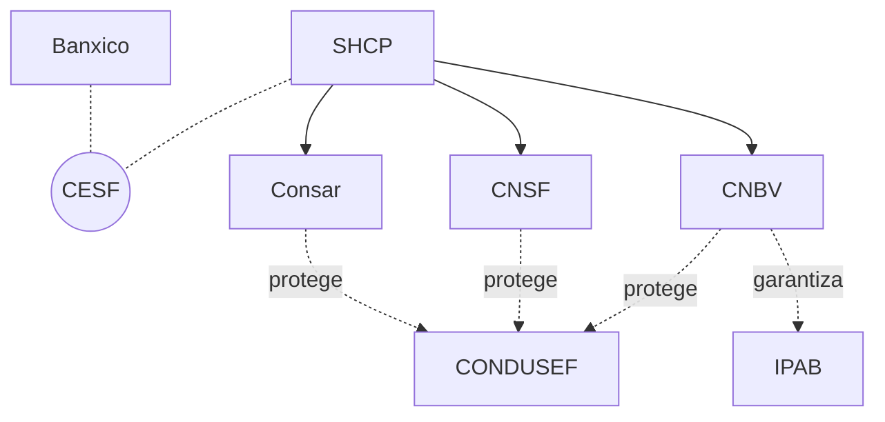

# Unidad 1 · Estructura del Sistema Financiero Mexicano

**Mercados de Deuda y Capitales**, Licenciatura en Comercio y Finanzas Internacionales, Universidad Autónoma de Zacatecas

## Objetivo de la unidad

Que el estudiante ubique qué autoridad del Sistema Financiero Mexicano regula, supervisa o protege (SHCP, Banxico, CNBV, CNSF, Consar, IPAB, CONDUSEF), y distinga el modelo de sistema financiero (basado en bancos o basado en mercados) de un país dado, ubicando su equivalente funcional a cada autoridad del SFM.

## Contenido

|     | Tema                                                 | Qué cubre                                                                                                          |
| --- | ---------------------------------------------------- | ------------------------------------------------------------------------------------------------------------------ |
| I   | Estructura del Sistema Financiero Mexicano           | Reguladores, supervisores y organismos de apoyo y protección; tipos de institución bajo cada supervisor            |
| II  | Organigrama del Sistema Financiero Mexicano          | Jerarquía, coordinación y relación funcional entre autoridades                                                     |
| III | De los activos financieros a sus autoridades         | Qué autoridad vigila cada instrumento de la Unidad 0, en qué mercado opera y qué protección tiene el inversionista |
| IV  | Protección al usuario financiero en la práctica      | IPAB (seguro de depósito), CONDUSEF (reclamación formal), Buró de Entidades Financieras/SIPRES                     |
| V   | Panorama de los sistemas financieros internacionales | Modelos bank-based/market-based y equivalencias funcionales al SFM                                                 |

> La práctica de este tema está en [`practica_2_estructura_mecanica.md`](../../practicas/unidad1/practica_2_estructura_mecanica.md).

---

### 1. Estructura del Sistema Financiero Mexicano

Mapa general de autoridades: tres niveles con funciones complementarias.

| Nivel              | Función                                                    | Instituciones      |
| ------------------ | ---------------------------------------------------------- | ------------------ |
| Reguladores        | Diseñan la política y las reglas del sistema financiero.   | SHCP, Banxico      |
| Supervisores       | Vigilan a los intermediarios de cada sector especializado. | CNBV, CNSF, Consar |
| Apoyo y Protección | Respaldan y defienden al ahorrador y al usuario final.     | IPAB, CONDUSEF     |

Dentro del nivel de supervisores, cada autoridad vigila un tipo distinto de institución, según qué tan predecible es lo que le deben pagar a sus clientes: un banco puede sufrir un retiro masivo de depósitos en cualquier momento, mientras que una aseguradora o una Afore saben con más certeza cuándo y cuánto van a pagar.

| Categoría             | Institución en México                                                        | Autoridad |
| --------------------- | ---------------------------------------------------------------------------- | --------- |
| Depósito              | Banca múltiple / de desarrollo                                               | CNBV      |
| Depósito              | SOFIPO, SOCAP (ahorro popular)                                               | CNBV      |
| Ahorro contractual    | Instituciones de seguros y fianzas                                           | CNSF      |
| Ahorro contractual    | Afores / Siefores                                                            | Consar    |
| Inversión             | Casas de bolsa (fondos de inversión, colocación de emisiones, corretaje)     | CNBV      |
| Auxiliares de crédito | Arrendadoras, factoraje, almacenes de depósito, uniones de crédito, SOFOM ER | CNBV      |

> Las casas de bolsa no son intermediarios financieros en sentido estricto: no emiten deuda propia para captar recursos, solo conectan a quien tiene el dinero con quien lo necesita (administran fondos de inversión, colocan emisiones de empresas, y operan por cuenta de terceros). Aun así, la CNBV las supervisa junto con el resto del sector bursátil.
>
> Estas categorías no son compartimentos aislados en la práctica: un **grupo financiero** (p. ej. Grupo Financiero Banorte, BBVA México, Santander o Inbursa) reúne varias de estas instituciones bajo una controladora común. Banco, casa de bolsa, aseguradora y Afore siguen siendo entidades legales separadas, cada una supervisada por su propia autoridad (CNBV, CNSF, Consar según el caso), aunque compartan marca, accionistas y clientes.

### 2. Organigrama del Sistema Financiero Mexicano

No todas las relaciones son de mando: hay jerarquía, coordinación entre autoridades autónomas y funciones cruzadas entre entidades.

**Tipos de relación:**

- Línea sólida: jerarquía / sectorización (SHCP sobre CNBV, CNSF, Consar).
- Línea punteada sin flecha: coordinación entre autoridades autónomas (SHCP y Banxico vía CESF).
- Línea punteada con flecha: relación funcional (IPAB garantiza lo que supervisa la CNBV; CONDUSEF protege al usuario de los tres sectores supervisados).

**Detalle por institución:**

- **SHCP**: cabeza de sector, política financiera.
- **Banxico**: autónomo, no forma parte de la SHCP; coordina con la SHCP vía el **CESF** (Consejo de Estabilidad del Sistema Financiero).
- **CNBV**: regula banca y mercado de valores. Sectores: banca múltiple y de desarrollo; bursátil (BMV, BIVA, casas de bolsa); Fintech/ITF; ahorro popular (SOFIPO, SOCAP); auxiliares (SOFOM ER, uniones de crédito).
- **CNSF**: regula seguros y fianzas. Sectores: instituciones de seguros; fianzas y caución.
- **Consar**: regula el sistema de pensiones. Sector: Afores y Siefores generacionales.
- **IPAB**: garantiza el ahorro bancario; garantiza el seguro de depósito bancario de las instituciones que supervisa la CNBV.
- **CONDUSEF**: protege al usuario financiero; defiende al usuario ante bancos, aseguradoras, Afores y demás entidades del sistema.

### 3. De los activos financieros a sus autoridades

<!-- diapositivas: omitir -->

Retomamos los ejemplos de `0_activo_financiero.md`: cada uno tenía un emisor y un inversionista, pero no se dijo quién vigila al emisor ni qué pasa si algo sale mal. La columna "Mercado" retoma la clasificación por plazo de [`0_activo_financiero.md`](0_activo_financiero.md#3-mercado-de-dinero-y-mercado-de-capitales). Así se reparten entre las autoridades de la sección anterior, y así protegen (o no) al inversionista:

| Activo financiero                          | Emisor                   | Mercado                                             | ¿Quién lo regula o supervisa?                                                                                            | ¿Garantía institucional al inversionista?                                               |
| ------------------------------------------ | ------------------------ | --------------------------------------------------- | ------------------------------------------------------------------------------------------------------------------------ | --------------------------------------------------------------------------------------- |
| CETE                                       | Gobierno federal (SHCP)  | Dinero                                              | SHCP emite; Banxico regula la subasta como agente financiero del Gobierno Federal; CNBV supervisa el mercado secundario. | Ninguna: el respaldo es la capacidad de pago del Estado, no una garantía institucional. |
| Bono gubernamental (Bono M, UDIBONO)       | Gobierno federal         | Capitales                                           | Igual que el CETE.                                                                                                       | Igual que el CETE: ninguna garantía institucional.                                      |
| Bono corporativo                           | La empresa que lo coloca | Capitales                                           | CNBV autoriza y supervisa la oferta pública (sector bursátil).                                                           | Ninguna: el inversionista asume el riesgo de crédito directo frente al emisor.          |
| Papel comercial                            | La empresa que lo emite  | Dinero                                              | CNBV (sector bursátil).                                                                                                  | Ninguna, mismo caso que el bono corporativo.                                            |
| Certificado bursátil                       | Empresa o gobierno       | Capitales (el más común; hay CEBURS de corto plazo) | CNBV (sector bursátil).                                                                                                  | Ninguna.                                                                                |
| Acción común o preferente                  | La empresa que cotiza    | Capitales                                           | CNBV (sector bursátil).                                                                                                  | Ninguna: ni el dividendo ni el precio de venta están garantizados.                      |
| FIBRA / CKD / CERPI                        | El fideicomiso           | Capitales                                           | CNBV (sector bursátil).                                                                                                  | Ninguna.                                                                                |
| Cuenta de ahorro / depósito a plazo        | El banco                 | Dinero                                              | Banxico regula la tasa de referencia y el sistema de pagos; CNBV supervisa al banco (sector banca múltiple).             | IPAB garantiza el depósito hasta el límite legal.                                       |
| Crédito hipotecario (visto desde el banco) | Quien pide el préstamo   | Capitales                                           | Banxico regula la tasa de referencia (p. ej. TIIE); CNBV supervisa al banco que otorga el crédito.                       | No aplica: aquí el banco es quien presta, no quien necesita protección.                 |
| Pagaré entre particulares                  | Quien firma el pagaré    | Depende del plazo pactado                           | Ninguna autoridad del SFM: es un acuerdo privado fuera del sistema regulado.                                             | Ninguna.                                                                                |

> Banxico solo aparece donde su ley le da competencia directa: mercado de dinero (subasta de CETES y bonos gubernamentales), banca (tasas de referencia, sistema de pagos) y cambios. La emisión de valores corporativos y de capital (bono corporativo, papel comercial, certificado bursátil, acciones, FIBRA/CKD/CERPI) es competencia exclusiva de la CNBV bajo la Ley del Mercado de Valores; por eso esas filas no mencionan a Banxico.
>
> Regular la emisión no es lo mismo que garantizar el pago. La CNBV exige transparencia y reglas de oferta a casi todos los instrumentos bursátiles de la Unidad 0, pero solo el depósito bancario tiene una garantía explícita (IPAB) si el emisor incumple; en el resto, el riesgo de crédito [incumplimiento] del apéndice de [`1_intermediacion_financiera.md`](1_intermediacion_financiera.md#apéndice-riesgo-de-un-activo-financiero) lo sigue asumiendo el inversionista, con o sin supervisión de la CNBV encima. Los ejemplos de la Unidad 0 no incluyen pólizas de seguro ni cuentas de Afore: esos instrumentos existen, pero sus autoridades (CNSF y Consar) ya aparecieron en el organigrama de la sección anterior.

### 4. Protección al usuario financiero en la práctica

**IPAB: reclamar el seguro de depósito.** Si el banco donde tienes tus ahorros quiebra, no tienes que hacer ningún trámite especial: el IPAB paga automáticamente a cada cuenta afectada, hasta un límite de **400,000 UDIs** por persona por institución (unos \$3.5 millones de pesos, según el valor de la UDI [2026]). Cubre cuentas de ahorro, depósitos a plazo y otros pasivos bancarios; no cubre inversiones en fondos, acciones o instrumentos bursátiles que el banco solo distribuya como intermediario.

**CONDUSEF: presentar una reclamación formal.** Ante un cobro indebido, una mala práctica o un incumplimiento de un banco, aseguradora, Afore o cualquier entidad que regula el SFM, el usuario puede reclamar directamente ante la institución y, si no hay respuesta satisfactoria, escalar a la CONDUSEF. El proceso general: (1) presentar la queja por escrito ante la propia institución, (2) si no se resuelve, acudir a CONDUSEF con la documentación del caso, (3) CONDUSEF media entre ambas partes y, si no hay acuerdo, puede emitir un dictamen técnico que el usuario puede usar en una demanda judicial.

**Buró de Entidades Financieras y SIPRES: consultar antes de contratar.** Son dos herramientas distintas y complementarias, ambas de CONDUSEF:

- **Buró de Entidades Financieras**: muestra el historial de quejas de una institución ya contratada por otros usuarios, y las cláusulas o prácticas que CONDUSEF ha calificado como abusivas.
- **SIPRES** (Sistema de Registro de Prestadores de Servicios Financieros): verifica si una institución está legalmente registrada y autorizada para operar, antes de contratarla.

> Consultar el Buró responde "¿qué tanto se han quejado de esta institución?"; consultar el SIPRES responde "¿esta institución existe legalmente?". Son preguntas distintas y conviene hacer ambas.

### 5. Panorama de los sistemas financieros internacionales

Las mismas tres funciones (regular, supervisar, proteger) aparecen en todos lados, pero el **modelo** que canaliza el ahorro hacia la inversión varía por país.

| Modelo                            | Cómo se financian las empresas                                             | Países representativos      |
| --------------------------------- | -------------------------------------------------------------------------- | --------------------------- |
| Basado en bancos (bank-based)     | Predominan el crédito bancario y la relación de largo plazo banco-empresa. | México, Alemania, Japón     |
| Basado en mercados (market-based) | Predomina la emisión directa de deuda y acciones en mercados públicos.     | Estados Unidos, Reino Unido |

Sobre ese modelo se monta una estructura de autoridades equivalente, aunque con nombres distintos a los del SFM:

| Función (SFM)                    | México   | Estados Unidos                               | Zona Euro                                                 |
| -------------------------------- | -------- | -------------------------------------------- | --------------------------------------------------------- |
| Banco central                    | Banxico  | Reserva Federal (Fed)                        | Banco Central Europeo (BCE) + bancos centrales nacionales |
| Regulador/supervisor de valores  | CNBV     | SEC (Securities and Exchange Commission)     | ESMA + reguladores nacionales (p. ej. BaFin, CNMV)        |
| Garantía del ahorro bancario     | IPAB     | FDIC (Federal Deposit Insurance Corporation) | Esquemas nacionales de garantía de depósitos              |
| Protección al usuario financiero | CONDUSEF | CFPB (Consumer Financial Protection Bureau)  | Autoridades nacionales de protección al consumidor        |

- Ningún país reproduce el organigrama mexicano tal cual: EE. UU., por ejemplo, reparte la supervisión bancaria entre varias agencias (Fed, OCC, FDIC) en vez de concentrarla en una sola como la CNBV.
- La Zona Euro es un caso especial: comparte banco central y buena parte de la supervisión bancaria de forma supranacional, pero la protección al usuario sigue siendo, en gran medida, un asunto nacional.
- Por encima de estas estructuras nacionales existen organismos que coordinan entre países (FMI, Banco Mundial, BIS, IOSCO, FSB); esa capa se estudia a fondo en la Unidad 4.

---

## Fuentes y referencias recomendadas

- Banxico Educa: infografías y explicaciones sobre "¿Qué es el Sistema Financiero?", ideales para repaso.
- Catálogo del Sistema Financiero Mexicano (SHCP): registro oficial de la estructura de autoridades e intermediarios regulados.
- Portal CNBV (Sectores Supervisados): esquemas gráficos descargables.
- Portal CONDUSEF (Educación Financiera, Buró de Entidades Financieras, SIPRES): material gráfico, historial de quejas y verificación de registro de instituciones.
- Portal IPAB: qué es el seguro de depósito, límite de cobertura vigente en UDIs y proceso de reclamación.
- Mishkin, F. S. y Eakins, S. G. (2024). *Financial Markets and Institutions* (10ª ed.). Pearson: comparación de sistemas financieros bank-based y market-based alrededor del mundo.
- Mishkin, F. S. (2019). *The Economics of Money, Banking, and Financial Markets* (Business School Edition, 5ª ed.). Pearson. Cap. 2, "An Overview of the Financial System", pp. 38-42: tipos de intermediarios financieros (depósito, ahorro contractual, inversión).
- Mántey de Anguiano, G. (2024). *Lecciones de Economía Monetaria*. UNAM. Lección 2, §5 "Características de las instituciones financieras": bancos comerciales e hipotecarios, sociedades financieras, banca de desarrollo, seguros y fondos de pensión, casas de bolsa, bolsas de valores, y auxiliares de crédito (arrendadoras, factoraje, almacenes de depósito, uniones de crédito).

---

## Cierre de la unidad — Lo esencial para recordar

- El SFM se organiza en tres niveles: **reguladores** (SHCP, Banxico) diseñan la política y coordinan vía el **CESF**; **supervisores** (CNBV, CNSF, Consar) vigilan cada sector, la CNBV con el alcance más amplio (banca, valores, Fintech, ahorro popular); **apoyo y protección** (IPAB, CONDUSEF) respaldan al usuario. Dentro de los supervisores, cada tipo de institución (depósito, ahorro contractual, inversión, auxiliares de crédito) tiene una lógica distinta según qué tan predecible es lo que debe pagar; un **grupo financiero** (Banorte, BBVA, Santander) puede reunir varias bajo una misma marca, pero cada una sigue respondiendo a su propia autoridad.
- Regular la emisión no es garantizar el pago: la CNBV vigila casi todos los instrumentos de la Unidad 0, pero solo el depósito bancario tiene garantía explícita (IPAB); en el resto, el riesgo de crédito lo asume el inversionista.
- Un usuario ejerce esa protección de forma concreta: reclama el seguro de depósito ante el **IPAB**, presenta una reclamación formal ante **CONDUSEF**, y consulta el **Buró de Entidades Financieras** (quejas históricas) o el **SIPRES** (registro legal) antes de contratar.
- Todo país reparte las mismas tres funciones (regular, supervisar, proteger) bajo un **modelo** distinto (México **bank-based**, EE. UU. **market-based**), y las autoridades del SFM tienen equivalentes funcionales en otros países (Banxico↔Fed↔BCE, CNBV↔SEC, IPAB↔FDIC, CONDUSEF↔CFPB), aunque el reparto exacto de funciones entre agencias no es idéntico.
