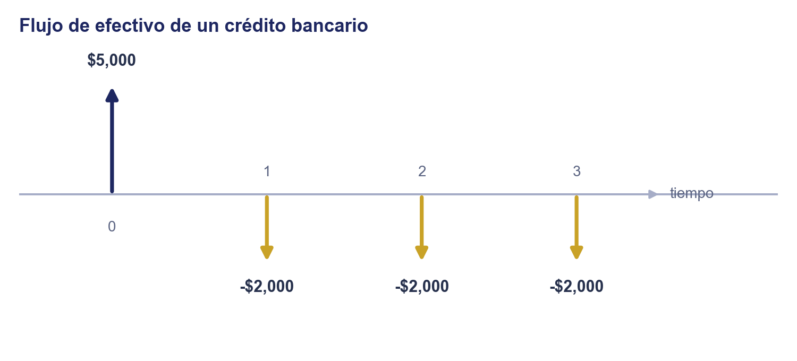

# Unidad 1 · Ciencia de la Inversión

**Mercados de Deuda y Capitales**, Licenciatura en Comercio y Finanzas Internacionales, Universidad Autónoma de Zacatecas

## Objetivo de la unidad

Que el estudiante calcule el valor de un flujo en el tiempo (valor presente/futuro), la tasa efectiva a partir de una tasa nominal, y la tasa interna de retorno de una inversión para decidir si conviene realizarla frente a otras alternativas.

## Contenido

|      | Tema                                              | Qué cubre                                                                                                                   |
| ---- | ------------------------------------------------- | --------------------------------------------------------------------------------------------------------------------------- |
| I    | ¿Qué es invertir?                                 | Las dos definiciones de inversión y el flujo de efectivo como lenguaje común                                                |
| II   | Principios del análisis de inversión              | Comparación, no arbitraje, dinámica, aversión al riesgo                                                                     |
| III  | Problemas típicos de inversión                    | Fijación de precio, cobertura, inversión pura (selección de portafolio)                                                     |
| IV   | Interés simple                                    | Cuándo se calcula solo sobre el capital original, y por qué crece linealmente                                               |
| V    | Interés compuesto                                 | Cuándo el interés genera más interés, y por qué crece geométricamente                                                       |
| VI   | Valor futuro y valor presente de un flujo único   | Fórmula base de toda la valuación del curso                                                                                 |
| VII  | Valor presente de una serie de flujos (anualidad) | La fórmula que luego valúa un bono                                                                                          |
| VIII | Tasa interna de retorno (TIR)                     | La tasa que hace cero el VPN de un flujo; antecedente directo del rendimiento al vencimiento de un bono                     |
| IX   | Criterios de evaluación: VPN vs. TIR              | Cuándo coinciden, cuándo no, y cuál usar para decidir entre alternativas                                                    |
| X    | Tasa nominal (TNA) vs. tasa efectiva (TEA)        | Convención de cotización de tasas: por qué la efectiva siempre es mayor o igual, hasta el límite de capitalización continua |

> La práctica de este tema (ejercicios) está en [`practica_3_ciencia_inversion.md`](../../practicas/unidad1/practica_3_ciencia_inversion.md).

---

### 1. ¿Qué es invertir?

Las tres notas anteriores respondieron el quién y el cómo: qué es un activo financiero y quién lo emite (un activo intangible sobre el efectivo futuro de un emisor), los básicos del sistema financiero (por qué existe, deuda directa frente a indirecta, su estructura jerárquica de regulación, supervisión y protección) y cómo un instrumento pasa del mercado primario al secundario. Falta la pregunta que sostiene todo lo demás: ¿por qué alguien participa en ese sistema? En otras palabras, ¿qué es invertir?

La teoría económica tradicional define la inversión como dar dinero hoy para recibir más dinero después. Esta definición funciona cuando el monto futuro es cierto, como un CETE, pero es ingenua porque deja fuera dos cosas que sí importan:

- **El momento de los pagos:** no es lo mismo recibir todo al final que recibirlo en abonos a lo largo del tiempo, aunque la suma sea igual.
- **La certeza del rendimiento:** muchos activos (un crédito con interés variable, una acción) no prometen desde el inicio un monto fijo.

Si un conocido te pide dinero prestado y te dice que ya verán cuánto y cuándo te paga, ¿te parecería seria su propuesta? Probablemente no, y esa misma exigencia (saber cuánto y cuándo) es la que la definición tradicional no obliga a especificar.

Para propósitos de este curso, invertir es diseñar el flujo de efectivo completo de una decisión para volverlo más conveniente. En otras palabras, invertir es adquirir activos financieros para maximizar la utilidad esperada del efectivo, dada la incertidumbre sobre su resultado futuro.

> **Nota explicativa.** Pedir un préstamo también es invertir bajo esta definición, aunque no encaje en la tradicional (ahí quien "invierte" recibe dinero hoy y lo entrega después, no al revés). Así se trata bajo un mismo marco tanto activos financieros como decisiones de financiamiento: son dos lados de la misma moneda.

Bajo esta definición, cualquier inversión queda descrita por su **flujo de efectivo**: los montos que entran o salen en cada fecha. Cuando se conocen de antemano, el flujo es **determinístico** y se representa en un diagrama de línea de tiempo.

> **Ejemplo:** comprar hoy un Bono M (deuda directa) por \$1,000 (salida), con cupón anual del 8% (\$80) al final de los años 1 y 2, y el último cupón más el capital (\$1,080) al final del año 3.

> **Ejemplo:** pedir un crédito personal bancario (deuda indirecta) por \$5,000 hoy (entrada), a pagar en 3 abonos anuales de \$2,000. Es el mismo tipo de flujo determinístico que el del Bono M, con los signos invertidos: aquí quien "invierte" recibe primero y paga después.

Cuando los montos futuros no se conocen con certeza (**flujo estocástico**), como el dividendo de una acción o el precio de reventa de un activo, se necesita otro tipo de diagrama. El más simple es un **árbol binomial**.

> **Árbol binomial:** un periodo, dos resultados posibles.
>
> - Comprar hoy una acción en \$100; en un año su valor puede subir a \$130 (p = 0.2) o bajar a \$80 (p = 0.8).
> - Pedir hoy un crédito a tasa variable referenciada a la TIIE; en la siguiente revisión la tasa puede subir o bajar, cambiando el pago de intereses.

> **Red binomial (recombinante):** subir y luego bajar llega al mismo nodo que bajar y luego subir; es la que se usa más adelante para valuar bonos y opciones a varios periodos.
>
> - El precio de una acción a lo largo de varios periodos, donde en cada uno puede subir o bajar.
> - La tasa de referencia de Banxico, revisada varias veces al año, donde en cada revisión puede subir o bajar.

> **Árbol multinomial (trinomial):** más de dos resultados posibles por periodo, por ejemplo subir, quedarse igual o bajar.
>
> - La calificación crediticia de un emisor en su próxima revisión: mejora, se mantiene o empeora.
> - El precio de una acción según tres escenarios de un analista: optimista, base o pesimista.

> **Trayectorias simuladas:** varias posibles rutas continuas que podría seguir el valor con el tiempo (simulación de Monte Carlo).
>
> - El precio diario de una acción que cotiza en la BMV.
> - El tipo de cambio spot peso-dólar día con día.

> **Fan chart:** una banda de confianza que se abre conforme pasa el tiempo, mostrando que la incertidumbre crece mientras más lejos se proyecta.
>
> - Las proyecciones de inflación que publica Banxico cada trimestre.
> - El rango de precios objetivo a varios años de una acción, según distintos escenarios de valuación.

Cada uno de estos diagramas ilustra un modelo matemático:

- detrás del árbol binomial hay una distribución de probabilidad bernoulli,
- detrás de las trayectorias simuladas hay una caminata aleatoria del valor,
- detrás del fan chart hay una distribución que se ensancha con el tiempo.

Ilustrar la idea es el primer paso, pero fijar un precio, comparar alternativas o medir un riesgo obliga a contestar preguntas más precisas: ¿qué tan probable es cada resultado?, ¿cómo se comporta el proceso en cualquier instante, no solo una vez al año?, ¿cómo se compara el efecto conjunto de flujos que llegan en fechas distintas? Ninguna de esas preguntas se responde con una suma simple.

Por eso las finanzas modernas dependen de herramientas matemáticas (cálculo, probabilidad, álgebra lineal, estadística, ...).

### 2. Principios del análisis de inversión

El **análisis de inversión** es el proceso de examinar alternativas de inversión y decidir cuál es más conveniente.

Por ejemplo, invertir en un CETE a 28 días es una decisión de corto plazo con un rendimiento conocido desde el momento de la compra; invertir en una acción para mantenerla varios años es usualmente una decisión de largo plazo cuyo rendimiento no se conoce hasta que se vende. Ambas son decisiones de inversión, aunque difieran en cuándo se recupera el dinero y en qué tan cierto es el monto que se recibe.

Las decisiones de inversión casi siempre se toman dentro de un **mercado financiero**, y ese mercado ofrece una referencia de comparación.

Cuatro principios sostienen ese análisis:

- **Principio de comparación.** El mercado ofrece una tasa de referencia (el rendimiento de un CETE o un Bono M) contra la cual se evalúa cualquier oportunidad de inversión; si el proyecto ofrece una tasa por arriba de esa referencia conviene aceptarlo, ¿por qué?
- **Aversión al riesgo.** Entre dos inversiones con el mismo rendimiento esperado, un inversionista racional prefiere la de menor riesgo.

  Si un CETE y una acción ofrecieran el mismo rendimiento esperado, nadie preferiría la acción, porque su rendimiento es incierto mientras el del CETE es conocido; para que alguien acepte el riesgo de la acción, esta debe ofrecer en promedio un rendimiento mayor al del CETE, una prima por riesgo. Este principio es la base de la teoría de portafolios que se estudia en la Unidad de Mercado de Capitales.
- **No arbitraje.** En un mercado sin fricciones no debería existir una forma de obtener una ganancia segura sin arriesgar capital propio.

  Si dos activos con el mismo riesgo cotizaran a precios distintos, cualquiera podría comprar el más barato, vender el más caro y quedarse con la diferencia sin arriesgar nada; suponer que estas oportunidades no persisten (dos activos con el mismo riesgo deben tener el mismo precio) es lo que permite calcular precios de forma analítica en el resto del curso, en vez de depender solo de la oferta y la demanda.
- **Dinámica.** El precio de un activo no es un número fijo, sino un proceso que cambia con el tiempo.

  El precio de una acción cambia cada día que cotiza en la BMV, así que un portafolio armado hoy puede dejar de ser el más conveniente mañana; administrar una inversión implica ajustarla conforme cambian esos precios, no fijarla una sola vez y olvidarla.

### 3. Problemas típicos de inversión

Con estos principios, la mayoría de los problemas reales de inversión caben en un puñado de categorías:

- **Fijación de precio (pricing):** dado un flujo de efectivo con características conocidas, ¿qué precio es consistente con lo que ofrece el resto del mercado?
- **Cobertura (hedging):** reducir el riesgo financiero de una operación, por ejemplo con futuros o seguros, sin necesariamente buscar una ganancia adicional.
- **Inversión pura (selección de portafolio):** decidir dónde colocar el capital disponible para maximizar el rendimiento esperado dado un nivel de riesgo tolerado.

En la práctica, muchos problemas combinan varias de estas categorías a la vez, como decidir cuánto consumir hoy frente a cuánto invertir para el retiro. Resolver cualquiera de ellos exige comparar montos de dinero en fechas distintas, y eso no se puede hacer sumándolos directamente: \$100 hoy no vale lo mismo que \$100 dentro de un año. El resto de esta unidad construye, paso a paso, las herramientas para hacer esa comparación: empieza por cómo crece el dinero con el tiempo (interés simple y compuesto) y termina en cómo traer cualquier flujo futuro a su valor de hoy (valor presente, tasa interna de retorno).

### 4. Interés simple

**Definición:** interés simple es el que se calcula siempre sobre el capital original, nunca sobre el interés ya ganado. Fabozzi lo describe de forma práctica: el interés se retira al final de cada periodo en vez de quedarse invertido, así que el capital que sigue generando interés nunca cambia.

$$v = a(1 + rt)$$

- **v**: el valor de la cuenta después de $t$ periodos.
- **a**: el capital invertido (principal).
- **r**: la tasa de interés por periodo.
- **t**: el número de periodos transcurridos.

El valor de la cuenta crece **linealmente** con el tiempo: cada periodo se suma la misma cantidad, $ra$.

**Justificación matemática.** Cada periodo se gana lo mismo, $ra$: una tasa $r$ sobre el capital original $a$, sin componer. Después de $t$ periodos el interés acumulado es $rta$, y sumado al capital original da $v = a + rta = a(1+rt)$.

### 5. Interés compuesto

**Definición:** interés compuesto es el que se queda invertido junto con el capital, así que en el siguiente periodo también genera rendimiento ("interés sobre interés"). Es el supuesto que se usa en casi toda la valuación financiera del curso.

$$v = a(1+r)^t$$

- **v**: el valor de la cuenta después de $t$ periodos.
- **a**: el capital invertido (principal).
- **r**: la tasa de interés por periodo.
- **t**: el número de periodos transcurridos.

El valor de la cuenta crece **geométricamente**: cada periodo se multiplica, no se suma, por el mismo factor $(1+r)$.

**Justificación matemática.** Después de 1 periodo: $v_1 = a(1+r)$. Ese nuevo monto vuelve a crecer un factor $(1+r)$ en el periodo 2: $v_2 = a(1+r)(1+r) = a(1+r)^2$. Repitiendo el mismo paso $t$ veces: $v = a(1+r)^t$. La derivación completa de esta fórmula, ya en notación $v_t$, está en la sección 6.

La diferencia entre sumar (simple) y multiplicar (compuesto) parece pequeña al inicio, pero se vuelve grande conforme pasa el tiempo:

> **Ejemplo:** invertir \$10,000 a una tasa del 8% anual.
>
> A 5 años: interés simple v = 10,000(1 + 0.08(5)) = **\$14,000**; interés compuesto v = 10,000(1.08)⁵ ≈ **\$14,693**.
>
> A 25 años: interés simple v = 10,000(1 + 0.08(25)) = **\$30,000**; interés compuesto v = 10,000(1.08)²⁵ ≈ **\$68,485**.

### 6. Valor futuro y valor presente de un flujo único

**Definición:** llamamos $v_t$ al valor de un flujo en el periodo $t$; $v_0$ es el valor presente (present value, PV), y $v_t$ en un periodo futuro es el valor futuro (future value, FV). Es la fórmula de interés compuesto de la sección anterior, $v = a(1+r)^t$, con otro nombre: $v_0$ es el monto hoy, $v_N$ el monto en el periodo N. Lo que agrega esta sección es la dirección contraria: si conozco el monto futuro, ¿cuánto vale hoy?

$$v_N = v_0(1+r)^N \qquad v_0 = v_N(1+r)^{-N}$$

- **$v_t$**: el valor del flujo en el periodo $t$.
- **$v_0$**: el valor presente (present value), el monto hoy.
- **$v_N$**: el valor futuro (future value), el monto en el periodo N.
- **r**: tasa de interés por periodo.
- **N**: número de periodos.

**Justificación matemática.** Partiendo de $v_N = v_0(1+r)^N$ (la fórmula de interés compuesto, renombrada), despejar $v_0$ solo invierte la operación: multiplicar por $(1+r)^{-N}$, el factor de descuento (el inverso del factor de crecimiento), deshace exactamente los N pasos de crecimiento compuesto, es decir, trae el flujo futuro de vuelta al presente ("descontarlo").

> **Ejemplo:** ¿cuánto necesitas invertir hoy para tener \$100,000 en 3 años, si la tasa es 8% anual compuesta?
> $v_0$ = 100,000(1.08)⁻³ ≈ **\$79,383**

### 7. Valor presente de una serie de flujos (anualidad)

Ahora suponemos una serie de pagos constantes en vez de un solo flujo.

**Definición:** el valor presente de esa serie ($v_0$) es la suma de cada flujo constante ($c$) descontado individualmente:

$$v_0 = c(1+r)^{-1} + c(1+r)^{-2} + \dots + c(1+r)^{-N} = \sum_{t=1}^{N} c(1+r)^{-t}$$

Esa suma es una serie geométrica que se simplifica en una sola fracción (para $r \neq 0$; si $r = 0$, $v_0 = cN$):

$$v_0 = c\dfrac{1-(1+r)^{-N}}{r} \qquad v_N = c\dfrac{(1+r)^N-1}{r} \qquad (r \neq 0)$$

> **Ejemplo:** un instrumento paga \$5,000 de cupón anual durante 5 años. Si la tasa de descuento es 9%:
> $v_0$ = 5,000[1 − (1.09)⁻⁵] / 0.09 ≈ **\$19,448**

Esta es la fórmula que en la Unidad de Deuda se convierte en "el precio de un bono": los cupones son justamente una serie de flujos constantes.

### 8. Tasa interna de retorno (TIR)

Hasta ahora calculamos el valor de un flujo dada una tasa. La pregunta contraria también importa: dado un flujo completo (lo que se invierte y lo que se recibe después), ¿qué tasa está implícita en él?

**Definición:** la TIR, denotada $r^*$, es la tasa que hace que el valor presente neto de ese flujo sea exactamente cero. Con precisión: es el valor de $r$ que resuelve

$$0 = c_0 + c_1(1+r^*)^{-1} + c_2(1+r^*)^{-2} + \dots + c_N(1+r^*)^{-N}$$

A diferencia de una tasa de mercado cotizada (como una tasa de descuento), es una propiedad del flujo mismo: no depende de ninguna tasa de mercado externa.

- **TIR** ($r^*$): la tasa que hace que el valor presente neto del flujo sea cero.
- **cₜ**: el flujo de efectivo en el periodo t (t = 0, 1, …, N); c₀ suele ser negativo (el desembolso inicial), y los demás pueden ser positivos o negativos, a diferencia de una anualidad, donde todos son iguales.
- **N**: número de periodos del flujo.

**Por qué existe $r^*$: teorema del valor intermedio.** La suma de flujos descontados es una función continua de $r$; para un flujo de inversión típico (salida hoy, entradas después) esa función cambia de signo entre los extremos de su dominio. El teorema del valor intermedio (cálculo) garantiza entonces que existe al menos un $r^*$ donde la función cruza cero. No es un resultado propio de finanzas: es ese teorema aplicado a esta función en particular.

### 9. Criterios de evaluación: VPN vs. TIR

Con el valor presente de un flujo (sección 6), el valor presente neto de un flujo completo (sección 7) y la TIR (sección 8) ya definidos, falta la pregunta que en realidad importa al invertir: dadas varias alternativas, ¿cuál conviene? Hay dos criterios, y no siempre coinciden.

- **Criterio del VPN:** a la tasa de referencia del mercado (o el costo de oportunidad de quien invierte), se calcula el valor presente neto de cada alternativa; conviene aceptar solo si es positivo, y entre varias, la de mayor VPN.
- **Criterio de la TIR:** se acepta una inversión si su TIR supera la tasa de referencia del mercado, exactamente el **principio de comparación** de la sección 2; entre varias alternativas, conviene la de mayor TIR.

> **Ejemplo:** sembrar árboles hoy cuesta \$1 (millón). Cortarlos y venderlos en 1 año deja \$2 (flujo −1, 2); esperar a que crezcan y cortarlos en 2 años deja \$3 (flujo −1, 0, 3). La TIR de cada alternativa (sección 8) es 100% y √3 − 1 ≈ 73%.
>
> Con una tasa de mercado del 10%: VPN(a) = −1 + 2(1.1)⁻¹ ≈ **0.82**; VPN(b) = −1 + 3(1.1)⁻² ≈ **1.48**.
>
> Por VPN conviene (b), cortar tarde; por TIR conviene (a), cortar temprano (100% > 73%): los dos criterios no coinciden.

Muchos practicantes prefieren la TIR porque no depende de adivinar una tasa externa, pero el VPN tiene una ventaja que la TIR no tiene: los VPN de flujos distintos se pueden sumar para comparar combinaciones. El conflicto entre ambos suele avisar que falta modelar algo del problema (por ejemplo, el ciclo completo si el proyecto se puede repetir), no que uno de los dos criterios esté "equivocado".

En la práctica, el criterio principal debería ser el VPN, pero conviene reportar también la TIR por ser un porcentaje independiente de la escala: private equity y venture capital todavía la usan para medir el desempeño de un fondo.

### 10. Tasa Nominal y Tasa Efectiva

El análisis de inversión también exige una tasa que de verdad se pueda comparar entre alternativas.

¿Qué pasa si un banco ofrece 12% anual capitalizable mensualmente y otro ofrece 12% anual capitalizable diario? Anuncian la misma tasa "de etiqueta", pero no rinden lo mismo: el que capitaliza más seguido genera más interés sobre interés dentro del mismo año. TNA y TEA son las dos formas de nombrar esa tasa anual, ¿cuál de las dos sirve para comparar de verdad?

Recordemos que capitalizar es sumar el interés que ya se ganó en un periodo al capital, para que el siguiente periodo genere interés también sobre ese monto aumentado.

En la fórmula de $v_t$ (sección 6), la variable del periodo $t$ dicta la temporalidad de la tasa $r$: si $t$ está expresada y avanza en años, $r$ tiene que ser una tasa efectiva anual para que el interés compuesto se acumule al ritmo correcto.

Para ser precisos, distingamos cuatro cantidades: la tasa nominal a la escala de $t$ ($r_{nom}$), la duración de un sub-periodo de capitalización en esa misma escala ($\Delta t$), cuántos sub-periodos caben en un año ($n$), y la tasa que de verdad se aplica en cada sub-periodo ($r_{per}$).

La tasa que opera en cada sub-periodo se obtiene multiplicando la tasa nominal por la duración exacta de ese sub-periodo:

$$r_{per} = r_{nom} \times \Delta t$$

Como $n = 1/\Delta t$, esto es lo mismo que la fórmula estándar:

$$r_{per} = \dfrac{r_{nom}}{n}$$

Cuando la inversión avanza un solo sub-periodo (por ejemplo, un mes), el capital no solo retiene su valor original (1), sino que gana la tasa periódica correspondiente ($r_{per}$). El factor que representa ese salto es:

$$1 + r_{per}$$

Como en un año caben $n$ sub-periodos, el capital pasa por ese factor de crecimiento $n$ veces sucesivas; el interés compuesto multiplica el crecimiento sobre el saldo anterior cada vez, así que el crecimiento total en un año es ese factor elevado a $n$:

$$(1 + r_{per})^n$$

La TEA es, por definición, la tasa única que produce ese mismo crecimiento total aplicada una sola vez al final del año, con factor de crecimiento $(1+TEA)$. Para que ambas descripciones del mismo año sean equivalentes:

$$1 + TEA = (1 + r_{per})^n$$

Sustituyendo $r_{per} = TNA/n$:

$$1 + TEA = \left(1+\dfrac{TNA}{n}\right)^n.$$

Restando el capital original para quedarse solo con el rendimiento neto del año:

$$TEA = \left(1+\dfrac{TNA}{n}\right)^n - 1 $$

Esta formula requiere varios calculos algebraicos, pero podemos simplificar el trabajo mecanico/electronico si usamos la idea intuitiva de la capitalización es instantánea, es decir, cuando $n \to \infty$ (equivalentemente, $\Delta t \to 0$). A esa tasa límite se le llama **capitalización continua**:

$$r_{cont} = \lim_{n \to \infty} \left[\left(1+\dfrac{TNA}{n}\right)^n - 1\right] = e^{TNA} - 1, $$

donde $e$ es la base de la función exponencial y los logaritmos naturales, y $r_{nom}$ es la TNA cuando $t$ se mide en años.

Por lo general, $t$ suele medirse en años, así que $r_{nom}$ es la TNA y $r_{per}$ es la tasa periódica que se aplica en cada sub-periodo de capitalización (e.g. dia, semana, mes, trimestre, ... .).

> **Ejemplo:** un banco ofrece un producto financiero con tasa anual de 12%, capitalizable mensualmente.
>
> Primero, traduzcamos a nuestra notacion matematica:
>
> - La tasa nominal es de 12%, esto significa $r_{nom} = 0.1$.
> - La periodicidad es mensual, 12 sub-periodos, entonces $r_{per} = r_{nom}/n = 0.01$.
>
> Entonces, enchufando los valores en al formula de la $TEA$, vemos que
>
> $$ TEA = (1+r_{per})^{12} - 1 = 0.126825... ≈ 12.682\%.$$
>
> La TEA siempre es mayor o igual a la TNA cuando hay más de una capitalización al año: la diferencia es "el interés que gana el interés".
>
> Por otro lado, utilizando la formula de la capitalizacion continua tenemos que
> $$r_{cont} = e^{0.12} - 1 \approx 12.749\%, $$
> muy cerca del $12.682\%$ mensual, sin necesitar calcular $n$ ni $r_{per}$.
> El error de approximacion es de 0.00067, que puede ser negligible en montos chicos.

> **Ejemplo de capitalizacion mas instantanea [**se recomienda al lector hacer los calculos intermedios en una hoja de papel**]:**
>
> Ahora, un banco ofrece un producto financiero con tasa anual de 12%, capitalizable **diario**. Entonces,
>
> $$ TEA = (1+r_{per})^{365} - 1 ≈ 12.747\%.$$
>
> Notese que la misma tasa nominal con capitalizacion mas rapida da mayor rendimiento.  Ahora, el error de approximacion es de 0.00002.

Para finalizar, unimos el concepto de valor presente y futuro con la tasa nominal anual:

$$v_t = v_0 e^{TNA \times t} \qquad r_{cont} = e^{TNA} - 1,$$
donde $t$ esta en una escala de anios.

> Ningún banco capitaliza literalmente en cada instante, pero la capitalización continua sí se usa en la práctica: en la valuación de derivados, porque $e^{rt}$ evita fijar una frecuencia de capitalización arbitraria. Su uso teórico es más profundo: es la base de los modelos de tiempo continuo (movimiento browniano, procesos de Wiener) que describen cómo se mueve el precio de un activo, así que la tasa de descuento tiene que ser continua para ser consistente con el resto de esas matemáticas. Ambos se estudian en la Unidad de Mercado de Capitales.

Todavía falta una distinción más. TNA y TEA solo separan la frecuencia de capitalización dentro de un mismo año, pero ambas están expresadas en pesos nominales, sin descontar que esos mismos pesos compran menos conforme sube la inflación. La **tasa efectiva real** corrige la TEA por ese efecto.

El factor de crecimiento nominal de un año, $(1+TEA)$, multiplica el capital en pesos; si los precios subieron una tasa de inflación $r_{inf}$ en el mismo año, cada peso de ese capital ahora compra $(1+r_{inf})$ veces menos, así que dividir el factor nominal entre el factor de inflación aísla el crecimiento en poder de compra, una relación conocida como la ecuación de Fisher:

$$1 + r_{real} = \dfrac{1+TEA}{1+r_{inf}} \qquad r_{real} = \dfrac{1+TEA}{1+r_{inf}} - 1$$

- **$r_{real}$**: la tasa efectiva real, el rendimiento en poder de compra.
- **TEA**: la tasa efectiva anual.
- **$r_{inf}$**: la tasa de inflación del periodo.

La $r_{inf}$ de esta fórmula toma dos valores distintos según qué tan cierta sea al momento de usarla:

- **Tasa efectiva real** ($r_{real}$): usa la inflación ya observada al final del periodo, $r_{inf}$; solo se puede calcular después de que el periodo terminó, y responde cuánto realmente se ganó en poder de compra.
- **Tasa efectiva real predicha** ($\hat{r}_{real}$): usa la inflación esperada al inicio del periodo, $\hat{r}_{inf}$, en vez de la realizada; es la que un inversionista usa para decidir si invertir, porque al momento de decidir la inflación futura todavía es incierta.

$$\hat{r}_{real} = \dfrac{1+TEA}{1+\hat{r}_{inf}} - 1$$

> **Ejemplo:** un CETE a un año ofrece una TEA de 10.5%. Al momento de decidir la inversión, la inflación esperada para ese año es 3.8% ($\hat{r}_{inf}$); un año después, la inflación observada resultó 4.3% ($r_{inf}$).
>
> Tasa efectiva real predicha (la que se usó para decidir): $\hat{r}_{real}$ = 1.105/1.038 − 1 ≈ **6.45%**.
>
> Tasa efectiva real (la que en realidad se ganó, calculada en retrospectiva): $r_{real}$ = 1.105/1.043 − 1 ≈ **5.94%**.
>
> La diferencia entre 6.45% y 5.94% es el costo de que la inflación resultara más alta de lo esperado: el inversionista ganó menos poder de compra del que había anticipado al decidir.

---

## Fuentes y referencias recomendadas

- Luenberger, D. G. (1998). *Investment Science*. Oxford University Press.
- Fabozzi, F. J. y Peterson Drake, P. (2009). *Finance*. Wiley.

---

## Cierre de la unidad — Lo esencial para recordar

- **Invertir es diseñar un flujo de efectivo** (cierto o incierto) para hacerlo más conveniente; el análisis de inversión compara ese flujo contra el mercado (comparación, no arbitraje, dinámica, aversión al riesgo), y casi todo problema de inversión se reduce a fijar un precio, cubrir un riesgo o armar un portafolio.
- **El valor presente y el valor futuro son la misma fórmula vista desde los dos lados**: descontar hacia el presente o proyectar hacia el futuro. Toda la valuación de deuda de la siguiente unidad se construye sobre esto.
- Una **anualidad** (serie de flujos constantes) es exactamente lo que es el flujo de cupones de un bono: por eso esta fórmula reaparece al valuar deuda.
- La **TIR** es la tasa implícita en un flujo, sin referencia externa; el **criterio de comparación** (aceptar si la TIR supera la tasa de mercado, o si el VPN a esa tasa es positivo) es cómo se decide entre alternativas, aunque VPN y TIR no siempre estén de acuerdo.
- La **tasa efectiva** es la que de verdad ganas o pagas en un año; la **nominal** es solo la etiqueta. Entre más frecuente la capitalización, más se separan. La **tasa efectiva real** va un paso más allá: descuenta la inflación de la TEA para medir el rendimiento en poder de compra, con dos versiones (predicha, con inflación esperada; real, con inflación ya observada) según qué tan cierta sea esa inflación al momento de usarla.
