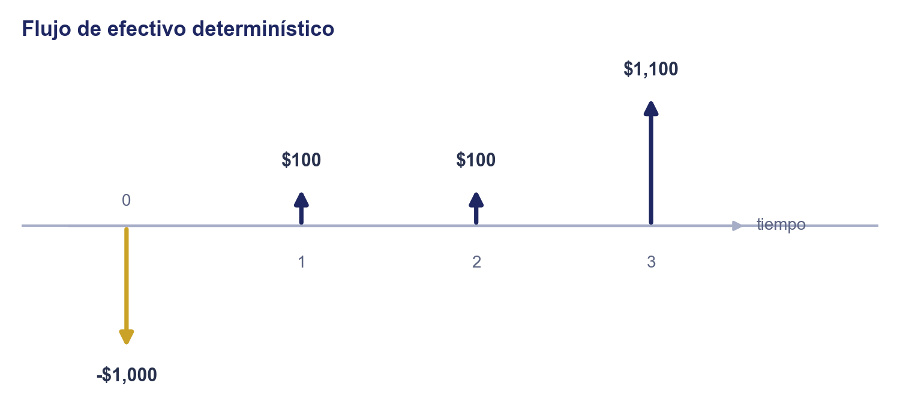
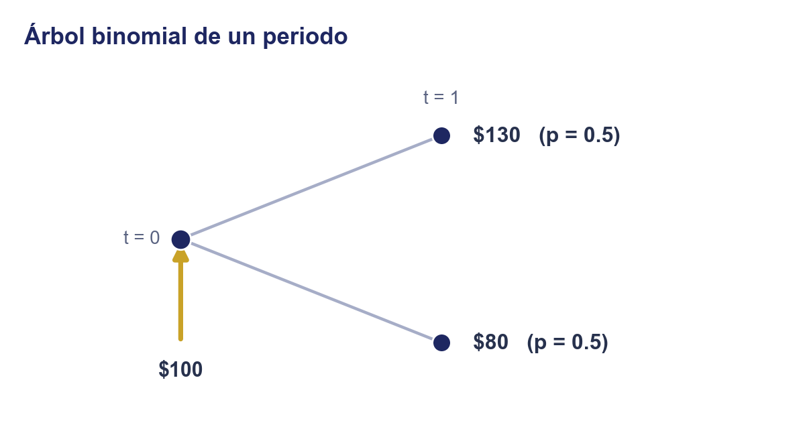
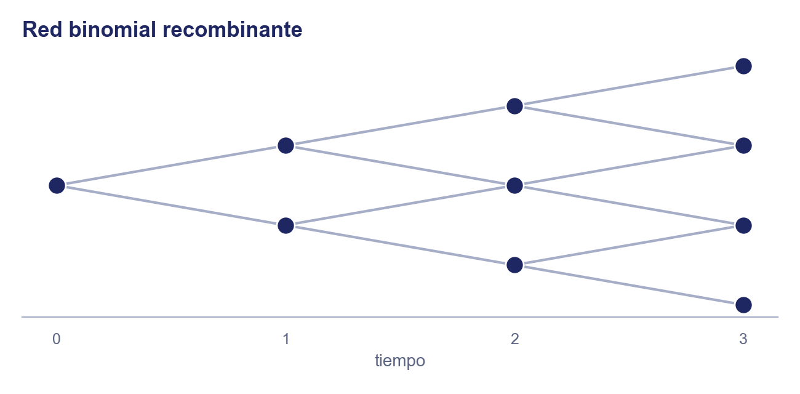
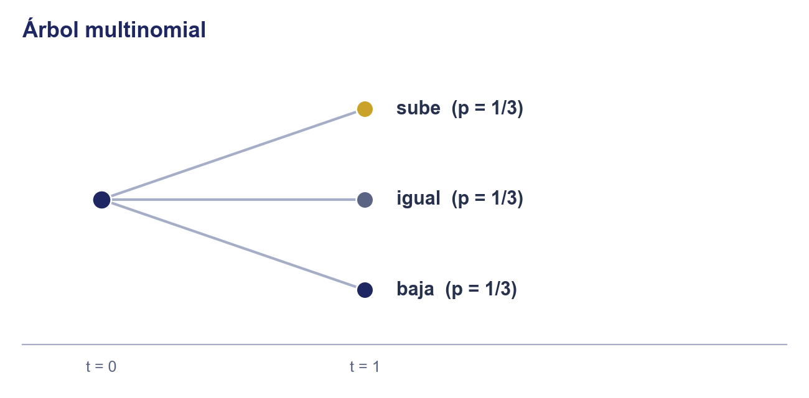
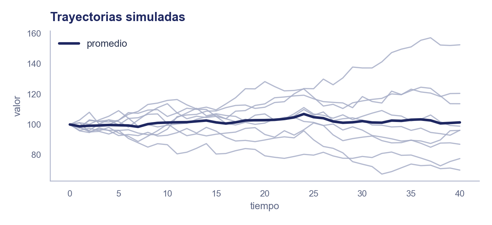
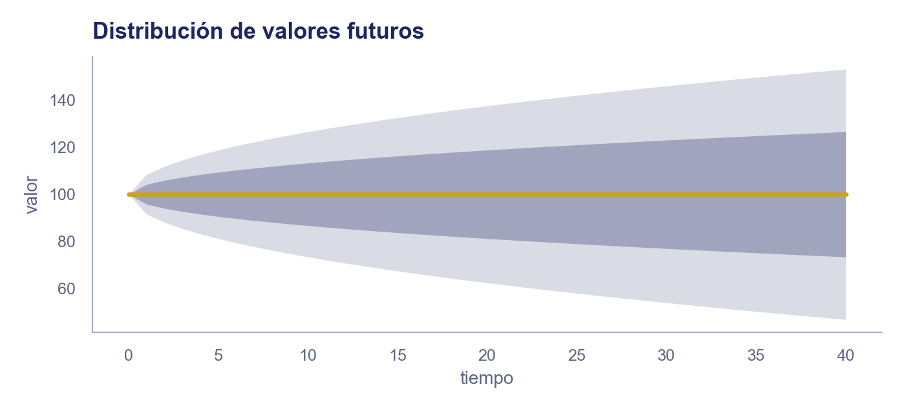
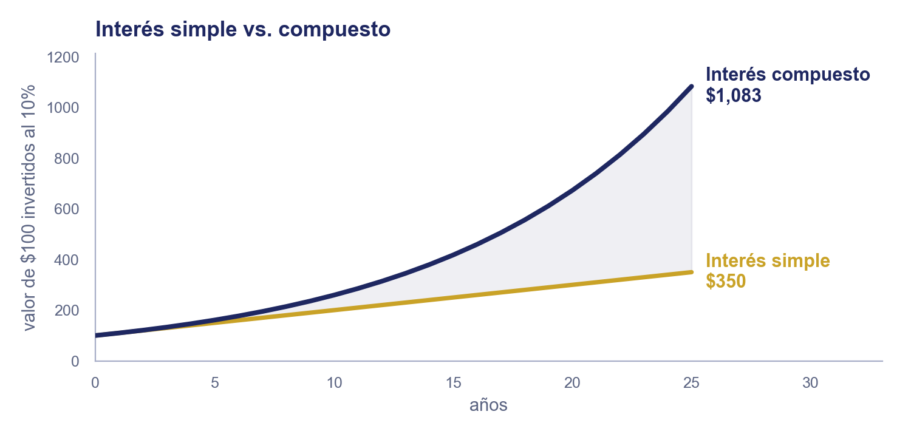
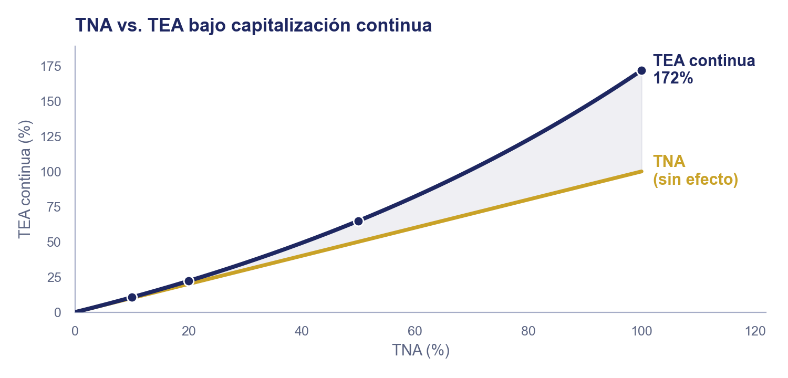

# Unidad 1 · Ciencia de la Inversión

**Mercados de Deuda y Capitales**, Licenciatura en Comercio y Finanzas Internacionales, Universidad Autónoma de Zacatecas

## Objetivo de la unidad

Que el estudiante calcule el valor de un flujo en el tiempo (valor presente/futuro), la tasa efectiva a partir de una tasa nominal, y la tasa interna de retorno de una inversión para decidir si conviene realizarla frente a otras alternativas.

## Contenido

|      | Tema                                                  | Qué cubre                                                                                               |
| ---- | ----------------------------------------------------- | ------------------------------------------------------------------------------------------------------- |
| I    | ¿Qué es invertir?                                     | Las dos definiciones de inversión y el flujo de efectivo como lenguaje común                            |
| II   | Análisis de inversión: principios y problemas típicos | Comparación, no arbitraje, dinámica, aversión al riesgo; fijación de precio, cobertura, portafolio      |
| III  | Interés simple                                        | Cuándo se calcula solo sobre el capital original, y por qué crece linealmente                           |
| IV   | Interés compuesto                                     | Cuándo el interés genera más interés, y por qué crece geométricamente                                   |
| V    | Valor futuro y valor presente de un flujo único       | Fórmula base de toda la valuación del curso                                                             |
| VI   | Tasa nominal (TNA) vs. tasa efectiva (TEA)            | Por qué la efectiva siempre es mayor o igual, hasta el límite de capitalización continua                |
| VII  | Valor presente de una serie de flujos (anualidad)     | La fórmula que luego valúa un bono                                                                      |
| VIII | Tasa interna de retorno (TIR)                         | La tasa que hace cero el VPN de un flujo; antecedente directo del rendimiento al vencimiento de un bono |
| IX   | Criterios de evaluación: VPN vs. TIR                  | Cuándo coinciden, cuándo no, y cuál usar para decidir entre alternativas                                |

> La práctica de este tema (ejercicios) está en [`practica_unidad1.md`](../../practicas/unidad1/practica_unidad1.md).

---

### 1. ¿Qué es invertir?

Las tres notas anteriores respondieron el quién y el cómo: qué es un activo financiero y quién lo emite, cómo lo intermedia el sistema financiero y quién lo regula, y cómo se negocia un instrumento en el mercado bursátil mexicano. Falta la pregunta que sostiene todo lo demás: ¿por qué alguien participa en ese sistema? En otras palabras, ¿qué es invertir?

La teoría económica tradicional define la inversión como comprometer dinero hoy con la esperanza de recibir más dinero después. Funciona bien cuando el monto futuro es cierto, como un certificado de depósito bancario, pero en la mayoría de los casos reales es incierto.

Luenberger propone una definición más amplia, la que guía este curso: invertir es diseñar el flujo de efectivo completo de una decisión para volverlo más conveniente. Pedir un préstamo, por ejemplo, también es invertir bajo esta definición, aunque no encaje en la tradicional. Así se trata bajo un mismo marco tanto activos financieros como decisiones de financiamiento.

Bajo esta definición, cualquier inversión queda descrita por su **flujo de efectivo**: los montos que entran o salen en cada fecha. Cuando se conocen de antemano, el flujo es **determinístico** y se representa en un diagrama de línea de tiempo.

> **Ejemplo:** invertir \$1,000 hoy (salida) a cambio de \$100 al final de los años 1 y 2, y \$1,100 (el último cupón más el capital) al final del año 3.

Cuando los montos futuros no se conocen con certeza (**flujo estocástico**), como el dividendo de una acción o el precio de reventa de un activo, se necesita otro tipo de diagrama. El más simple es un **árbol binomial**.

> **Ejemplo:** comprar hoy una acción en \$100. En un año, su valor puede subir a \$130 (probabilidad 0.5) o bajar a \$80 (probabilidad 0.5).

El árbol binomial es solo el punto de partida: según cuántos resultados posibles haya, o si el proceso es continuo en vez de un salto por periodo, la misma idea se dibuja de otras formas.

> **Red binomial (recombinante):** subir y luego bajar llega al mismo nodo que bajar y luego subir; es la que se usa más adelante para valuar bonos y opciones a varios periodos.

> **Árbol multinomial (trinomial):** más de dos resultados posibles por periodo, por ejemplo subir, quedarse igual o bajar.

> **Trayectorias simuladas:** varias posibles rutas continuas que podría seguir el valor con el tiempo (simulación de Monte Carlo).

> **Fan chart:** una banda de confianza que se abre conforme pasa el tiempo, mostrando que la incertidumbre crece mientras más lejos se proyecta.

La red binomial recombinante reaparece más adelante para valuar bonos y opciones. Con o sin incertidumbre, toda inversión se describe en su flujo de efectivo, y por eso casi cualquier pregunta de inversión se plantea en esos términos: eso es lo que el resto de esta unidad enseña a calcular.

### 2. Análisis de inversión: principios y problemas típicos

Luenberger define el **análisis de inversión** como el proceso de examinar alternativas y decidir cuál es más conveniente, un proceso similar al de cualquier otra decisión (operar una planta, diseñar un edificio, planear un viaje). Lo que distingue a las decisiones de inversión es que casi siempre se toman dentro de un **mercado financiero**, y ese mercado ofrece una referencia de comparación que no existe en otras decisiones; esa estructura es lo que vuelve al análisis de inversión particularmente poderoso.

Cuatro principios sostienen ese análisis:

- **Principio de comparación:** el mercado da una tasa de referencia contra la cual se evalúa cualquier oportunidad; si ofrece una tasa por arriba de la del mercado conviene aceptarla, si ofrece una tasa por debajo conviene rechazarla.
- **No arbitraje:** en un mercado sin fricciones no debería existir una forma de obtener una ganancia segura sin arriesgar capital propio; suponer que esto no ocurre (dos activos con el mismo riesgo deben tener el mismo precio) es lo que permite calcular precios de forma analítica en el resto del curso.
- **Dinámica:** el precio de un activo no es un número fijo, sino un proceso que cambia con el tiempo; administrar una inversión implica ajustarla conforme cambian esos precios, no fijarla una sola vez.
- **Aversión al riesgo:** entre dos inversiones con el mismo rendimiento esperado, un inversionista racional prefiere la de menor riesgo; este principio es la base de la teoría de portafolios que se estudia en la Unidad de Mercado de Capitales.

Con estos principios, la mayoría de los problemas reales de inversión caben en un puñado de categorías:

- **Fijación de precio (pricing):** dado un flujo de efectivo con características conocidas, ¿qué precio es consistente con lo que ofrece el resto del mercado?
- **Cobertura (hedging):** reducir el riesgo financiero de una operación, por ejemplo con futuros o seguros, sin necesariamente buscar una ganancia adicional.
- **Inversión pura (selección de portafolio):** decidir dónde colocar el capital disponible para maximizar el rendimiento esperado dado un nivel de riesgo tolerado.

En la práctica, muchos problemas combinan varias de estas categorías a la vez, como decidir cuánto consumir hoy frente a cuánto invertir para el retiro.

### 3. Interés simple

**Definición:** interés simple es el que se calcula siempre sobre el capital original, nunca sobre el interés ya ganado. Fabozzi lo describe de forma práctica: el interés se retira al final de cada periodo en vez de quedarse invertido, así que el capital que sigue generando interés nunca cambia.

$$v = a(1 + rt)$$

- **v**: el valor de la cuenta después de $t$ periodos.
- **a**: el capital invertido (principal).
- **r**: la tasa de interés por periodo.
- **t**: el número de periodos transcurridos.

El valor de la cuenta crece **linealmente** con el tiempo: cada periodo se suma la misma cantidad, $ra$.

**Justificación matemática.** Cada periodo se gana lo mismo, $ra$: una tasa $r$ sobre el capital original $a$, sin componer. Después de $t$ periodos el interés acumulado es $r \cdot t \cdot a$, y sumado al capital original da $v = a + rta = a(1+rt)$.

### 4. Interés compuesto

**Definición:** interés compuesto es el que se queda invertido junto con el capital, así que en el siguiente periodo también genera rendimiento ("interés sobre interés"). Es el supuesto que se usa en casi toda la valuación financiera del curso.

$$v = a(1+r)^t$$

- **v**: el valor de la cuenta después de $t$ periodos.
- **a**: el capital invertido (principal).
- **r**: la tasa de interés por periodo.
- **t**: el número de periodos transcurridos.

El valor de la cuenta crece **geométricamente**: cada periodo se multiplica, no se suma, por el mismo factor $(1+r)$.

**Justificación matemática.** Después de 1 periodo: $v_1 = a(1+r)$. Ese nuevo monto vuelve a crecer un factor $(1+r)$ en el periodo 2: $v_2 = a(1+r)(1+r) = a(1+r)^2$. Repitiendo el mismo paso $t$ veces: $v = a(1+r)^t$. La derivación completa de esta fórmula, ya en notación $v_t$, está en la sección 5.

La diferencia entre sumar (simple) y multiplicar (compuesto) parece pequeña al inicio, pero se vuelve grande conforme pasa el tiempo:

> **Ejemplo:** invertir \$10,000 a una tasa del 8% anual.
>
> A 5 años: interés simple v = 10,000(1 + 0.08 × 5) = **\$14,000**; interés compuesto v = 10,000(1.08)⁵ ≈ **\$14,693**.
>
> A 25 años: interés simple v = 10,000(1 + 0.08 × 25) = **\$30,000**; interés compuesto v = 10,000(1.08)²⁵ ≈ **\$68,485**.

### 5. Valor futuro y valor presente de un flujo único

**Definición:** llamamos $v_t$ al valor de un flujo en el periodo $t$; $v_0$ es el valor presente (present value, PV), y $v_t$ en un periodo futuro es el valor futuro (future value, FV). Es la fórmula de interés compuesto de la sección anterior, $v = a(1+r)^t$, con otro nombre: $v_0$ es el monto hoy, $v_N$ el monto en el periodo N. Lo que agrega esta sección es la dirección contraria: si conozco el monto futuro, ¿cuánto vale hoy?

$$v_N = v_0(1+r)^N \qquad v_0 = v_N \cdot (1+r)^{-N}$$

- **$v_t$**: el valor del flujo en el periodo $t$.
- **$v_0$**: el valor presente (present value), el monto hoy.
- **$v_N$**: el valor futuro (future value), el monto en el periodo N.
- **r**: tasa de interés por periodo.
- **N**: número de periodos.

**Justificación matemática.** Partiendo de $v_N = v_0(1+r)^N$ (la fórmula de interés compuesto, renombrada), despejar $v_0$ solo invierte la operación: multiplicar por $(1+r)^{-N}$, el factor de descuento (el inverso del factor de crecimiento), deshace exactamente los N pasos de crecimiento compuesto, es decir, trae el flujo futuro de vuelta al presente ("descontarlo").

> **Ejemplo:** ¿cuánto necesitas invertir hoy para tener \$100,000 en 3 años, si la tasa es 8% anual compuesta?
> $v_0$ = 100,000 · (1.08)⁻³ ≈ **\$79,383**

### 6. Tasa nominal (TNA) vs. tasa efectiva (TEA)

**Definición:** la TNA es la tasa anual "de etiqueta", tal como la cotiza un banco; la TEA es la tasa que realmente se gana o paga en un año, ya con el efecto de la capitalización. La fórmula de $v_t$ de la sección anterior usa una tasa $r$ por periodo, pero los bancos casi siempre cotizan una tasa anual: TNA y TEA son las dos formas de expresar esa tasa anual, y la diferencia entre ellas depende de qué tan seguido se capitaliza.

$$TNA = r \times n \qquad TEA = (1+r)^n - 1$$

- **TNA** (tasa nominal anual): la tasa "de etiqueta", sin considerar cuántas veces al año se capitaliza.
- **TEA** (tasa efectiva anual): la tasa que realmente se gana/paga en un año, ya con el efecto de la capitalización.
- **n**: número de periodos de capitalización al año.
- **r**: tasa de interés por periodo de capitalización, $r = TNA/n$.

**Justificación matemática.** La TNA es solo la tasa por periodo multiplicada por el número de periodos del año: una simple regla de tres que ignora que esos intereses también generan intereses. La TEA sí lo considera: aplica la fórmula de la sección anterior con la tasa periódica $r = TNA/n$ capitalizada durante los $n$ periodos del año ($v_n = v_0(1+r)^n$), y le resta el capital inicial para quedarse solo con el rendimiento neto del año.

> **Ejemplo:** un banco ofrece una tasa nominal anual del 12%, capitalizable mensualmente (n = 12, r = 0.12/12 = 0.01).
> TEA = (1.01)¹² − 1 ≈ **12.68%**
>
> La tasa efectiva siempre es mayor o igual a la nominal cuando hay más de una capitalización al año: la diferencia es "el interés que gana el interés".

La fórmula de arriba funciona para cualquier frecuencia de capitalización $n$: mensual, diaria, o cualquier otra. Llevar $n$ al límite (capitalizar en cada instante) tiene una solución cerrada: la **capitalización continua**.

**Justificación matemática (capitalización continua).** Es el mismo $v_n = v_0(1+TNA/n)^n$ de arriba, pero con $n$ creciendo sin límite. Ese límite es un resultado conocido de cálculo: $(1+TNA/n)^n$ se acerca cada vez más a la constante $e$ elevada a la TNA, donde $e \approx 2.71828$ es la base de los logaritmos naturales. Extendiendo el resultado a un plazo de $t$ años:

$$v_t = v_0 \cdot e^{TNA \cdot t} \qquad TEA_{continua} = e^{TNA} - 1$$

- **TNA**: tasa nominal anual.
- **t**: tiempo en años.

> Ningún banco capitaliza literalmente en cada instante, pero la capitalización continua sí se usa en la práctica: en la valuación de derivados, porque $e^{rt}$ evita fijar una frecuencia de capitalización arbitraria. Su uso teórico es más profundo: es la base de los modelos de tiempo continuo (movimiento browniano, procesos de Wiener) que describen cómo se mueve el precio de un activo, así que la tasa de descuento tiene que ser continua para ser consistente con el resto de esas matemáticas. Ambos se estudian en la Unidad de Mercado de Capitales.

El efecto es más notorio mientras más alta es la tasa nominal:

> **Ejemplo:** una tasa nominal del 8% anual da una TEA de 8.24% si se capitaliza trimestralmente, 8.30% si es mensual, y 8.33% en el límite continuo: cada capitalización más frecuente acerca la TEA a ese tope, sin superarlo nunca.

### 7. Valor presente de una serie de flujos (anualidad)

Ahora suponemos una serie de pagos constantes en vez de un solo flujo.

**Definición:** el valor presente de esa serie ($v_0$) es la suma de cada flujo constante ($c$) descontado individualmente:

$$v_0 = c(1+r)^{-1} + c(1+r)^{-2} + \dots + c(1+r)^{-N} = \sum_{t=1}^{N} c(1+r)^{-t}$$

Esa suma es una serie geométrica que se simplifica en una sola fracción (para $r \neq 0$; si $r = 0$, $v_0 = c \cdot N$):

$$v_0 = c \cdot \dfrac{1-(1+r)^{-N}}{r} \qquad v_N = c \cdot \dfrac{(1+r)^N-1}{r} \qquad (r \neq 0)$$

> **Ejemplo:** un instrumento paga \$5,000 de cupón anual durante 5 años. Si la tasa de descuento es 9%:
> $v_0$ = 5,000[1 − (1.09)⁻⁵] / 0.09 ≈ **\$19,448**

Esta es la fórmula que en la Unidad de Deuda se convierte en "el precio de un bono": los cupones son justamente una serie de flujos constantes.

### 8. Tasa interna de retorno (TIR)

Hasta ahora calculamos el valor de un flujo dada una tasa. La pregunta contraria también importa: dado un flujo completo (lo que se invierte y lo que se recibe después), ¿qué tasa está implícita en él?

**Definición:** la TIR, denotada $r^*$, es la tasa que hace que el valor presente neto de ese flujo sea exactamente cero. Con precisión: es el valor de $r$ que resuelve

$$0 = c_0 + c_1(1+r^*)^{-1} + c_2(1+r^*)^{-2} + \dots + c_N(1+r^*)^{-N}$$

A diferencia de la TEA o la tasa de descuento, es una propiedad del flujo mismo: no depende de ninguna tasa de mercado externa.

- **TIR** ($r^*$): la tasa que hace que el valor presente neto del flujo sea cero.
- **cₜ**: el flujo de efectivo en el periodo t (t = 0, 1, …, N); c₀ suele ser negativo (el desembolso inicial), y los demás pueden ser positivos o negativos, a diferencia de una anualidad, donde todos son iguales.
- **N**: número de periodos del flujo.

**Por qué existe $r^*$: teorema del valor intermedio.** La suma de flujos descontados es una función continua de $r$; para un flujo de inversión típico (salida hoy, entradas después) esa función cambia de signo entre los extremos de su dominio. El teorema del valor intermedio (cálculo) garantiza entonces que existe al menos un $r^*$ donde la función cruza cero. No es un resultado propio de finanzas: es ese teorema aplicado a esta función en particular.

### 9. Criterios de evaluación: VPN vs. TIR

Con el valor presente de un flujo (sección 5), el valor presente neto de un flujo completo (sección 7) y la TIR (sección 8) ya definidos, falta la pregunta que en realidad importa al invertir: dadas varias alternativas, ¿cuál conviene? Hay dos criterios, y no siempre coinciden.

- **Criterio del VPN:** a la tasa de referencia del mercado (o el costo de oportunidad de quien invierte), se calcula el valor presente neto de cada alternativa; conviene aceptar solo si es positivo, y entre varias, la de mayor VPN.
- **Criterio de la TIR:** se acepta una inversión si su TIR supera la tasa de referencia del mercado, exactamente el **principio de comparación** de la sección 2; entre varias alternativas, conviene la de mayor TIR.

> **Ejemplo:** sembrar árboles hoy cuesta \$1 (millón). Cortarlos y venderlos en 1 año deja \$2 (flujo −1, 2); esperar a que crezcan y cortarlos en 2 años deja \$3 (flujo −1, 0, 3). La TIR de cada alternativa (sección 8) es 100% y √3 − 1 ≈ 73%.
>
> Con una tasa de mercado del 10%: VPN(a) = −1 + 2·(1.1)⁻¹ ≈ **0.82**; VPN(b) = −1 + 3·(1.1)⁻² ≈ **1.48**.
>
> Por VPN conviene (b), cortar tarde; por TIR conviene (a), cortar temprano (100% > 73%): los dos criterios no coinciden.

Muchos practicantes prefieren la TIR porque no depende de adivinar una tasa externa, pero el VPN tiene una ventaja que la TIR no tiene: los VPN de flujos distintos se pueden sumar para comparar combinaciones. El conflicto entre ambos suele avisar que falta modelar algo del problema (por ejemplo, el ciclo completo si el proyecto se puede repetir), no que uno de los dos criterios esté "equivocado".

En la práctica, el criterio principal debería ser el VPN, pero conviene reportar también la TIR por ser un porcentaje independiente de la escala: private equity y venture capital todavía la usan para medir el desempeño de un fondo.

---

## Fuentes y referencias recomendadas

- Luenberger, D. G. (1998). *Investment Science*. Oxford University Press.
- Fabozzi, F. J. y Peterson Drake, P. (2009). *Finance*. Wiley.

---

## Cierre de la unidad — Lo esencial para recordar

- **Invertir es diseñar un flujo de efectivo** (cierto o incierto) para hacerlo más conveniente; el análisis de inversión compara ese flujo contra el mercado (comparación, no arbitraje, dinámica, aversión al riesgo), y casi todo problema de inversión se reduce a fijar un precio, cubrir un riesgo o armar un portafolio.
- **El valor presente y el valor futuro son la misma fórmula vista desde los dos lados**: descontar hacia el presente o proyectar hacia el futuro. Toda la valuación de deuda de la siguiente unidad se construye sobre esto.
- La **tasa efectiva** es la que de verdad ganas o pagas en un año; la **nominal** es solo la etiqueta. Entre más frecuente la capitalización, más se separan.
- Una **anualidad** (serie de flujos constantes) es exactamente lo que es el flujo de cupones de un bono: por eso esta fórmula reaparece al valuar deuda.
- La **TIR** es la tasa implícita en un flujo, sin referencia externa; el **criterio de comparación** (aceptar si la TIR supera la tasa de mercado, o si el VPN a esa tasa es positivo) es cómo se decide entre alternativas, aunque VPN y TIR no siempre estén de acuerdo.
