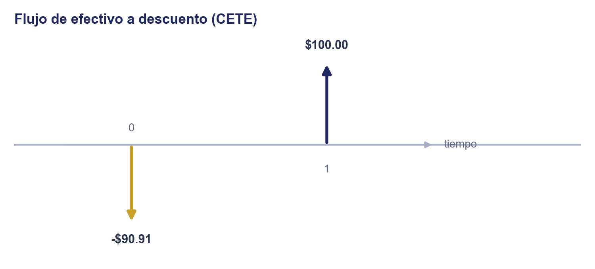
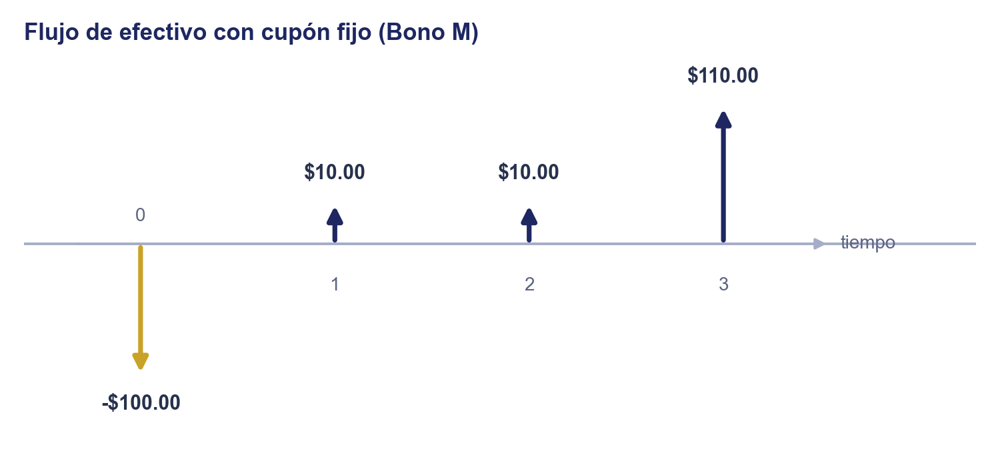
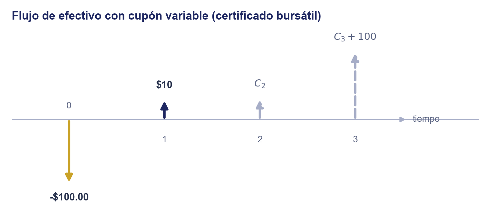
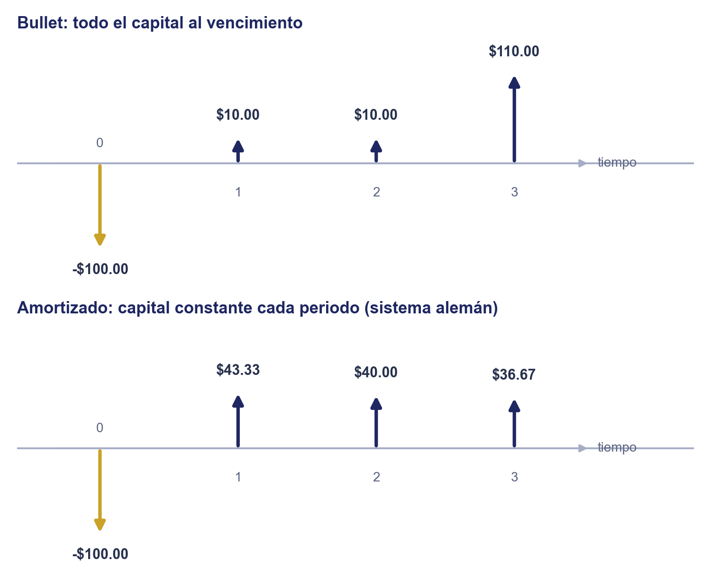

# Unidad 2 · Características del Mercado de Deuda

**Mercados de Deuda y Capitales**, Licenciatura en Comercio y Finanzas Internacionales, Universidad Autónoma de Zacatecas

## Objetivo de la unidad

Que el estudiante distinga las características del mercado de deuda (quién emite, a qué plazo y cómo paga) frente a las de otros mercados financieros.

## Contenido

|     | Tema                                                                | Qué cubre                                                                                                          |
| --- | ------------------------------------------------------------------- | ------------------------------------------------------------------------------------------------------------------ |
| I   | Desfase ahorro-proyecto: deuda o participación de capital           | Por qué existe el financiamiento, y la primera decisión: prometer un pago fijo o ceder parte del negocio           |
| II  | Deuda directa o indirecta: por qué este mercado prescinde del banco | Emitir el título uno mismo frente a pedirle el crédito a un banco, y por qué esta unidad vive del lado directo     |
| III | Qué es un instrumento de deuda                                      | Vocabulario común: capital, cupón, valor nominal, plazo; mecánicas de pago y de amortización de capital            |
| IV  | Las mecánicas de pago como vector de flujos                         | Descuento, cupón fijo, cupón variable, bullet y amortización, cada uno construido y dibujado como vector de flujos |
| V   | Cómo se coloca y se negocia la deuda                                | Subasta gubernamental, oferta pública, colocación privada, y el mercado secundario donde se revende después        |
| VI  | Tres preguntas para caracterizar cualquier instrumento de deuda     | Quién emite, a qué plazo, cómo paga: vista previa de los 6 instrumentos mexicanos y su análogo en EUA              |

> La práctica de este tema está en [`practica_unidad2.md`](../../practicas/unidad2/practica_unidad2.md).

---

### 1. Desfase ahorro-proyecto: deuda o participación de capital

Hay quien tiene un proyecto y no tiene el dinero para realizarlo; hay quien tiene el dinero y, por ahora, no tiene dónde ponerlo a trabajar. El mercado financiero existe para cerrar ese desfase entre ahorro y proyecto de inversión, la misma intermediación entre unidades superavitarias y deficitarias que presentó [`1_intermediacion_financiera.md`](../unidad1/1_intermediacion_financiera.md#1-intermediación-financiera).

Cerrar ese desfase, sin embargo, no fija todavía los términos del trato. Si tienes el proyecto y consigues quien te dé el dinero, la primera decisión no es institucional (a quién acudir), es contractual: ¿se lo pides prestado, o lo haces tu socio? Esa disyuntiva, deuda o participación de capital, es el criterio que divide toda la materia en dos: esta unidad recorre el lado de la deuda, la Unidad 3 (Mercado de Capitales, en el sentido de participación) recorrerá el lado de la participación. Cuatro rasgos del trato cambian según el lado que se elija:

| Rasgo     | Deuda                                                                                                                 | Participación de capital                                                                       |
| --------- | --------------------------------------------------------------------------------------------------------------------- | ---------------------------------------------------------------------------------------------- |
| Flujo     | Fijo: un monto pactado desde el inicio (cupón, capital), sin importar el desempeño del proyecto, salvo incumplimiento | Residual: lo que sobra después de cubrir a todos los demás compromisos, incluida la deuda      |
| Prelación | Cobra primero si el emisor se liquida                                                                                 | Cobra al final, solo si sobra algo después de pagar a todos los acreedores                     |
| Control   | Ninguno: el tenedor no vota ni participa en las decisiones del proyecto mientras se le pague                          | Voto y voz en las decisiones, proporcional a la parte del capital que se posea                 |
| Horizonte | Definido: la relación termina en la fecha de vencimiento pactada                                                      | Indefinido: dura mientras la empresa exista, o hasta que el socio venda su parte a alguien más |

Por prometer un flujo fijo y cobrar antes que el socio, la deuda es la opción de menor riesgo para quien presta el dinero, pero también la de menor participación en las ganancias del proyecto si a este le va excepcionalmente bien: un tenedor de deuda no gana más porque el negocio prospere, un socio sí.

> **Cuidado con el nombre.** La Unidad 3 de este curso se llama "Mercado de Capitales", pero ahí ese nombre usa el criterio de esta sección (solo instrumentos de participación: acciones, FIBRAs, CKD, CERPIs), no el de plazo de la Unidad 1. Un Bono M es "mercado de capitales" por su plazo largo ([`0_activo_financiero.md`](../unidad1/0_activo_financiero.md#3-mercado-de-dinero-y-mercado-de-capitales)) pero sigue siendo mercado de deuda, no mercado de capitales en el sentido de la Unidad 3. En estas notas, "mercado de capitales" sin calificar siempre usa el criterio de plazo; al criterio de esta sección se le llama aquí **mercado de participación** o **mercado accionario**, precisamente para no chocar con el nombre de la Unidad 3.
>
> **Ejemplo resuelto.** Un Bono M a 10 años: por plazo es mercado de capitales (Unidad 1); por tipo de promesa de pago (esta sección) es mercado de deuda, porque paga un cupón fijo pactado desde la emisión y su tenedor no tiene voto en las decisiones del Gobierno Federal ni en cuándo termina esa relación. Los dos criterios conviven sin contradecirse, solo responden preguntas distintas.

### 2. Deuda directa o indirecta: por qué este mercado prescinde del banco

Elegido el lado de la deuda, queda una segunda pregunta: ¿a quién se la pides? [`1_intermediacion_financiera.md`](../unidad1/1_intermediacion_financiera.md#2-deuda-directa-indirecta-y-capital) ya distinguió las dos rutas: pedirla **indirectamente**, a un banco que capta de muchos ahorradores y absorbe el riesgo de crédito por ti, o pedirla **directamente**, emitiendo tú mismo un título que el público inversionista compra sin que nadie más absorba ese riesgo en medio.

Los seis instrumentos de esta unidad, sin excepción, están del lado directo: un CETE, un Bono M o un certificado bursátil los coloca el propio emisor (Gobierno Federal o empresa) con el inversionista final; si el emisor incumple, la pérdida es del inversionista, no de un banco intermediario. Un crédito bancario no aparece como instrumento propio de esta unidad, pero no porque su análisis sea distinto: en lo estructural sigue siendo el mismo problema que resuelve el resto de esta nota (un flujo prometido a cambio de un capital, a un plazo dado, con un riesgo de que no se cumpla); lo único que cambia es el canal y quién absorbe ese riesgo, la intermediación indirecta que ya cubrió Unidad 1.

¿Por qué un emisor elegiría prescindir del banco? Porque un banco cobra por absorber el riesgo de crédito: la diferencia entre lo que le paga al ahorrador y lo que le cobra al deudor es su margen financiero ([`1_intermediacion_financiera.md`](../unidad1/1_intermediacion_financiera.md#3-el-ciclo-de-captación-colocación)). Un emisor lo bastante grande y conocido para que el público inversionista le preste directamente puede evitarse ese margen y financiarse más barato que con un crédito bancario; a cambio, asume el costo de emitir (prospecto, calificación, colocación) que un crédito bancario no exige. Esa es la disyuntiva que resuelve, para el Gobierno Federal y para una empresa privada, cada uno de los instrumentos de esta unidad.

### 3. Qué es un instrumento de deuda

Un **instrumento de deuda** (también llamado de **renta fija**) es un flujo de efectivo fijo salvo por variaciones debidas a circunstancias contingentes bien definidas, como un cupón indexado a una tasa de referencia: el emisor promete ese calendario de pagos (determinístico o no), y el instrumento no es más que ese flujo.

Recordemos el vocabulario que adoptamos para instrumentos de deuda:

- **Capital (principal, $v_0$):** el monto originalmente prestado; es el mismo $v_0$ al momento de la emisión, no el cupón ($c$).
- **Valor nominal ($v_N$):** el monto de referencia sobre el que se calculan los pagos, y el monto que se liquida al vencimiento.
- **Cupón ($c$):** el pago periódico de interés que promete el emisor. La **tasa cupón** es ese pago expresado como porcentaje del valor nominal.
- **Plazo (vencimiento):** la fecha en que el emisor debe liquidar el valor nominal, junto con el último cupón si lo hay.

Con ese vocabulario, cualquier instrumento de deuda se caracteriza por dos decisiones de diseño independientes: cómo paga interés y cómo liquida el capital.

**Cómo paga interés**, según Mishkin hay tres mecánicas:

- **A descuento (o cupón cero):** no paga ningún cupón. Se compra por debajo del valor nominal y se cobra el valor nominal completo al vencimiento; la ganancia es esa diferencia.
- **Con cupones periódicos, cupón fijo:** paga el mismo cupón $c$ cada periodo, pactado desde la emisión.
- **Con cupones periódicos, cupón variable (flotante):** paga un cupón que se recalcula cada periodo según una tasa de referencia vigente (típicamente la TIIE), así que a diferencia de las otras dos mecánicas, no es completamente determinístico: el cupón más próximo suele estar ya fijo (se determinó en el último reseteo), pero los siguientes dependen de una tasa que todavía no se conoce.

**Cómo liquida el capital**, hay dos mecánicas:

- **Bullet:** todo el valor nominal se liquida de golpe, junto con el último cupón si lo hay. Es la mecánica de los seis instrumentos mexicanos de esta unidad.
- **Con amortización de capital:** el capital se reparte en abonos antes del vencimiento (sistema francés, sistema alemán, fondo de amortización o *sinking fund*), como un crédito hipotecario o un préstamo de auto. Ningún instrumento de esta unidad usa esta mecánica, pero conviene nombrarla porque Fabozzi la documenta como otra característica más de los bonos, y porque cierra los cuatro tipos de instrumento de crédito de Mishkin.

Las fórmulas de precio de cada una de estas mecánicas (a partir del valor presente de un flujo único y de la anualidad de [`4_ciencia_inversion.md`](../unidad1/4_ciencia_inversion.md)) se calculan a fondo, con datos reales de mercado, en [`2_valuacion_instrumentos_deuda.md`](2_valuacion_instrumentos_deuda.md).

> **Ejemplo resuelto.** Un CETE a 28 días con valor nominal \$10 se compra hoy en \$9.95 y no paga nada más hasta el vencimiento, cuando el gobierno paga los \$10 completos: es a descuento, bullet, la ganancia es \$0.05 (el precio exacto, a partir de la tasa de la subasta, se calcula en [`2_valuacion_instrumentos_deuda.md`](2_valuacion_instrumentos_deuda.md#1-valuación-a-descuento)). Un Bono M paga una tasa cupón fija cada seis meses durante toda su vida, más el valor nominal el día del vencimiento: es cupón fijo, bullet. Un certificado bursátil también puede pagar cupones periódicos de cupón variable referenciado a la TIIE de fondeo: cada cupón depende de la tasa vigente ese periodo, no de una tasa fija pactada desde la emisión, aunque también liquida el capital bullet.

*Fuente: Luenberger, D. G. (2013). Investment Science (2ª ed.). Oxford University Press. Cap. 3, "Fixed-Income Securities", pp. 42-43: definición de instrumento de deuda como flujo de efectivo. Mishkin, F. S. y Eakins, S. G. (2014). Financial Markets and Institutions (8ª ed.). Pearson. Cap. 3, "What Do Interest Rates Mean and What Is Their Role in Valuation?", "Four Types of Credit Market Instruments", p. 39. Fabozzi, F. J. (2009). Capital Markets, Financial Management, and Investment Management. Wiley. Cap. 19, "Bond Portfolio Management", "Features of Bonds", "Coupon Rate" y "Provisions for Paying off Bonds", pp. 681-685.*

### 4. Las mecánicas de pago como vector de flujos

La sección anterior describió cada mecánica de pago con palabras. Dicho con números, cualquier instrumento de deuda es un **vector de flujos** $(c_0, c_1, \ldots, c_N)$: un monto por cada periodo entre la compra ($t=0$) y el vencimiento ($t=N$), negativo si sale de tu bolsillo, positivo si entra. El primer monto es siempre la compra, $c_0=-v_0$; lo que distingue una mecánica de otra es, nada más, qué forma toma el resto del vector. Este es el mismo vector que [`2_valuacion_instrumentos_deuda.md`](2_valuacion_instrumentos_deuda.md) va a descontar término por término para llegar al precio; aquí solo se construye y se dibuja, todavía sin poner una tasa de por medio.

**A descuento.** Un solo flujo distinto de cero, el valor nominal al vencimiento:

$$(c_0, c_1, \ldots, c_N) = (-v_0,\ 0,\ \ldots,\ 0,\ v_N)$$

Construirlo es una sola decisión: cuánto se paga hoy ($v_0$) por recibir un monto ya fijo ($v_N$) al final, sin nada en medio. El diagrama tiene, por eso, solo dos flechas: una hacia abajo en $t=0$, una hacia arriba en $t=N$.

**Cupón fijo.** El mismo cupón $c$ se repite cada periodo, y el último periodo además liquida el valor nominal:

$$(c_0, c_1, \ldots, c_N) = (-v_0,\ c,\ c,\ \ldots,\ c,\ c+v_N)$$

Construirlo agrega un paso al anterior: entre $t=0$ y $t=N$ aparece una flecha del mismo tamaño ($c$) en cada periodo intermedio, y solo la última flecha crece, porque ahí se suman dos cosas que llegan el mismo día: el último cupón y el valor nominal. El diagrama lo muestra directo: una fila de flechas parejas, y una última flecha más alta que las demás.

**Cupón variable.** El cupón más próximo ya quedó fijo desde el último reseteo, así que ese sí es un número; los siguientes dependen de una tasa de referencia que todavía no existe, así que son inciertos:

$$(c_0, c_1, \ldots, c_N) = (-v_0,\ c_1,\ C_2,\ \ldots,\ C_{N-1},\ C_N+v_N)$$

La mayúscula en $C_2, \ldots, C_N$ no es un capricho de notación: marca justo la diferencia con los dos vectores anteriores, siguiendo la misma regla que ya distingue un dato cierto de una variable aleatoria en esta unidad. Construir este vector es, entonces, dibujar la primera flecha como las de un cupón fijo (ya se conoce) y las siguientes con una línea punteada, porque su tamaño todavía no existe; solo se sabrá conforme se cumplan las fechas de reseteo.

**Bullet frente a amortización de capital.** No son mecánicas de interés, son dos formas distintas de acomodar el capital dentro del mismo vector. Bullet concentra todo el capital en el último flujo (el mismo vector de cupón fijo de arriba); amortizar lo reparte en abonos $k_t$ a lo largo de la vida del instrumento, junto con el interés que corresponde al saldo insoluto de ese periodo:

$$(c_0, c_1, \ldots, c_N) = (-v_0,\ k_1+rs_0,\ k_2+rs_1,\ \ldots,\ k_N+rs_{N-1}) \qquad \left(\textstyle\sum_{t=1}^N k_t = v_0\right)$$

Construir el vector amortizado es, paso a paso: decidir el calendario de abonos $k_t$ (constante en el sistema alemán, calculado para que el pago total sea constante en el sistema francés), calcular el interés de cada periodo sobre lo que todavía se debe ($rs_{t-1}$), y sumar ambas partes flujo por flujo. El diagrama deja ver la diferencia de un vistazo: el vector bullet es plano y termina en una flecha mucho más alta que las demás; el vector amortizado no tiene ese pico final, sus flechas ya vienen repartidas (y, en el sistema alemán, decrecen, porque el interés baja conforme baja el saldo insoluto). Ninguno de los seis instrumentos de esta unidad usa amortización, todos son bullet; el vector amortizado se construye aquí solo para completar el panorama de mecánicas de Fabozzi y de Mishkin.

*Fuente: Fabozzi, F. J. (2009). Capital Markets, Financial Management, and Investment Management. Wiley. Cap. 19, "Bond Portfolio Management", "Features of Bonds" y "Provisions for Paying off Bonds", pp. 679-685: el flujo de un bono representado como vector, y las variantes de amortización de capital.*

### 5. Cómo se coloca y se negocia la deuda

Ya establecido que esta unidad es toda deuda directa (sección 2), queda ver cómo se emite y se negocia en la práctica. El mercado de deuda cumple dos funciones económicas distintas, y esa función es justamente el criterio de plazo de la Unidad 1 ([`0_activo_financiero.md`](../unidad1/0_activo_financiero.md#3-mercado-de-dinero-y-mercado-de-capitales)):

- **Mercado de dinero (corto plazo):** administra necesidades de liquidez inmediata. El Gobierno Federal cubre faltantes temporales de caja entre lo que recauda y lo que gasta; una empresa financia capital de trabajo (nómina, inventario) sin comprometerse a un plazo largo. Banxico, además, usa este mismo mercado como herramienta de política monetaria: compra y vende CETES a los bancos en **operaciones de mercado abierto** para inyectar o retirar liquidez del sistema bancario y así mantener su tasa de referencia en el nivel que decide.
- **Mercado de capitales, en su vertiente de deuda (largo plazo):** financia proyectos que tardan años en pagarse solos. El Gobierno Federal financia déficit presupuestal plurianual; una empresa financia una planta, una expansión o una adquisición.

Quién emite determina el canal de colocación primaria:

- **Deuda gubernamental:** Banxico, como agente financiero del Gobierno Federal, coloca CETES, Bonos M y UDIBONOS (y también Bondes, un cuarto instrumento de cupón variable que existe en el mismo mercado pero que esta unidad no cubre a fondo) en una **subasta primaria** semanal (con calendario público), a la que solo pueden postular directamente los **Formadores de Mercado**, un grupo de bancos y casas de bolsa autorizados; el resto de los inversionistas participa a través de ellos.
- **Deuda corporativa:** una empresa coloca papel comercial, bonos corporativos o certificados bursátiles de dos formas. La **oferta pública** requiere autorización de la CNBV, prospecto de colocación y una casa de bolsa que la suscriba (underwriting, ver [`3_mecanica_mercado.md`](../unidad1/3_mecanica_mercado.md#2-quién-interviene-bmv-biva-casas-de-bolsa-indeval)); la **colocación privada** se coloca directamente entre inversionistas institucionales calificados, sin oferta pública, lo que la hace más rápida y barata pero también menos líquida en el secundario.

> **Ejemplo resuelto.** El Banco Centroamericano de Integración Económica (BCIE) colocó en 2026 un certificado bursátil de hasta \$3,000 millones de pesos a un plazo de 3.5 años, con cupón cada 28 días referenciado a la TIIE de fondeo a 28 días más una sobretasa, y amortización bullet (todo el capital en un solo pago) al vencimiento en 2029. Es exactamente el canal de colocación privada/institucional: no es una subasta gubernamental ni una oferta pública al gran público inversionista.

Colocada la deuda, el mercado secundario donde se revende es mayoritariamente de mostrador (over the counter), como documentan los propios manuales operativos de la BMV: bancos y casas de bolsa negocian entre sí en sus mesas de dinero, no en un libro de órdenes público como el de una acción en la bolsa. Esos mismos manuales son donde la BMV documenta qué tan líquido es cada instrumento, un punto que se retoma a fondo como riesgo de liquidez en [`3_riesgos_mercado_deuda.md`](3_riesgos_mercado_deuda.md#4-riesgo-de-liquidez). Para que ese mercado disperso tenga un precio de referencia diario, existen **proveedores de precios** (empresas especializadas, autorizadas por la CNBV) que publican el precio de valuación de cada instrumento en circulación; ese precio es el insumo que un banco o una Siefore usa para valorar su portafolio de deuda todos los días, y el punto de partida de la valuación que se estudia en [`2_valuacion_instrumentos_deuda.md`](2_valuacion_instrumentos_deuda.md).

Dos cifras ilustran el tamaño y la forma de este mercado a inicios de septiembre de 2026: en la subasta del 1 de septiembre, el CETE a 28 días rindió 6.49%, prácticamente igual a la tasa de referencia de Banxico (6.50%) porque es casi el mismo plazo que decide la política monetaria; el Bono M a 10 años, en cambio, cotizaba en el mercado secundario en un rango de 8.5%-9.3% durante 2026, muy por encima de la tasa de corto plazo, porque un inversionista exige más rendimiento por comprometer su dinero una década en vez de 28 días.

*Fuente: Mishkin, F. S. y Eakins, S. G. (2014). Financial Markets and Institutions (8ª ed.). Pearson. Cap. 11, "The Money Markets" y Cap. 12, "The Bond Market": función económica del mercado de deuda de corto y largo plazo, y su mecánica de colocación y negociación.*

### 6. Tres preguntas para caracterizar cualquier instrumento de deuda

Con lo visto en esta nota, cualquier instrumento de deuda queda caracterizado con tres preguntas:

1. **¿Quién emite?** Gobierno federal o empresa privada; en esta unidad, siempre deuda directa (sección 2).
2. **¿A qué plazo?** Corto (mercado de dinero) o largo (mercado de capitales), por el criterio de plazo de la Unidad 1.
3. **¿Cómo paga?** A descuento o con cupones periódicos, fijos o variables (secciones 3 y 4).

| Instrumento          | ¿Quién emite?      | ¿A qué plazo? | ¿Cómo paga?                                          | Análogo en EUA                                                                 |
| -------------------- | ------------------ | ------------- | ---------------------------------------------------- | ------------------------------------------------------------------------------ |
| CETE                 | Gobierno federal   | Corto         | A descuento                                          | Treasury bill                                                                  |
| Bono M               | Gobierno federal   | Largo         | Cupones periódicos, cupón fijo                       | Treasury note / Treasury bond                                                  |
| UDIBONO              | Gobierno federal   | Largo         | Cupones periódicos, cupón fijo (en UDIs)             | Treasury Inflation-Protected Securities (TIPS)                                 |
| Bono corporativo     | Empresa privada    | Largo         | Cupones periódicos, fijos o variables                | Corporate bond                                                                 |
| Papel comercial      | Empresa privada    | Corto         | A descuento                                          | Commercial paper                                                               |
| Certificado bursátil | Empresa o gobierno | Corto o largo | Cupones periódicos (o descuento en emisiones cortas) | Sin equivalente exacto; el más cercano es el corporate bond / medium-term note |

La columna "Análogo en EUA" ubica cada instrumento mexicano dentro de la taxonomía de instrumentos de deuda que usan los libros de texto del curso, mayormente centrados en el mercado estadounidense.

> Esta tabla es solo una vista previa: la siguiente nota, [`1_instrumentos_deuda.md`](1_instrumentos_deuda.md), responde estas tres preguntas a fondo para cada uno de estos seis instrumentos, incluyendo por qué UDIBONO y Bono M pagan distinto aunque comparten emisor y plazo.

---

## Fuentes y referencias recomendadas

- Mishkin, F. S. y Eakins, S. G. (2014). *Financial Markets and Institutions* (8ª ed.). Pearson. Cap. 2, "Overview of the Financial System", "Debt and Equity Markets" (p. 18) y "Money and Capital Markets" (p. 20): los dos criterios de clasificación de mercados financieros. Cap. 11, "The Money Markets" y Cap. 12, "The Bond Market": función económica del mercado de deuda de corto y largo plazo, y su mecánica de colocación y negociación. Cap. 3, "What Do Interest Rates Mean and What Is Their Role in Valuation?", "Four Types of Credit Market Instruments", p. 39: los cuatro tipos de instrumento de crédito según su flujo (préstamo simple, préstamo de pago fijo amortizado, bono con cupón, bono a descuento).
- Fabozzi, F. J. (2009). *Capital Markets, Financial Management, and Investment Management*. Wiley. Cap. 19, "Bond Portfolio Management", "Features of Bonds", p. 679: vocabulario de valor nominal, cupón y plazo. "Coupon Rate" y "Provisions for Paying off Bonds", pp. 681-685: cupón variable/flotante y estructura de amortización del principal.
- Luenberger, D. G. (2013). *Investment Science* (2ª ed.). Oxford University Press. Cap. 3, "Fixed-Income Securities", pp. 42-46: definición de instrumento de deuda como flujo de efectivo (p. 42) y taxonomía de instrumentos de deuda estadounidenses usada como análogo de los instrumentos mexicanos ("The Market for Future Cash", pp. 43-46).
- Banco de México: ficha técnica y mecánica de CETES, Bonos M, UDIBONOS y Bondes; resultados de subasta de valores gubernamentales y calendario de subastas; operaciones de mercado abierto como instrumento de política monetaria; consultado el 3 de septiembre de 2026 para las tasas citadas en la sección 5.
- Portal BMV: manuales operativos y sección educativa sobre el funcionamiento del mercado secundario, la liquidez de los instrumentos y la estructura de emisiones corporativas (certificados bursátiles) y gubernamentales; prospectos de colocación (ejemplo del BCIE citado en la sección 5).
- Manuales para inversionistas de casas de bolsa e instituciones financieras (por ejemplo, BBVA y Skandia): perfil de riesgo conservador, mecánica de pago de cupón (fijo, variable o real) y derechos legales del tenedor de deuda frente al accionista (prioridad de cobro).

---

## Cierre de la unidad — Lo esencial para recordar

- El desfase entre quien tiene un proyecto y quien tiene el ahorro se cierra de dos formas: **deuda** (flujo fijo, prelación, sin control, horizonte definido) o **participación de capital** (flujo residual, cobra al final, con voto, sin horizonte). Esta unidad recorre solo el lado de la deuda.
- Del lado de la deuda, se puede pedir **directamente** al mercado (el emisor coloca su propio título, el inversionista asume el riesgo) o **indirectamente** a un banco (el banco absorbe el riesgo y cobra un margen por hacerlo, Unidad 1). Los seis instrumentos de esta unidad son todos deuda directa.
- Un **instrumento de deuda (renta fija)** se caracteriza por dos decisiones de diseño independientes: cómo paga interés (**a descuento**, **cupón fijo** o **cupón variable**) y cómo liquida el capital (**bullet**, todo de golpe al vencimiento, o **con amortización de capital**, repartido antes). Los seis instrumentos de esta unidad son todos bullet.
- Cualquier instrumento de deuda es, en números, un **vector de flujos** $(c_0, c_1, \ldots, c_N)$ con $c_0=-v_0$: a descuento (un solo flujo final), cupón fijo (flujos iguales más un último flujo mayor), cupón variable (los primeros flujos ciertos, los siguientes en mayúscula porque son inciertos) y bullet o amortizado (todo el capital al final, o repartido en abonos $k_t$ a lo largo del vector).
- El Gobierno Federal coloca su deuda en **subasta primaria** (vía Banxico y los Formadores de Mercado); una empresa la coloca por **oferta pública** (autorizada por la CNBV) o **colocación privada**; después, casi todo se revende en un mercado secundario de **mostrador**, con precio de referencia diario de un **proveedor de precios**.
- Cualquier instrumento de deuda se caracteriza con tres preguntas: quién emite, a qué plazo, y cómo paga.

**Próxima sesión:** instrumentos concretos del mercado de deuda mexicano (CETES, Bonos M, UDIBONOS, bonos corporativos, papel comercial, certificados bursátiles), respondiendo estas tres preguntas para cada uno.
