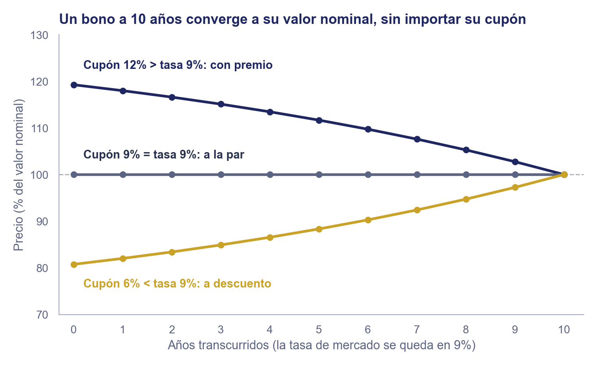
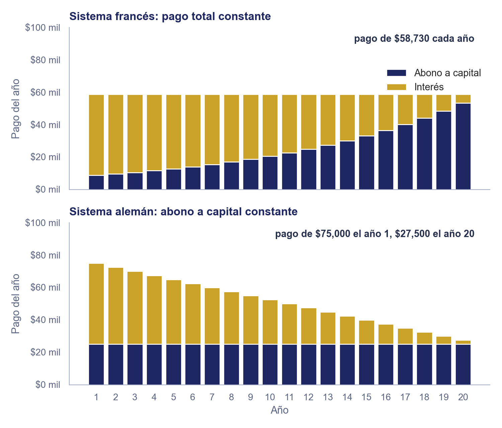

# Unidad 2 · Valuación de Instrumentos de Deuda

**Mercados de Deuda y Capitales**, Licenciatura en Comercio y Finanzas Internacionales, Universidad Autónoma de Zacatecas

## Objetivo de la unidad

Que el estudiante calcule el precio de un instrumento de deuda a partir de sus flujos y su valor nominal.

## Contenido

|     | Tema                                    | Qué cubre                                                              |
| --- | --------------------------------------- | ---------------------------------------------------------------------- |
| I   | Valuación a descuento                   | CETE y papel comercial: la convención de mercado día/360               |
| II  | Valuación con cupón fijo                | Bono M, UDIBONO y bono corporativo: anualidad más flujo único          |
| III | Valuación con cupón variable            | Por qué no hay fórmula cerrada, y qué sí se puede decir del precio     |
| IV  | Amortización de capital                 | Sistema francés, sistema alemán y fondo de amortización (sinking fund) |
| V   | Ejemplo integrador con datos de mercado | Precio de un CETE, un Bono M y un UDIBONO con tasas reales de 2026     |

> La práctica de este tema está en [`practica_unidad2.md`](../../practicas/unidad2/practica_unidad2.md).

---

### 1. Valuación a descuento

En septiembre de 2026, el CETE a 28 días rindió 6.13% en la subasta del 1 de septiembre y 6.25% en la del 15; el 21 de septiembre, el Bono M a 10 años rendía 9.16%. Hablar de "la" tasa de interés como si fuera un solo número deja de tener sentido en cuanto se pregunta a qué plazo: cada plazo trae su propio precio, y esta nota calcula ese precio a partir de la tasa que le corresponde a cada instrumento, empezando por el más simple.

Un instrumento a descuento (CETE, papel comercial) tiene un solo flujo distinto de cero, el valor nominal al vencimiento: el vector $(c_0, c_1, \ldots, c_N) = (-a,\ 0,\ \ldots,\ 0,\ v_N)$ ya construido y dibujado en [`0_mercado_e_instrumentos_deuda.md`](0_mercado_e_instrumentos_deuda.md#2-cómo-paga-un-instrumento-mecánicas-y-vector-de-flujos). Su precio, lo que se paga al comprarlo ($a$), es su valor presente $v_0$: exactamente la fórmula de valor presente de un flujo único de [`4_ciencia_inversion.md`](../unidad1/4_ciencia_inversion.md#6-valor-futuro-y-valor-presente-de-un-flujo-único), sección 6, con un solo periodo ($N=1$):

$$v_0 = v_N(1+r)^{-1}$$

El mercado mexicano de dinero no cotiza $r$ como una tasa por periodo cualquiera: cotiza una tasa nominal anual $r_{nom}$ y la prorratea al plazo exacto del instrumento con la convención día/360 (el estándar del mercado de dinero, no de calendario). Es la misma idea de $r_{per} = r_{nom}\times \Delta t$ de la sección 10 de [`4_ciencia_inversion.md`](../unidad1/4_ciencia_inversion.md#10-tasa-nominal-y-tasa-efectiva), aquí con $\Delta t = n/360$ ($n$ días de vida sobre 360, en vez de un subperiodo de capitalización) en el lugar de $\Delta t$. Sustituyendo $r$ por esa tasa periódica prorrateada, $r_{per}=r_{nom}\frac{n}{360}$:

$$v_0 = \dfrac{v_N}{1+r_{nom}\frac{n}{360}}$$

- **$r_{nom}$**: tasa de rendimiento anual cotizada en la subasta o el mercado secundario.
- **$n$**: número de días por vencer.
- **$v_N$**: valor nominal (\$10 en un CETE, el monto del pagaré en papel comercial).

> **Ejemplo resuelto.** Un CETE a 28 días, valor nominal \$10, se colocó en la subasta del 15 de septiembre de 2026 a una tasa de rendimiento de 6.25% anual.
> $v_0 = 10 / (1+0.0625\frac{28}{360}) = 10/1.004861 \approx \$9.9516$
>
> La ganancia del inversionista que lo conserva a vencimiento es $10 - 9.9516 = \$0.0484$ por cada CETE de \$10, exactamente el descuento que fija la tasa de la subasta.
>
> **En la práctica.** El resultado de la subasta se difunde como tasa de rendimiento, no como precio; el precio se deriva con esta fórmula. El 21 de septiembre de 2026, la tabla de CETES de cetesdirecto mostraba el plazo de un mes a 6.25% con precio de \$9.95, y el de tres meses (91 días) a 6.66% con precio de \$9.83: $10/(1+0.0666\frac{91}{360}) \approx \$9.8344$. La plataforma solo convierte la tasa en el precio que ve el inversionista.

### 2. Valuación con cupón fijo

Un instrumento con cupón fijo (Bono M, UDIBONO, bono corporativo a tasa fija) paga el mismo cupón $c$ cada periodo más el valor nominal al vencimiento: $(c_0, c_1, \ldots, c_N) = (-a,\ c,\ c,\ \ldots,\ c,\ c+v_N)$. Ese vector es la suma de dos flujos superpuestos: una anualidad de $c$ por periodo ([`4_ciencia_inversion.md`](../unidad1/4_ciencia_inversion.md#7-valor-presente-de-una-serie-de-flujos-anualidad), sección 7) y un flujo único de $v_N$ al final (sección 6, arriba). El valor presente de una suma de flujos es la suma de sus valores presentes:

$$v_0 = c\dfrac{1-(1+r)^{-N}}{r} + v_N(1+r)^{-N} \qquad (r \neq 0)$$

- **$c$**: cupón fijo por periodo.
- **$r$**: tasa de descuento (rendimiento de mercado) por periodo.
- **$N$**: número de periodos por vencer.
- **$v_N$**: valor nominal.

Tres casos se siguen directamente de comparar $c$ contra $r$: si $c = r$, $v_0 = v_N$ (el bono se valúa exactamente **a la par**); si $c < r$, $v_0 < v_N$ (**a descuento**, el mercado exige más de lo que paga el cupón); si $c > r$, $v_0 > v_N$ (**con premio**, sobre par).

Si la tasa de mercado no cambia, los tres bonos llegan al valor nominal en el vencimiento (convergencia a la par, o *pull to par*): el premio o el descuento es el valor presente de la diferencia entre el cupón y lo que exige el mercado, y esa diferencia tiene cada año menos periodos por cobrar.

> **Ejemplo resuelto.** Un Bono M con cupón fijo de 8% anual (simplificando a un solo pago anual en vez de los dos pagos semestrales reales, para no complicar el ejemplo), valor nominal \$100 y 10 años por vencer, se descuenta hoy a la tasa de mercado de ese plazo, aproximadamente 9% (el Bono M a 10 años rendía 9.16% el 21 de septiembre de 2026, según cetesdirecto).
> $v_0 = 8\dfrac{1-(1.09)^{-10}}{0.09} + 100(1.09)^{-10} \approx 8(6.4177) + 100(0.42241) \approx 51.34 + 42.24 = \$93.58$
>
> Como el cupón (8%) es menor que la tasa de mercado (9%), el bono se valúa a descuento: por debajo de su valor nominal de \$100.
>
> **En la práctica.** El mercado real no simplifica tres cosas que este ejemplo sí. Primero, según la descripción técnica de Banxico, el Bono M tiene valor nominal de \$100 y paga cupón cada 182 días, con intereses calculados sobre los días efectivos y base de 360: $c = v_N r_{cup}\dfrac{182}{360}$, con $r_{cup}$ la tasa cupón anual. Segundo, se cotiza el rendimiento al vencimiento, no el precio; el precio sale de descontar todos los flujos con el mismo factor por periodo, $1+r\dfrac{182}{360}$. Tercero, cuando ya corre un cupón, lo que se cotiza es el **precio limpio**, sin los intereses devengados de los $d$ días transcurridos, $v_N r_{cup}\dfrac{d}{360}$; al liquidar se suman y resulta el **precio sucio**.
>
> Banxico documenta el cálculo con un ejemplo oficial (con fechas del año 2000): un Bono M con cupón de 18% ($c = \$9.10$ por periodo), seis cupones por cobrar, 21 días transcurridos del cupón vigente y un rendimiento de 19%, es decir $R = 1+0.19\frac{182}{360} \approx 1.0961$. Se suman el primer cupón, los cinco siguientes como anualidad y el valor nominal descontado cinco periodos: $9.10 + 34.8466 + 63.2175 = 107.1641$. Ese valor corresponde a la próxima fecha de cupón; se descuentan los $161/182$ de periodo que faltan (el mismo factor $(1+r)^{-t}$ con $t$ fraccionario) y resulta el precio sucio, \$98.81269. Restar el interés devengado, $9.10 \times 21/182 = \$1.05$, da el precio limpio, \$97.76269.

### 3. Valuación con cupón variable

Un instrumento con cupón variable (certificado bursátil referenciado a TIIE) no tiene un vector de flujos completamente determinístico: $(c_0, C_1, C_2, \ldots, C_{N-1}, C_N+v_N)$, con cada $C_t$ dependiendo de la tasa de referencia vigente ese periodo. Sin un patrón constante ni flujos determinísticos no hay fórmula cerrada como la de la sección 2: valuar este instrumento significa proyectar o cubrir cada $C_t$ por separado.

Sí se puede afirmar algo del precio sin proyectar cada flujo. El cupón se recalcula en cada fecha de reseteo para igualar (aproximadamente) la tasa de mercado vigente, así que justo después de cada reseteo el instrumento vuelve a valuarse cerca de su valor nominal, por el mismo argumento de la sección 2 con $c \approx r$: un cupón que siempre se ajusta a la tasa de mercado no se aleja de la par por el nivel general de tasas. Entre reseteos, el precio sí puede desviarse un poco de la par, pero por otras razones (cambio en el riesgo de crédito del emisor, o en la sobretasa que el mercado exigiría para esa misma emisión hoy), no por el nivel general de tasas. El apéndice lo comprueba con una simulación de 10,000 escenarios de tasas.

> **Ejemplo resuelto.** El certificado bursátil del BCIE de [`0_mercado_e_instrumentos_deuda.md`](0_mercado_e_instrumentos_deuda.md#6-los-seis-instrumentos) paga TIIE de fondeo a 28 días (cercana a la tasa de referencia de Banxico, que se mantuvo en 6.50% en la decisión del 6 de agosto de 2026) más una sobretasa. En cada fecha de reseteo (cada 28 días), ese cupón vuelve a igualar la tasa de mercado vigente más la sobretasa pactada, así que el precio del certificado se mantiene cerca de su valor nominal durante toda su vida, a diferencia de un Bono M a 10 años, cuyo cupón queda fijo desde la emisión y por eso su precio sí se aleja de la par cuando cambian las tasas (sección 2).

### 4. Amortización de capital

Ningún instrumento mexicano de esta unidad amortiza capital antes del vencimiento (todos son bullet, sección 2 de [`0_mercado_e_instrumentos_deuda.md`](0_mercado_e_instrumentos_deuda.md#2-cómo-paga-un-instrumento-mecánicas-y-vector-de-flujos)), pero un crédito hipotecario, un préstamo de auto o una emisión corporativa con retiro programado sí lo hacen, y Fabozzi documenta las tres formas como otra característica más de los bonos. Todas comparten la misma estructura de saldo insoluto:

$$s_t = a - \sum_{i=1}^{t} k_i \qquad (s_0 = a)$$

donde $a$ es el capital prestado y $k_t$ el abono a capital del periodo $t$, con $\sum_{t=1}^{N} k_t = a$ (el capital completo se termina de pagar en $N$ periodos).

**Sistema francés (pago total constante):** cada pago $c$ es igual, resultado de despejar $c$ en la misma fórmula de anualidad de la sección 2 (con $v_N = 0$, porque no hay valor nominal residual al final: todo el capital ya se pagó en abonos; y con $v_0 = a$, porque el capital prestado es el valor presente de los pagos):

$$c = a\dfrac{r}{1-(1+r)^{-N}} \qquad (r \neq 0)$$

El abono a capital de cada periodo se obtiene restando el interés del periodo ($rs_{t-1}$) al pago total: $k_t = c - rs_{t-1}$. Como el saldo insoluto baja con el tiempo, el interés baja y el abono implícito sube, aunque el pago total se mantenga fijo.

> **Ejemplo resuelto.** Un crédito hipotecario de \$500,000 a 20 años, tasa fija de 10% anual, sistema francés.
> $c = 500{,}000\dfrac{0.10}{1-(1.10)^{-20}} \approx 500{,}000 \times 0.117459 \approx \$58{,}730$ cada año.
> Primer año: interés $= 0.10 \times 500{,}000 = \$50{,}000$; abono a capital $k_1 = 58{,}730 - 50{,}000 = \$8{,}730$; saldo insoluto $s_1 = 500{,}000-8{,}730=\$491{,}270$.
>
> **En la práctica.** Los bancos ofrecen este esquema con mensualidades fijas. A junio de 2026, BBVA México publicaba una hipoteca de tasa fija desde 9.15% a 5, 10, 15 o 20 años. Con los mismos \$500,000 a 20 años y periodos mensuales ($r_{per}=0.0915/12$, $N=240$): $c = 500{,}000\dfrac{0.0915/12}{1-(1+0.0915/12)^{-240}} \approx \$4{,}547$ al mes. El banco anuncia además el Costo Anual Total (CAT), que en su ejemplo era 13.3% sin IVA, calculado con una tasa de 11.20%. El CAT es la tasa interna de retorno de los flujos del crédito con todas sus comisiones y seguros, el mismo cálculo del rendimiento al vencimiento de [`2_rendimiento_y_curva_de_rendimientos.md`](2_rendimiento_y_curva_de_rendimientos.md#1-del-precio-al-rendimiento-ytm) aplicado a un préstamo; por eso supera a la tasa: lo que realmente se paga por el dinero recibido es más que el interés.

**Sistema alemán (abono a capital constante):** el abono $k_t = a/N$ es igual cada periodo, así que el pago total decrece porque el interés se cobra sobre un saldo insoluto cada vez menor:

$$\text{pago}_t = \dfrac{a}{N} + rs_{t-1}$$

> **Ejemplo resuelto.** Mismo crédito (\$500,000, 20 años, 10% anual), sistema alemán.
> $k = 500{,}000/20 = \$25{,}000$ cada año.
> Primer pago $= 25{,}000 + 0.10 \times 500{,}000 = \$75{,}000$; segundo pago $= 25{,}000 + 0.10 \times 475{,}000 = \$72{,}500$: el pago baja \$2,500 cada año, siempre por el mismo abono constante multiplicado por la tasa.

En el sistema francés el pago es parejo y el interés pesa más que el abono durante los primeros 13 años; en el alemán el abono es parejo, así que el pago arranca más alto y cae con el saldo.

**Fondo de amortización (sinking fund):** el emisor retira una fracción $k_t$ de la emisión cada periodo según un calendario pactado, no necesariamente uniforme (a diferencia del sistema alemán, donde $k_t$ sí es constante), y paga cupón solo sobre el saldo insoluto restante. La fórmula de precio es la misma idea que las dos anteriores, sumando cada pago descontado a su propio periodo:

$$v_0 = \sum_{t=1}^{N} \left(k_t + rs_{t-1}\right)(1+r)^{-t}$$

Es el mecanismo típico de una emisión corporativa que retira, por ejemplo, 10% del principal cada año durante los primeros años y el resto al vencimiento, en vez de repartirlo en partes exactamente iguales como el sistema alemán.

### 5. Ejemplo integrador con datos de mercado

Con las fórmulas de las secciones 1 y 2, se valúan los tres instrumentos gubernamentales con las tasas publicadas el 21 de septiembre de 2026 y se comparan con el precio que publica cetesdirecto ese mismo día:

| Instrumento     | Fórmula que aplica                                            | Datos                                                         | Precio calculado                | Precio publicado (21 sep 2026)   |
| --------------- | ------------------------------------------------------------- | ------------------------------------------------------------- | ------------------------------- | -------------------------------- |
| CETE 28 días    | Sección 1 (descuento)                                         | $v_N =$ \$10, $r_{nom} = 6.25\%$, $n = 28$                    | ≈ \$9.9516                      | \$9.95 (tasa 6.25%)              |
| Bono M 10 años  | Sección 2 (cupón fijo), simplificado a un pago anual          | $c =$ \$8, $v_N =$ \$100, $r \approx 9\%$, $N = 10$           | ≈ \$93.58 (a descuento)         | \$96.40 (tasa 9.16%)             |
| UDIBONO 10 años | Sección 2 (cupón fijo), en UDIs, simplificado a un pago anual | $c = r = 4.75\%$ (a la par en UDIs), $v_N = 100$ UDIs, $N=10$ | 100 UDIs × \$8.82 ≈ \$882 pesos | \$838.79 pesos (tasa real 4.75%) |

El CETE coincide con el precio publicado porque la fórmula es exactamente la que usa la plataforma. Los otros dos no coinciden, y la diferencia enseña algo: el ejemplo simplificado supone un cupón de 8% pagado una vez al año, pero cada serie real tiene el suyo, fijado en la emisión, y lo paga cada 182 días. El UDIBONO del ejemplo se valuó a la par por suposición ($c=r$); el mercado publicó \$838.79, que dividido entre el valor de la UDI de ese día (\$8.818843) da 95.11 UDIs por cada 100 de valor nominal: por debajo de la par, porque el cupón real de esa serie es menor que el rendimiento real de 4.75% (sección 2). Convertirlo a pesos requiere multiplicar por el valor de la UDI del día, un paso adicional que ningún instrumento denominado en pesos necesita. El apéndice cuantifica cuánto de la diferencia se debe al cupón y cuánto a la frecuencia de pago.

---

## Apéndice: Verificación numérica con código y datos

Esta sección amplía el núcleo; no forma parte del objetivo ni se evalúa. Somete las fórmulas de la nota a pruebas en Python ([`codigo/`](codigo/)) y las contrasta con los precios publicados el 21 de septiembre de 2026 ([`datos/`](datos/)).

**Las fórmulas cumplen lo que la nota afirma.** `test_valuacion.py` reúne 29 pruebas, de las cuales las últimas diez fijan el comportamiento del modelo de tasas de la simulación. Las que importan para las fórmulas de esta nota son cinco:

- La fórmula cerrada de la sección 2 da lo mismo que descontar los flujos uno por uno.
- Un bono con $c=r$ vale $v_N$ a cualquier plazo, y con $c<r$ o $c>r$ vale menos o más que $v_N$.
- La función de precio de un Bono M reproduce el ejemplo oficial de Banxico de la sección 2: precio sucio de 98.81269 y limpio de 97.76269.
- Las tres tablas de amortización cierran el saldo en cero, suman $a$ en abonos y, descontados sus pagos a la tasa del crédito, valen exactamente $a$.
- El precio de un CETE a 28 y a 91 días coincide con el de la sección 1.

La sección 2 excluye $r=0$ porque divide entre $r$. ¿De dónde sale el límite? Para $r$ pequeña, $(1+r)^{-N}\approx 1-Nr$, así que $\frac{1-(1+r)^{-N}}{r}\approx N$ y

$$v_0 \to Nc + v_N \qquad (r \to 0)$$

es decir, sin descuento el bono vale la suma de sus flujos. La prueba lo verifica con $r=10^{-7}$ y comprueba que la función rechaza $r=0$. Las pruebas se corren desde la raíz del repositorio con `python -m pytest notas_unidades/unidad2/codigo -q`.

**Conciliación con el precio publicado.** Cetesdirecto publica la tasa y el precio de cada plazo. Para los CETES, la fórmula de la sección 1 reproduce el precio al centavo (\$9.9516 contra \$9.95 a un mes, \$9.8344 contra \$9.83 a tres meses). Para Bonos M y UDIBONOS no se conoce el cupón de la serie que la plataforma valúa, pero el precio es lineal en el cupón, así que se despeja el cupón que haría coincidir la fórmula con el precio publicado. ¿De dónde sale la fórmula? De despejar $c$ en la fórmula de precio de la sección 2, con $r_{per}=r_{nom}\frac{182}{360}$ la tasa de cada periodo de 182 días:

$$c = \dfrac{v_0 - v_N(1+r_{per})^{-N}}{\dfrac{1-(1+r_{per})^{-N}}{r_{per}}} \qquad (r_{per} \neq 0)$$

- **$c$**: cupón por periodo que se despeja, el que haría coincidir la fórmula con el precio publicado.
- **$v_0$**: precio publicado por la plataforma, en pesos para un Bono M y en UDIs para un UDIBONO.
- **$v_N$**: valor nominal (\$100 o 100 UDIs).
- **$r_{per}$**: tasa por periodo de 182 días, $r_{nom}\frac{182}{360}$.
- **$N$**: número de periodos de 182 días por vencer, dos por cada año del plazo.

La tasa de cupón anual es $\frac{c}{v_N}\times\frac{360}{182}$. El cálculo supone que el plazo por vencer es el plazo nominal ($N$ periodos de 182 días, dos por año) y que la liquidación cae en fecha de cupón, de modo que el precio limpio es el sucio. Cualquier otra diferencia con la serie real (su cupón exacto, su plazo por vencer, los días devengados) queda dentro del resultado, así que el cupón implícito es un diagnóstico y no el cupón de la emisión.

| Instrumento     | Rendimiento | Precio publicado | Cupón implícito |
| --------------- | ----------- | ---------------- | --------------- |
| Bono M 3 años   | 8.24%       | \$100.94         | 8.60%           |
| Bono M 5 años   | 9.00%       | \$98.90          | 8.72%           |
| Bono M 10 años  | 9.16%       | \$96.40          | 8.61%           |
| Bono M 20 años  | 9.64%       | \$86.34          | 8.09%           |
| Bono M 30 años  | 9.87%       | \$84.22          | 8.22%           |
| UDIBONO 3 años  | 3.99%       | 99.95 UDIs       | 3.97%           |
| UDIBONO 10 años | 4.75%       | 95.11 UDIs       | 4.14%           |
| UDIBONO 30 años | 4.90%       | 86.95 UDIs       | 4.07%           |

Los cupones implícitos de los Bonos M quedan entre 8.1% y 8.7%, cerca del 8% del ejemplo de la sección 2, y los de los UDIBONOS rondan 4%. Coincide con lo visto en la sección 5: el UDIBONO a 10 años vale menos de 100 UDIs porque su cupón implícito (4.14%) es menor que su rendimiento real (4.75%), mientras que el de 3 años, con cupón implícito de 3.97% y rendimiento de 3.99%, vale casi la par.

Para el Bono M a 10 años, la diferencia entre el \$93.58 del ejemplo y el \$96.40 publicado se descompone cambiando un supuesto a la vez, en este orden:

| Paso                                                        | Precio  | Cambio |
| ----------------------------------------------------------- | ------- | ------ |
| Ejemplo de la sección 2 (cupón 8%, tasa 9%, pago anual)     | \$93.58 |        |
| Tasa publicada de 9.16%, todavía con pago anual             | \$92.61 | -0.97  |
| Pagos cada 182 días con base 360, todavía con cupón de 8%   | \$92.46 | -0.15  |
| Cupón implícito de 8.61%, que reproduce el precio publicado | \$96.40 | +3.94  |

El cupón explica más que toda la brecha; la tasa y la frecuencia de pago mueven el precio en sentido contrario y por mucho menos. El orden de los pasos cambia cuánto se atribuye a cada uno, no el total.

**Costo de las simplificaciones.** Las secciones 1 y 2 simplifican dos cosas que el mercado no: la base de días y la frecuencia del cupón. Cuánto pesa cada una:

| Simplificación                                                     | Precio simplificado | Precio con la convención | Diferencia |
| ------------------------------------------------------------------ | ------------------- | ------------------------ | ---------- |
| CETE a 28 días al 6.25%: base 365 en vez de 360                    | \$9.9523            | \$9.9516                 | \$0.0007   |
| CETE a 91 días al 6.66%: base 365 en vez de 360                    | \$9.8367            | \$9.8344                 | \$0.0022   |
| Bono M a 10 años, cupón 8%, tasa 9%: pago anual en vez de 182 días | \$93.58             | \$93.45                  | \$0.13     |

La base de días cambia el precio menos de un centavo por cada \$10, pero a 91 días redondea a \$9.84 con base 365 y a \$9.83 con base 360, y cetesdirecto publica \$9.83: los datos confirman la convención día/360. El pago anual en vez de cada 182 días mueve el precio de un bono de \$100 unos 13 centavos.

**Sistemas de amortización.** Para el crédito de la sección 4 (\$500,000, 20 años, 10% anual) y un fondo de amortización que retira 10% del capital cada año durante los años 1 a 5 y el 50% restante en el año 20:

| Sistema               | Primer pago | Último pago | Interés total | Pago total  |
| --------------------- | ----------- | ----------- | ------------- | ----------- |
| Francés               | \$58,730    | \$58,730    | \$674,596     | \$1,174,596 |
| Alemán                | \$75,000    | \$27,500    | \$525,000     | \$1,025,000 |
| Fondo de amortización | \$100,000   | \$275,000   | \$575,000     | \$1,075,000 |

El sistema alemán paga menos interés porque devuelve el capital antes, a cambio de un primer pago 28% mayor que el francés; el fondo de amortización termina con un pago final de \$275,000. Pagar más interés total no significa que el francés sea más caro: descontados al 10%, los tres esquemas valen exactamente \$500,000, y la diferencia está solo en cuándo se paga.

**Simulación: cupón fijo contra cupón variable.** La sección 3 argumenta con palabras que el precio de un instrumento con cupón variable se mantiene cerca de la par. Una simulación de Monte Carlo lo pone a prueba con 10,000 escenarios de tasas.

Las tasas se generan con el modelo de **Vasicek**, en el que la tasa corta no vaga sin rumbo sino que es atraída hacia un nivel de largo plazo $r_{lp}$ con una velocidad $\kappa$:

$$R_{k+1} = r_{lp} + (R_k - r_{lp})e^{-\kappa\Delta t} + \sigma\sqrt{\dfrac{1-e^{-2\kappa\Delta t}}{2\kappa}}\,Z_{k+1} \qquad (\kappa > 0)$$

- **$R_k$**: tasa corta vigente en la fecha de cupón $k$. Va en mayúscula porque es el único elemento del modelo que es incierto: todo lo demás son parámetros fijos.
- **$r_{lp}$**: nivel de largo plazo, la tasa hacia la que el proceso es atraído.
- **$\kappa$**: velocidad de reversión, en unidades de 1/año. Entre más grande, más rápido vuelve la tasa a $r_{lp}$.
- **$\sigma$**: volatilidad de la tasa, en puntos porcentuales anuales.
- **$\Delta t$**: fracción de año entre una fecha de cupón y la siguiente, $182/360$ aquí.
- **$Z_{k+1}$**: variable aleatoria normal estándar (media 0, varianza 1), independiente de un periodo a otro. Es la única fuente de azar.

¿De dónde sale la fórmula? Es la misma idea de un valor que se acerca a otro por un factor fijo cada periodo, la de $(1+r)^{-t}$ de la sección 1, aplicada a la distancia que separa a la tasa de su nivel de largo plazo: esa distancia se encoge en $e^{-\kappa\Delta t}$ cada paso, y lo que queda es lo que la lleva de vuelta. El tamaño del empujón aleatorio está escalado para que la varianza acumulada deje de crecer y se estacione en $\sigma^2/2\kappa$, en vez de dispararse como lo haría si cada periodo sumara su ruido al anterior sin nada que lo contuviera.

Los parámetros no son supuestos: se estiman por mínimos cuadrados con la tasa interbancaria mexicana a 3 meses, mensual de julio de 2001 a agosto de 2026. Salen $\kappa = 0.217$, que equivale a cerrar la mitad de la distancia en 3.2 años, y $\sigma = 1.24$ puntos porcentuales al año. El laboratorio [`laboratorio_calibracion.md`](../../practicas/unidad2/laboratorio_calibracion.md) explica cómo se estiman y, sobre todo, qué tan bien predicen.

El Bono M se valúa descontando los flujos que le quedan con la curva que el propio modelo implica, no aplicando la tasa corta a todos los plazos. Eso importa: bajo Vasicek, un movimiento de 100 puntos base en la tasa corta mueve el rendimiento a 10 años solo 41, porque el mercado sabe que el brinco de hoy se va a deshacer. Un modelo que moviera las dos por igual exageraría el riesgo de los plazos largos. El cupón del bono se fija en 9.13%, el que lo deja exactamente a la par con la curva de ese día, para que los dos instrumentos arranquen en el mismo punto.

Para el certificado,

$$V_k = v_N\left(1 - M_k\Delta t\sum_{j=1}^{N-k} p_j\right)$$

- **$V_k$**: precio del certificado en la fecha de cupón $k$. En mayúscula porque depende de $M_k$, que es incierto.
- **$v_N$**: valor nominal.
- **$M_k$**: margen acumulado en la fecha $k$, la diferencia entre la sobretasa que el mercado exigiría hoy a esa emisión y la que quedó pactada. Arranca en cero y en mayúscula porque es aleatorio.
- **$N$**: número total de cupones de la emisión; **$k$**: cupones ya transcurridos, así que quedan $N-k$.
- **$p_j$**: factor de descuento del modelo al plazo $j\Delta t$, evaluado en la tasa corta $R_k$ de ese escenario. Es el equivalente de $(1+r)^{-j}$ de la sección 2, pero con una tasa distinta para cada plazo en vez de una sola.
- **$\Delta t$**: la misma fracción de año de arriba.

¿De dónde sale la fórmula? Justo después de un reseteo el cupón ya iguala la tasa de referencia más la sobretasa pactada, así que lo único que separa al certificado de la par es el margen acumulado $M_k$, el cambio de la sobretasa que hoy exigiría el mercado a esa emisión respecto a la pactada: un flujo de $M_k\Delta t v_N$ por periodo que el certificado deja de pagar durante los $N-k$ periodos restantes. Ese flujo es la anualidad de la sección 2, sin valor nominal aparte, y se resta de $v_N$. El margen sigue su propio proceso, con volatilidad anual de 0.3 puntos porcentuales, y esa sí es un supuesto de orden de magnitud, no una estimación.

| Horizonte | Bono M: desviación | Bono M: 5% a 95% | Certificado: desviación | Certificado: 5% a 95% |
| --------- | ------------------ | ---------------- | ----------------------- | --------------------- |
| 1 año     | 3.55               | 95.16 a 106.92   | 1.89                    | 96.93 a 103.13        |
| 3 años    | 4.85               | 94.98 a 110.94   | 2.78                    | 95.39 a 104.59        |
| 5 años    | 4.86               | 95.34 a 112.31   | 2.80                    | 95.34 a 104.50        |

El Bono M se mueve alrededor del doble que el certificado a cualquier horizonte, que es lo que la sección 3 anticipaba. Dos detalles valen la pena. El primero es que la dispersión del Bono M deja de crecer después del tercer año, por dos razones que se suman: las tasas revierten a su nivel en vez de alejarse sin límite, y al bono le quedan cada vez menos años por vencer, la convergencia a la par de la sección 2. El segundo es que la mediana del Bono M sube a 104 en cinco años en vez de quedarse en 100. No es un error del cálculo: la curva del mercado del 21 de septiembre descontaba tasas más altas que las que el modelo estimado con 25 años de historia realmente entrega, y esa diferencia es la prima que paga un bono largo por el riesgo de tasa que carga, la preferencia por la liquidez que explica [`2_rendimiento_y_curva_de_rendimientos.md`](2_rendimiento_y_curva_de_rendimientos.md#4-la-curva-de-rendimientos-ubicar-un-bono). El certificado no la cobra, y por eso su mediana se queda plana.

El modelo anterior de esta simulación hacía vagar la tasa sin rumbo. Cambiarlo baja la desviación del Bono M a cinco años de 7.54 a 4.86 puntos: la mitad de lo que parecía ser el riesgo del instrumento era, en realidad, un artefacto del supuesto.

**Hasta dónde llega este modelo.** Vasicek tiene un solo factor, la tasa corta, así que toda la curva se mueve a partir de un solo número. Eso le alcanza para lo que hace aquí (comparar la dispersión de dos instrumentos) pero no para reproducir la curva completa de un día. Con el nivel anclado al plazo de 10 años, el resto de la curva queda así:

| Plazo    | Observado | Modelo | Error     |
| -------- | --------- | ------ | --------- |
| 3 años   | 8.24%     | 7.87%  | -0.37 pp  |
| 5 años   | 9.00%     | 8.37%  | -0.63 pp  |
| 10 años  | 9.16%     | 9.16%  | 0.00 pp   |
| 20 años  | 9.64%     | 9.87%  | +0.23 pp  |
| 30 años  | 9.87%     | 10.15% | +0.28 pp  |

Acierta a 10 años porque ahí se ancló, y en los demás plazos se queda corto hasta 63 puntos base: la curva que produce es más plana que la del mercado. Un solo factor da una sola forma de curva, y esa forma la fija $\kappa$. Hay una familia de modelos construidos justamente para levantar esa restricción, empezando por el de Hull y White, que convierte $r_{lp}$ en una función del tiempo elegida para reproducir la curva observada entera en vez de un punto. Brigo y Mercurio los recorren todos y advierten, sobre los de un solo factor, que suponer que toda la curva se mueve a partir de su punto inicial es un supuesto peligroso cuando lo que se valúa depende de cómo se mueven unos plazos respecto a otros. El laboratorio tiene el mapa de esa familia.

**Datos y reproducibilidad.** [`cetesdirecto_2026-09-21.csv`](datos/cetesdirecto_2026-09-21.csv) guarda las tasas y los precios publicados de la conciliación, y [`fred_tasas_mensual.csv`](datos/fred_tasas_mensual.csv) las series mensuales con las que se calibró el modelo, ambos con su fecha, para que las cifras de la nota no dependan de una consulta que cambia cada día. `analisis_valuacion.py` imprime las tablas de este apéndice, `calibracion.py` las del laboratorio y `generar_figuras.py` produce las figuras, todos con semilla fija y corridos desde la raíz del repositorio.

---

## Fuentes y referencias recomendadas

- Luenberger, D. G. (2013). *Investment Science* (2ª ed.). Oxford University Press: valuación de bonos a descuento y con cupón a partir del valor presente de sus flujos.
- Fabozzi, F. J. (2009). *Capital Markets, Financial Management, and Investment Management*. Wiley: fórmulas y ejemplos de amortización (sistema francés, sistema alemán, sinking fund).
- Banco de México: *Descripción técnica de los Bonos de Desarrollo del Gobierno Federal con tasa de interés fija*: valor nominal, cupón cada 182 días, intereses sobre días efectivos con base de 360, cotización por rendimiento, precio limpio y sucio, y el ejemplo oficial de valuación; consultada el 21 de septiembre de 2026.
- Banco de México: convención día/360 de los CETES, valor de la UDI, decisión de política monetaria del 6 de agosto de 2026 (tasa de referencia de 6.50%) y documento de apoyo para el cálculo del Costo Anual Total (CAT). Los resultados de las subastas del 1 y del 15 de septiembre de 2026 (CETE a 28 días: 6.13% y 6.25%) se consultaron en la prensa financiera y en cetes.app, porque el portal de subastas de Banxico carga sus tablas con JavaScript.
- Cetesdirecto: tablas de valores gubernamentales (CETES, Bonos y UDIBONOS) del 21 de septiembre de 2026, con el precio y la tasa publicados de cada plazo y el valor de la UDI (\$8.818843).
- BBVA México: hipoteca de tasa fija (tasa desde 9.15%, CAT de 13.3% sin IVA, plazos de 5 a 20 años y mensualidades fijas), con fecha de cálculo del 30 de junio de 2026.
- Mishkin, F. S. y Eakins, S. G. (2014). *Financial Markets and Institutions* (8ª ed.). Pearson: relación entre cupón, tasa de mercado y precio (a la par, a descuento, con premio).
- Vasicek, O. (1977). An equilibrium characterization of the term structure. *Journal of Financial Economics*, 5(2), 177-188: el modelo de tasa corta con reversión a la media que usa la simulación del apéndice, y la fórmula del precio del cupón cero que se deriva de él.
- Brigo, D. y Mercurio, F. (2006). *Interest Rate Models: Theory and Practice. With Smile, Inflation and Credit* (2ª ed.). Springer: la referencia estándar de modelación de tasas, de Vasicek a los modelos de mercado. De ahí salen la limitación de los modelos de un solo factor y la familia de extensiones que la corrigen.
- Federal Reserve Bank of St. Louis (FRED): series mensuales con las que se calibró el modelo, consultadas el 21 de septiembre de 2026. La tasa interbancaria mexicana a 3 meses y el rendimiento del bono mexicano a 10 años son el espejo que la OCDE publica en FRED, no la fuente primaria; el último dato de la serie de 10 años, 9.16%, coincide con el que cetesdirecto publicó ese mismo día.

---

## Cierre de la unidad — Lo esencial para recordar

- El precio de cualquier instrumento de deuda es el **valor presente de su vector de flujos**, la misma idea de [`4_ciencia_inversion.md`](../unidad1/4_ciencia_inversion.md) aplicada a instrumentos de deuda: **flujo único** para un instrumento a descuento (CETE, papel comercial), **anualidad más flujo único** para un instrumento con cupón fijo (Bono M, UDIBONO, bono corporativo).
- Comparar el cupón contra la tasa de mercado predice el precio sin calcularlo: $c=r$ da un bono **a la par**, $c<r$ da un bono **a descuento**, $c>r$ da un bono **con premio**.
- Un instrumento con **cupón variable** no tiene fórmula cerrada de precio (cada flujo es estocástico), pero como el cupón se reajusta a la tasa de mercado en cada reseteo, su precio se mantiene cerca de la par por esa razón, aunque sí puede desviarse por riesgo de crédito o cambios en la sobretasa.
- La **amortización de capital** (sistema francés, sistema alemán, sinking fund) reparte el capital antes del vencimiento en vez de pagarlo todo de golpe (bullet); ninguno de los seis instrumentos mexicanos de esta unidad la usa, pero es la mecánica de un crédito hipotecario o de auto.
- En el mercado real se cotiza la tasa o el rendimiento y el precio se deriva. Con datos de septiembre de 2026, un CETE a 28 días (6.25%) valúa cerca de su valor nominal (descuento pequeño, por el plazo corto) y la fórmula reproduce el precio que publica cetesdirecto (\$9.95); un Bono M a 10 años con cupón menor a la tasa de mercado valúa por debajo de la par; un UDIBONO todavía necesita convertirse a pesos con el valor del día de la UDI. Un bono con cupón corriendo se cotiza a precio limpio y se liquida a precio sucio.
- Cada precio de esta nota se calculó con la tasa de un solo plazo a la vez, como si fuera un dato aislado. No lo es: la tasa del CETE a 28 días, la del Bono M a 10 años y la de cualquier otro plazo intermedio son puntos de una misma curva.

**Próxima sesión:** el camino inverso: dado el precio de mercado de un bono, qué rendimiento gana quien lo compra a ese precio.
