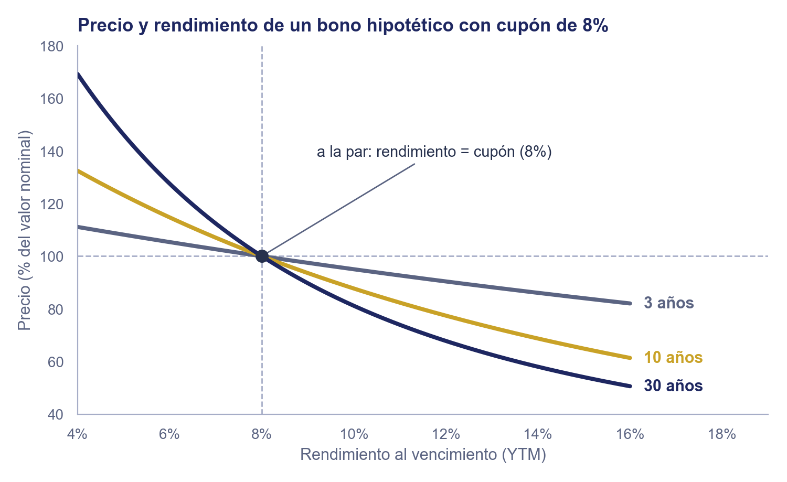
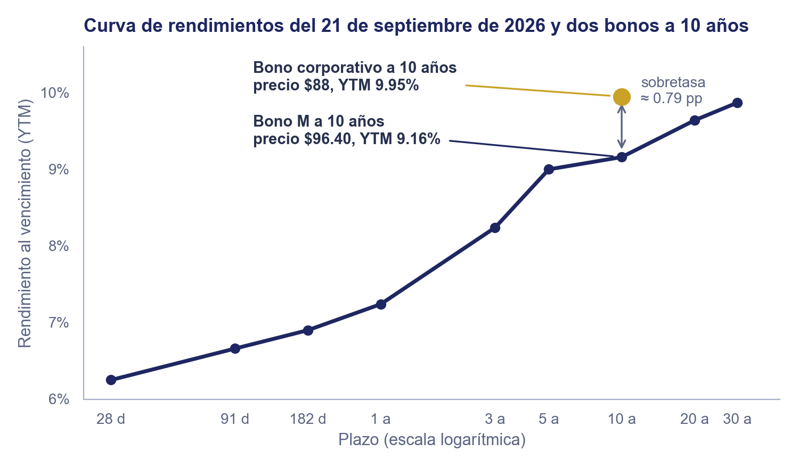

# Unidad 2 · Rendimiento y Curva de Rendimientos

**Mercados de Deuda y Capitales**, Licenciatura en Comercio y Finanzas Internacionales, Universidad Autónoma de Zacatecas

## Objetivo de la unidad

Que el estudiante calcule el rendimiento al vencimiento (YTM) de un bono a partir de su precio de mercado y sus flujos, y lo ubique en la curva de rendimientos para compararlo con bonos de otros plazos.

## Contenido

|     | Tema                                      | Qué cubre                                                                                                   |
| --- | ----------------------------------------- | ----------------------------------------------------------------------------------------------------------- |
| I   | Del precio al rendimiento (YTM)           | La tasa que iguala el valor presente de los flujos con el precio pagado, y cómo se resuelve                 |
| II  | Precio y rendimiento en sentido contrario | La curva precio-rendimiento: por qué baja, por qué se curva y por qué los plazos largos se mueven más       |
| III | Qué mide y qué no mide el rendimiento     | Las tres fuentes de retorno, los dos supuestos del YTM y el rendimiento corriente                           |
| IV  | La curva de rendimientos: ubicar un bono  | Graficar el YTM contra el plazo, leer su forma y sus movimientos, y ver dónde cae un bono frente al mercado |

> La práctica de este tema está en [`practica_2_rendimiento_estrategias.md`](../../practicas/unidad2/practica_2_rendimiento_estrategias.md).

---

### 1. Del precio al rendimiento (YTM)

[`1_valuacion_instrumentos_deuda.md`](1_valuacion_instrumentos_deuda.md) calculó el precio de un instrumento a partir de la tasa. Ese es el orden natural en el **mercado primario** ([`3_mecanica_mercado.md`](../unidad1/3_mecanica_mercado.md#1-mercado-primario-vs-mercado-secundario)): cuando una serie de Bono M se emite por primera vez, su cupón se fija cerca del rendimiento que el mercado exige ese día, y el bono se coloca cerca de la par. Ahí el precio pagado y el valor presente coinciden, $a=v_0$, y la tasa del cupón dice casi todo lo que gana el comprador.

El cupón queda fijo durante toda la vida del bono; las tasas del mercado no. La figura muestra el rendimiento del bono gubernamental mexicano a 10 años durante 25 años: bajó de 11% en 2002 a menos de 5% en 2013 y volvió a 9% después de 2022. El del Tesoro de EE.UU. al mismo plazo se mueve igual de lejos: de 5% en 2007 a 0.55% en julio de 2020 y de vuelta a 4.75% en agosto de 2026. Las tasas cambian en cualquier mercado, no solo en el mexicano. Un Bono M hipotético emitido a la par en septiembre de 2020, con cupón de 5.68%, sigue pagando 5.68%; en agosto de 2026 el mercado exigía 9.16% a 10 años, 3.48 puntos porcentuales más (la comparación es ilustrativa: a ese bono ya solo le quedan cuatro años, y su tasa de referencia sería la de ese plazo).

Quien compra el mismo bono años después, en el **mercado secundario** (o en una subasta que reabre esa serie vieja), cobra el cupón pactado en la emisión, pero paga el precio de hoy, que ya se alejó de la par. El Bono M a 10 años cotizaba \$96.40 el 21 de septiembre de 2026, con un cupón implícito de 8.59% (se despeja más abajo en esta sección). ¿Cuánto gana quien lo compra a ese precio? No el 8.59% del cupón: además de los cupones, paga \$96.40 y al vencer recibe \$100. Ninguna de las tasas que ya se conocen responde la pregunta:

1. **La tasa del cupón** se fijó para otro precio, el de la emisión.
2. **Las tasas que se anuncian**, como la de Banxico (6.50% en septiembre de 2026) o la de la Fed, se expresan como tasas nominales anuales, pero se aplican a préstamos interbancarios a un día, no a un bono con su propio plazo, cupón y precio.
3. **El precio por sí solo** no permite comparar. Un CETE de \$10 a 28 días cuesta \$9.9516; un Bono M de \$100 a 3 años cuesta \$100.94. Tienen distinto valor nominal y distinto plazo, y solo el segundo paga cupones: con esos dos precios no se sabe cuál rinde más.

Hace falta un concepto nuevo: la tasa anual que gana quien compra a ese precio, que junte en un solo número los cupones y la diferencia entre lo pagado y lo que se recibe al vencer. Se obtiene con la misma ecuación de valuación con los papeles invertidos, el precio como dato y la tasa como incógnita. Para el Bono M a 10 años esa tasa es 9.16%, por encima del cupón, porque se compró a descuento.

Un bono con cupón fijo genera el vector de flujos $(-a,\ c,\ c,\ \ldots,\ c,\ c+v_N)$: se paga el precio $a$ hoy (salida) y se cobra el cupón $c$ cada periodo, más el principal $v_N$ junto con el último cupón.

**Definición:** el **rendimiento al vencimiento** (*yield to maturity*, YTM) es la TIR de ese vector: la misma definición de [`4_ciencia_inversion.md`](../unidad1/4_ciencia_inversion.md#8-tasa-interna-de-retorno-tir) (ahí llamada $r^*$, aquí $r$, sin cambiar su significado), con $c_0=-a$, $c_t=c$ para $0<t<N$ y $c_N=c+v_N$: la tasa que hace cero el valor presente neto del vector,

$$0 = -a + c(1+r)^{-1} + c(1+r)^{-2} + \dots + (c+v_N)(1+r)^{-N}$$

Pasando $a$ al otro lado, esto es lo mismo que $v_0(r)=a$: la tasa que iguala el valor presente de los flujos con el precio pagado.

¿De dónde sale la fórmula cerrada que sigue? Los primeros $N-1$ cupones son una anualidad ([`4_ciencia_inversion.md`](../unidad1/4_ciencia_inversion.md#7-valor-presente-de-una-serie-de-flujos-anualidad)), y el pago del periodo $N$ (cupón más principal) se descuenta como un flujo único ([`4_ciencia_inversion.md`](../unidad1/4_ciencia_inversion.md#6-valor-futuro-y-valor-presente-de-un-flujo-único)). Sustituyendo esas dos fórmulas ya conocidas en la suma anterior:

$$a = c\dfrac{1-(1+r)^{-N}}{r} + v_N(1+r)^{-N} \qquad (r \neq 0)$$

que es la misma fórmula de precio de [`1_valuacion_instrumentos_deuda.md`](1_valuacion_instrumentos_deuda.md#3-valuación-con-cupón-fijo) con los papeles invertidos: allí $r$ era el dato y $v_0$ el resultado; aquí $v_0$ se iguala al precio observado $a$ y la incógnita es $r$.

Salvo casos muy simples, esta ecuación no tiene solución cerrada para $r$: es un problema de búsqueda de raíz. Antes de buscarla conviene saber si existe, porque no todo vector de flujos tiene TIR. Un vector de flujos $(c_0, c_1, \ldots, c_N)$ tiene una TIR positiva si cumple tres condiciones suficientes, y las tres tienen un significado financiero:

1. **$c_0<0$: hay una inversión inicial.** Hoy sale dinero; en un bono, el precio pagado, $c_0=-a$.
2. **$c_t\ge0$ para $t\ge1$: después solo se cobra.** No hay aportaciones posteriores; en un bono, cupones y principal, $c_t=c$ y $c_N=c+v_N$.
3. **$c_0+c_1+\dots+c_N>0$: la ganancia sin descontar es positiva.** Lo cobrado supera lo pagado; en un bono, $Nc+v_N>a$.

¿Por qué bastan? Con $x=(1+r)^{-1}$, el factor de descuento por periodo, el valor presente neto del vector es el polinomio de grado $N$

$$g(x) = c_0 + c_1x + c_2x^2 + \dots + c_Nx^N$$

y buscar la TIR es buscar una raíz de $g$ con $0<x<1$, que corresponde a $r=1/x-1>0$. En $x=0$ no se descuenta nada de lo que viene después y solo queda la inversión: $g(0)=c_0<0$ por la condición 1. En $x=1$ no se descuenta nada en absoluto ($r=0$) y queda la suma simple de los flujos: $g(1)>0$ por la condición 3. Como $g$ es continua, cambia de signo en $(0,1)$ y, por el mismo teorema del valor intermedio que ya garantizaba la existencia de la TIR en [`4_ciencia_inversion.md`](../unidad1/4_ciencia_inversion.md#8-tasa-interna-de-retorno-tir), tiene una raíz ahí. Es además la única: por la condición 2, todos los términos con $x$ tienen coeficiente no negativo, así que $g$ crece con $x$ y solo puede cruzar el cero una vez.

Un bono comprado a cualquier precio por debajo de la suma de sus pagos cumple las tres condiciones, así que su YTM existe, es positivo y es único. Si se pagara más que esa suma (condición 3 al revés: se pierde aun sin descontar), $g(1)<0$ y la raíz cae en $x>1$: un YTM negativo.

En la práctica, la raíz se encuentra con métodos numéricos que ya vienen dentro del software: la hoja de cálculo (la función TIR sobre el vector de flujos), las calculadoras financieras y las bibliotecas de programación prueban tasas sucesivas y las corrigen hasta que $v_0(r)$ iguala el precio. El resultado, el YTM, se cotiza como tasa anual (ver abajo cómo se anualiza cuando el bono paga más de una vez al año).

El YTM es importante ya que reduce un vector de flujos [de activos de instrumentos de renta fija] (precio, cupones, plazo y valor nominal) a un solo numeri, es decir, una sola tasa anual, y con eso bonos que no se parecen se vuelven comparables: el CETE y el Bono M de arriba, un bono gubernamental y uno corporativo, un bono mexicano y uno estadounidense. Por eso los Bonos M se negocian cotizando su rendimiento y no su precio, y por eso las preguntas que siguen en esta nota se plantean con él: cuánto cae el precio si el rendimiento sube (sección 2), qué gana en realidad quien compra (sección 3), y cómo se compara un bono con los demás plazos y emisores (la curva de rendimientos y la sobretasa, sección 4).

> **Ejemplo resuelto.** Un Bono M hipotético a 10 años, con cupón de 8% (un pago anual, como en la sección 3 de valuación) y valor nominal de \$100, se compra en \$93.58. Se prueba una tasa y se compara su valor presente con ese precio:

| Tasa de prueba | Valor presente $v_0(r)$ | Frente al precio de \$93.58         |
| -------------- | ----------------------- | ----------------------------------- |
| 8%             | \$100.00                | Demasiado alto: falta subir la tasa |
| 10%            | \$87.71                 | Demasiado bajo: falta bajar la tasa |
| 9%             | \$93.58                 | Coincide: el YTM es 9%              |

Es el mismo bono y la misma tasa del ejemplo de valuación: allí el 9% daba el precio de \$93.58; aquí el precio da el 9%.

> **Ejemplo resuelto.** La misma fórmula cerrada se despeja para el cupón cuando el precio y el YTM ya se observan en el mercado, en vez de iterar para el YTM. Para el Bono M a 3 años que cotizaba \$100.94 con YTM de 8.24% el 21 de septiembre de 2026, despejar $c$ de $a = c[1-(1+r)^{-N}]/r + v_N(1+r)^{-N}$ con $a=100.94$, $r=0.0824$, $N=3$, $v_N=100$ da $c\approx$ \$8.61. El mismo despeje, con el precio, el YTM y el plazo de cada bono, da el cupón implícito de los demás:
>
> | Bono M  | Precio   | YTM   | Cupón implícito | Se vende    |
> | ------- | -------- | ----- | --------------- | ----------- |
> | 3 años  | \$100.94 | 8.24% | \$8.61          | Con premio  |
> | 5 años  | \$98.90  | 9.00% | \$8.72          | A descuento |
> | 10 años | \$96.40  | 9.16% | \$8.59          | A descuento |
> | 30 años | \$84.22  | 9.87% | \$8.21          | A descuento |
>
> Con premio el cupón implícito queda arriba del YTM; a descuento, abajo: la relación de la sección 3. Estos cuatro cupones reaparecen en las secciones 2, 3 y el apéndice.

**Si el bono paga más de una vez al año.** Hasta aquí cada periodo del vector duró un año. El Bono M real paga cada 182 días, y la ecuación no cambia: solo cambia cuánto dura un periodo. Si cada periodo dura una fracción $\Delta t$ de año, el vector es el mismo, $(-a,\ c,\ \ldots,\ c,\ c+v_N)$ con $c$ el cupón de cada periodo y $N$ los periodos por vencer (dos por año de plazo en el Bono M), y la incógnita es la tasa por periodo $r_{per}$:

$$a = c\dfrac{1-(1+r_{per})^{-N}}{r_{per}} + v_N(1+r_{per})^{-N} \qquad (r_{per} \neq 0)$$

¿De dónde sale la fórmula? Es la de arriba con $r_{per}$ en lugar de $r$: su derivación solo usa que los $N$ periodos son iguales y que la tasa por periodo es constante, no que cada uno dure un año. Lo que el mercado cotiza es el YTM como tasa nominal anual, que se recupera con la relación $r_{per}=r_{nom}\Delta t$ de [`1_valuacion_instrumentos_deuda.md`](1_valuacion_instrumentos_deuda.md#2-valuación-a-descuento), con $\Delta t=182/360$ en el Bono M:

$$r_{nom} = \dfrac{r_{per}}{\Delta t} \qquad (\Delta t>0)$$

Si el bono paga $m$ veces al año con periodos iguales, $\Delta t=1/m$ y $r_{nom}=m\,r_{per}$.

> **Ejemplo resuelto.** El mismo Bono M hipotético (cupón de 8%, valor nominal de \$100, 10 años), ahora con los pagos reales cada 182 días: el cupón de cada periodo es $c=100\times0.08\times182/360\approx$ \$4.0444, hay $N=20$ periodos y se compra en \$93.45. Se prueba una tasa nominal, se convierte a tasa por periodo y se compara su valor presente con el precio:
>
> | Tasa nominal de prueba | Tasa por periodo $r_{per}=r_{nom}\frac{182}{360}$ | Valor presente $v_0$ | Frente al precio de \$93.45         |
> | ---------------------- | ------------------------------------------------- | -------------------- | ----------------------------------- |
> | 8%                     | 4.0444%                                           | \$100.00             | Demasiado alto: falta subir la tasa |
> | 10%                    | 5.0556%                                           | \$87.46              | Demasiado bajo: falta bajar la tasa |
> | 9%                     | 4.5500%                                           | \$93.45              | Coincide: el YTM es 9%              |
>
> Es el mismo YTM de 9% del ejemplo de pago anual, pero con otro precio: \$93.45 en vez de \$93.58. Con pagos cada 182 días, la tasa de 9% se compone más de una vez al año (equivale a una tasa anual efectiva de 9.20%), y el mismo rendimiento nominal da un precio algo menor. Los \$0.13 de diferencia son los que cuantifica el apéndice de [`1_valuacion_instrumentos_deuda.md`](1_valuacion_instrumentos_deuda.md#apéndice-verificación-numérica-con-código-y-datos).

Un instrumento a descuento sí se despeja a mano, porque tiene un solo flujo:

$$r_{nom} = \left(\dfrac{v_N}{a}-1\right)\dfrac{360}{n} \qquad (a>0,\ n>0)$$

¿De dónde sale la fórmula? Es la de la sección 2 de valuación, $v_0 = v_N/(1+r_{nom}\,n_{dias}/360)$, con $v_0=a$: se multiplica por el denominador, se resta 1 y se multiplica por $360/n_{dias}$. Para el CETE de \$10 comprado en \$9.9516 a 28 días, $(10/9.9516-1)(360/28) \approx 6.25\%$, la tasa de la subasta del 15 de septiembre de 2026.

### 2. Precio y rendimiento en sentido contrario

El YTM permite preguntar lo contrario: si el rendimiento que exige el mercado cambia, ¿qué pasa con el precio? Graficar el valor presente $v_0(r)$ de un bono contra $r$ lo responde. La figura muestra un bono con cupón de 8% y valor nominal de \$100 a tres plazos.

- **Pendiente negativa.** Si el rendimiento sube, el precio baja: para ganar más por el mismo flujo fijo hay que pagar menos. Cuando se dice que "el mercado de bonos cayó", se quiere decir que las tasas subieron.
- **A la par cuando $r=c$.** Las tres curvas cruzan \$100 en 8%, el caso $c=r$ de la sección 3 de valuación.
- **Extremos.** Con $r=0$ no hay descuento y el precio es la suma de todos los pagos (a 10 años, $8 \times 10 + 100 =$ \$180); cuando $r$ crece mucho, el precio tiende a cero, porque hasta el primer cupón se descuenta casi por completo.
- **Convexa, no recta.** La curva se dobla hacia el origen: el precio sube más cuando el rendimiento baja que lo que cae cuando sube el mismo monto. A 10 años, un punto porcentual más de rendimiento resta \$6.42 al precio y uno menos suma \$7.02.
- **Más plazo, más empinada.** Las curvas pivotan sobre el punto de la par: mientras más largo el plazo, más se mueve el precio ante el mismo cambio de rendimiento.

| Plazo   | $r=0$    | 6%       | 8%       | 9%      | 10%     | 12%     |
| ------- | -------- | -------- | -------- | ------- | ------- | ------- |
| 3 años  | \$124.00 | \$105.35 | \$100.00 | \$97.47 | \$95.03 | \$90.39 |
| 10 años | \$180.00 | \$114.72 | \$100.00 | \$93.58 | \$87.71 | \$77.40 |
| 30 años | \$340.00 | \$127.53 | \$100.00 | \$89.73 | \$81.15 | \$67.78 |

Al pasar del 8% al 9%, el precio cae 2.53% a 3 años, 6.42% a 10 años y 10.27% a 30 años. Esa pendiente, cuánto se mueve el precio por cada punto de rendimiento, es el riesgo de tasa de interés de [`4_riesgos_mercado_deuda.md`](4_riesgos_mercado_deuda.md#1-riesgo-de-tasa-de-interés), y [`5_duracion_convexidad.md`](5_duracion_convexidad.md) la convierte en un número (las dos son lectura complementaria, no se evalúan).

> **Ejemplo resuelto.** La misma sensibilidad se ve con bonos reales, no solo con el hipotético de cupón 8%. Con el cupón implícito del Bono M a 10 y a 30 años de la sección 1 (\$8.59 y \$8.21), subir el YTM de cada uno 50 puntos base sobre el observado el 21 de septiembre de 2026 da:
>
> | Bono M  | YTM real | Precio real | YTM + 50 pb | Precio nuevo | Variación |
> | ------- | -------- | ----------- | ----------- | ------------ | --------- |
> | 10 años | 9.16%    | \$96.40     | 9.66%       | \$93.35      | -3.16%    |
> | 30 años | 9.87%    | \$84.22     | 10.37%      | \$80.30      | -4.66%    |
>
> El mismo movimiento de tasa castiga el precio casi 50% más en el bono largo que en el de 10 años: a mayor plazo, mayor sensibilidad, tal como predice la curva convexa de arriba.

### 3. Qué mide y qué no mide el rendimiento

El YTM se calcula al comprar el bono. ¿Es lo que el inversionista terminará ganando?

El retorno de un bono viene de tres fuentes: los cupones, la ganancia o pérdida de precio (al vencer, al venderlo o si el emisor lo rescata) y lo que rinde reinvertir los cupones conforme se cobran. Una buena medida de rendimiento debería contar las tres, y el YTM lo hace, pero solo bajo dos supuestos:

1. Los cupones se reinvierten a la misma tasa del YTM.
2. El bono se conserva hasta el vencimiento.

Si no se cumple el primero, aparece el riesgo de reinversión; si no se cumple el segundo, el riesgo de tasa de interés (ambos en [`4_riesgos_mercado_deuda.md`](4_riesgos_mercado_deuda.md#1-riesgo-de-tasa-de-interés)).

> **Ejemplo resuelto.** Un bono a la par a 10 años, con cupón de 7% (un pago anual), tiene YTM de 7%. Para ganar 7% anual, los \$100 deben convertirse en $100(1.07)^{10} \approx$ \$196.72, un retorno total de \$96.72. Los cupones aportan $7 \times 10 =$ \$70; los \$26.72 restantes (28% del total) solo aparecen si cada cupón se reinvierte al 7%. No hay ganancia de precio, porque el bono se compró a la par. Si las tasas bajaran y los cupones se reinvirtieran al 4%, la riqueza final sería \$184.04 y el rendimiento efectivo, 6.29% en vez de 7%.
>
> **Ejemplo resuelto.** El mismo cálculo con un bono real y un plazo corto muestra que el riesgo de reinversión crece con el plazo. El Bono M a 3 años de la sección 1 (precio \$100.94, YTM 8.24%, cupón implícito \$8.61) debería crecer a $100.94(1.0824)^3\approx$ \$128.02 si todo se reinvierte al 8.24%. Si las tasas bajaran y los cupones se reinvirtieran al 5% en vez de 8.24%, la riqueza final sería \$127.13 y el rendimiento efectivo, 8.00% en vez de 8.24%: una caída de 24 puntos base, muy por debajo de los 71 puntos base del ejemplo anterior a 10 años. Mientras más corto el plazo, menos cupones hay que reinvertir y menos pesa esa fuente de retorno.

Otra medida, más simple, es el **rendimiento corriente** (*current yield*, CY): el cupón anual entre el precio.

$$CY = \dfrac{c}{a} \qquad (a>0)$$

¿De dónde sale la fórmula? Es el YTM de un bono que pagara su cupón para siempre. En la fórmula de anualidad de [`4_ciencia_inversion.md`](../unidad1/4_ciencia_inversion.md#7-valor-presente-de-una-serie-de-flujos-anualidad), con $N\to\infty$, $(1+r)^{-N}\to 0$ y queda $v_0=c/r$; al igualar $v_0=a$ resulta $r=c/a$. Por eso ignora la ganancia de precio y la reinversión. Entre la tasa cupón, el rendimiento corriente y el YTM se cumple:

| El bono se vende | Relación                                 |
| ---------------- | ---------------------------------------- |
| A la par         | tasa cupón = rendimiento corriente = YTM |
| A descuento      | tasa cupón < rendimiento corriente < YTM |
| Con premio       | tasa cupón > rendimiento corriente > YTM |

Un bono con cupón de 8% que cuesta \$88 a 10 años tiene $CY = 8/88 \approx 9.09\%$ y YTM de 9.95%: a descuento, con el rendimiento corriente entre el cupón y el YTM. Con datos reales, el Bono M a 10 años de la sección 1 (cupón implícito \$8.59, precio \$96.40, YTM 9.16%) da $CY = 8.59/96.40 \approx 8.91\%$: de nuevo tasa cupón (8.59%) < rendimiento corriente (8.91%) < YTM (9.16%), la misma fila de la tabla. Otras dos variantes usan el mismo método de la TIR con un supuesto distinto: el **rendimiento a la opción de compra** (*yield to call*, YTC) supone que el emisor rescata el bono en la fecha más temprana posible, y el **rendimiento al peor caso** (*yield to worst*) toma el más bajo de todos los rendimientos posibles.

Por último, el YTM es lo que se promete al comprar; el retorno efectivamente obtenido depende también del precio al que se venda y de lo que rinda reinvertir.

### 4. La curva de rendimientos: ubicar un bono

El YTM es la TIR de un solo bono, con su propio plazo. [`1_valuacion_instrumentos_deuda.md`](1_valuacion_instrumentos_deuda.md#2-valuación-a-descuento) calculó el precio de un CETE a 28 días con su propia tasa, y el de un Bono M a 10 años con la suya, como si fueran dos problemas sueltos. No lo son: graficar el YTM de cada instrumento contra su plazo (Cetes a 28, 91, 182 y 364 días; Bono M a 3, 5, 10, 20 y 30 años, todos el mismo día) traza una sola curva, la **curva de rendimientos**.

> **Ejemplo resuelto.** El 21 de septiembre de 2026, la curva de rendimientos según cetesdirecto fue: CETE 28 días, 6.25%; CETE 91 días, 6.66%; CETE 182 días, 6.90%; CETE 364 días, 7.24%; Bono M 3 años, 8.24%; Bono M 5 años, 9.00%; Bono M 10 años, 9.16%; Bono M 20 años, 9.64%; Bono M 30 años, 9.87%. Graficada, sube con el plazo (pendiente positiva), de 6.25% a 9.87%, y la mayor parte del ascenso ocurre antes de los 5 años.

Esa afirmación (la mayor parte del ascenso ocurre antes de los 5 años) se puede medir con los mismos datos, tramo por tramo:

| Tramo        | Cambio en YTM | Plazo   | Pendiente por año |
| ------------ | ------------- | ------- | ----------------- |
| 1 a 3 años   | +100 pb       | 2 años  | 50 pb/año         |
| 3 a 5 años   | +76 pb        | 2 años  | 38 pb/año         |
| 5 a 10 años  | +16 pb        | 5 años  | 3.2 pb/año        |
| 10 a 20 años | +48 pb        | 10 años | 4.8 pb/año        |
| 20 a 30 años | +23 pb        | 10 años | 2.3 pb/año        |

De 1 a 5 años la curva sube en promedio 44 puntos base por año; de 5 a 30 años, solo 3.5. Casi doce veces más rápido en el tramo corto: ahí se concentra casi todo el ascenso.

Su forma más común es ascendente ("normal"): los bonos largos rinden más que los cortos, en parte porque son más sensibles a la tasa (sección 2). La curva se invierte, en parte o en todo su recorrido, cuando las tasas cortas suben rápido y los inversionistas creen que el alza es temporal, de modo que las largas casi no se mueven.

La misma gráfica repetida para varias fechas (por ejemplo, un corte mensual durante 2026) deja ver tres movimientos de la curva completa:

- **Nivel:** la curva entera sube o baja de forma más o menos pareja en todos los plazos, típicamente cuando Banxico mueve su tasa de referencia o cambian las expectativas de inflación de largo plazo.
- **Pendiente:** la diferencia entre el extremo largo y el corto se abre o se cierra; una curva más empinada suele reflejar más incertidumbre o más expectativa de alza futura en el corto plazo.
- **Curvatura:** el tramo intermedio (2 a 5 años, aproximadamente) se aparta hacia arriba o hacia abajo de la línea recta que unen el corto y el largo plazo.

**Ubicar un bono en la curva.** Al estudiar un bono conviene calcular su YTM y su plazo, y ubicarlo como un punto frente a la curva de referencia: da una idea de cómo está valuado frente al mercado. Si cae lejos de la curva, hay una razón: el riesgo de crédito del emisor, su liquidez o alguna cláusula del contrato, como que sea rescatable.

> **Ejemplo resuelto.** El Bono M a 10 años que cotizaba cetesdirecto el 21 de septiembre de 2026 valía \$96.40 con un YTM de 9.16%, justo sobre la curva a 10 años (es ese mismo punto): el mercado lo valúa en línea con los demás bonos gubernamentales. Un bono corporativo a 10 años (ejemplo ilustrativo), también con cupón de 8%, cotiza en \$88 y tiene un YTM de 9.95%, casi ocho décimas de punto porcentual (0.79 pp) sobre la curva. Esa diferencia es la **sobretasa** (*spread*): lo que el mercado exige de más por el riesgo de crédito ([`4_riesgos_mercado_deuda.md`](4_riesgos_mercado_deuda.md#2-riesgo-de-crédito-y-calificaciones)) y la menor liquidez ([`4_riesgos_mercado_deuda.md`](4_riesgos_mercado_deuda.md#4-riesgo-de-liquidez)) del emisor corporativo.
>
> **Ejemplo resuelto.** La misma curva se puede comparar contra su versión en UDIBONOS, que paga en unidades ajustadas por inflación. El 21 de septiembre de 2026, cetesdirecto cotizaba UDIBONOS a 3.99% a 3 años, 4.75% a 10 años y 4.90% a 30 años, siempre por debajo de los 8.24%, 9.16% y 9.87% nominales del mismo plazo. La diferencia, entre 4 y 5 puntos porcentuales según el plazo, es lo que el mercado cobra por la inflación que todavía no ocurre: el apéndice muestra cómo convertir esa diferencia en una cifra concreta de inflación esperada.

**Un cuidado.** Esta curva de YTM todavía no es la que hace falta para descontar cualquier flujo futuro con precisión: cada punto es la tasa interna de retorno de un instrumento completo, no la tasa que le corresponde a un solo peso pagadero en una fecha exacta. Para el CETE (cupón cero) las dos cosas coinciden, porque solo hay un flujo; los cuatro puntos de Cetes sí son puntos de la curva cupón cero. Para el Bono M no: su YTM a 10 años ya mezcla el descuento de los cupones que paga antes del año 10 (a las tasas, más bajas, de esos plazos intermedios) con el descuento del pago final. Dos bonos del mismo plazo pero con cupón distinto pueden cotizar un YTM ligeramente distinto aunque el mercado esté valuando el mismo dinero de la misma forma; a esa distorsión se le llama **efecto cupón**, y es la razón por la que una curva de YTM y una curva cupón cero (o **curva spot**) no son la misma curva, aunque a menudo se confundan. El apéndice muestra cómo pasar de una a otra.

---

## Apéndice: De la curva de YTM a la curva spot

Esta sección amplía el núcleo; no forma parte del objetivo ni se evalúa. Muestra cómo se corrige el efecto cupón y qué más se hace con la curva.

**Tasas spot y factores de descuento.** La **tasa spot** $r_t$ es la tasa de un solo pago a plazo $t$, la que paga un instrumento sin cupones. Su **factor de descuento** es $(1+r_t)^{-t}$, el de [`4_ciencia_inversion.md`](../unidad1/4_ciencia_inversion.md#6-valor-futuro-y-valor-presente-de-un-flujo-único) con la tasa de ese plazo, y el valor presente de cualquier flujo es la suma de cada pago multiplicado por su factor de descuento. Si hubiera un cupón cero en cada plazo, la curva spot se leería directo; como no los hay, se calcula a partir de bonos con cupón.

**Por qué los Cetes regalan la curva spot hasta un año.** Un CETE no paga cupón: su tasa de rendimiento cotizada, en convención día/360 de [`1_valuacion_instrumentos_deuda.md`](1_valuacion_instrumentos_deuda.md#2-valuación-a-descuento), se convierte en tasa efectiva anual componiendo el rendimiento del periodo ($v_N/a-1=r_{nom}\,n/360$, de la fórmula de la sección 1) $365/n$ veces al año, la misma lógica de componer que la TEA de [`4_ciencia_inversion.md`](../unidad1/4_ciencia_inversion.md#10-tasa-nominal-y-tasa-efectiva):

$$r_t = \left(1+r_{nom}\dfrac{n}{360}\right)^{365/n} - 1 \qquad (n>0)$$

No hay ningún cupón intermedio que mezclarle, así que esta tasa convertida es exactamente la tasa spot $r_t$ de ese plazo. El CETE a 364 días del 21 de septiembre de 2026, cotizado a 7.24%, da $r_1 = (1+0.0724\times364/360)^{365/364}-1\approx7.34\%$. Con los cuatro Cetes (28, 91, 182 y 364 días) ya se tienen cuatro puntos de la curva spot sin resolver ninguna ecuación.

**Por qué el Bono M no regala nada, hay que despejarlo.** Un Bono M sí paga cupón, así que su precio observado $a$ es igual a la suma de cada cupón descontado a la tasa spot de *su propio* plazo, más el principal descontado a la tasa spot del plazo final:

$$a = \sum_{i=1}^{N-1} c(1+r_{t_i})^{-t_i} + (c+v_N)(1+r_{t_N})^{-t_N}$$

¿De dónde sale la fórmula? Es la misma suma de valor presente de un flujo único de [`4_ciencia_inversion.md`](../unidad1/4_ciencia_inversion.md#6-valor-futuro-y-valor-presente-de-un-flujo-único) aplicada cupón por cupón, con una sola diferencia frente a la fórmula de precio de [`1_valuacion_instrumentos_deuda.md`](1_valuacion_instrumentos_deuda.md#3-valuación-con-cupón-fijo): ahí se usaba una sola tasa $r$ para descontar todos los flujos; aquí cada flujo se descuenta con la tasa spot que le corresponde a su propio plazo $t_i$, porque es justamente esa curva la que todavía no se conoce.

De esa ecuación, todas las tasas spot $r_{t_i}$ con $t_i < t_N$ ya se conocen (son plazos más cortos, ya bootstrapeados con un Bono M o un CETE anterior); la única incógnita es $r_{t_N}$, la tasa spot del plazo más largo que se está agregando. Se despeja de forma recursiva: primero el Bono M más corto (usando solo tasas Cete ya conocidas), luego el siguiente (usando las tasas Cete y la spot recién despejada), y así hasta el plazo más largo disponible. Este método, de resolver la curva un plazo a la vez a partir de instrumentos cada vez más largos, se llama **bootstrapping**. Otra ruta arma un cupón cero sintético: dos bonos del mismo plazo y distinto cupón, combinados en proporciones que cancelen los cupones, dejan un solo flujo final cuyo precio da directo la tasa spot de ese plazo.

**Del precio con tasas spot al rendimiento.** La misma suma responde la pregunta inversa a la del bootstrapping: dadas las tasas spot, ¿qué YTM tiene el bono? Un bono hipotético a 2 años, con valor nominal de \$1,000 y cupón de \$25 cada seis meses, es el vector $(-a,\ 25,\ 25,\ 25,\ 1025)$ en $t=0.5,\ 1,\ 1.5$ y $2$ años. Con tasas spot efectivas anuales de 3%, 4%, 4.5% y 5% a esos plazos, cada flujo se descuenta con la suya: $a = 24.63 + 24.04 + 23.40 + 929.71 \approx$ \$1,001.78. El YTM es la única tasa por periodo que da ese mismo precio con la ecuación de la sección 1 para $N=4$ periodos de seis meses:

$$1001.78 = 25\dfrac{1-(1+r_{per})^{-4}}{r_{per}} + 1000(1+r_{per})^{-4} \quad\Rightarrow\quad r_{per}\approx2.45\%$$

es decir, un YTM nominal de 4.91% ($m=2$), equivalente a 4.97% efectivo anual. Queda por debajo de la spot a 2 años (5%) porque los tres cupones tempranos se descuentan a tasas spot más bajas, y muy cerca de ella porque el pago final concentra 93% del valor presente. Es el efecto cupón de la sección 4 con números: el YTM promedia las spots del bono, no es ninguna de ellas.

**Bootstrapping con datos reales.** Un ejemplo completo hasta el plazo de 3 años, con los datos del 21 de septiembre de 2026 ya usados en la sección 4. El CETE a 364 días da $r_1\approx7.34\%$, como se acaba de calcular. Para el plazo de 2 años no madura ningún instrumento: el hueco se llena interpolando la curva de YTM observada (línea recta entre 7.34% a 1 año y el 8.24% del Bono M a 3 años) y suponiendo un bono hipotético a la par en ese plazo, con cupón igual a esa tasa interpolada ($c_2\approx7.79\%$, precio 100 por construcción, porque a la par cupón = YTM). Resolviendo para $r_2$ con la ecuación de esta misma sección:

$$100 = \dfrac{7.79}{1+r_1} + \dfrac{107.79}{(1+r_2)^2} \quad\Rightarrow\quad r_2\approx7.81\%$$

Con $r_1$ y $r_2$ ya conocidos, el Bono M a 3 años (precio real \$100.94, cupón implícito \$8.61 de la sección 1) completa el bootstrap:

$$100.94 = \dfrac{8.61}{1.0734} + \dfrac{8.61}{(1.0781)^2} + \dfrac{108.61}{(1+r_3)^3} \quad\Rightarrow\quad r_3\approx8.29\%$$

$r_3$ (8.29%) queda arriba del YTM del mismo bono (8.24%): es el efecto cupón de la sección 4. Con una curva ascendente, los cupones tempranos se descuentan a tasas más bajas que la del plazo final, así que el YTM (un promedio ponderado de esas tasas) queda por debajo de la tasa spot pura a ese plazo. Repetir el mismo procedimiento (interpolar donde falte un instrumento, resolver la única incógnita nueva) con los Bonos M a 5, 10, 20 y 30 años extiende la curva spot completa; es exactamente lo que hace Banxico al publicar la suya.

Con la curva spot completa, se puede despejar la **tasa forward**: la tasa que el mercado ya trae implícita hoy para un periodo futuro. Entre los plazos $t_1$ y $t_2$ ($t_1<t_2$):

$$(1+r_{t_2})^{t_2} = (1+r_{t_1})^{t_1}(1+f_{t_1,t_2})^{t_2-t_1}$$

¿De dónde sale la fórmula? Invertir \$1 hoy a la tasa spot $r_{t_2}$ durante $t_2$ años debe dar el mismo resultado que invertirlo a $r_{t_1}$ durante $t_1$ años y luego reinvertir lo obtenido durante el periodo restante $(t_2-t_1)$ a la tasa $f_{t_1,t_2}$ que se amarra hoy para ese futuro; si no fuera así, habría una forma de ganar dinero sin riesgo solo cambiando de estrategia, algo que el propio mercado corrige de inmediato.

> **La pregunta que más rinde.** ¿La tasa forward es un pronóstico del mercado sobre la tasa que va a haber en ese periodo futuro, o es simplemente el precio al que hoy se puede amarrar una tasa para entonces, sin decir nada sobre qué va a pasar? Las dos lecturas conviven: la fórmula solo garantiza que $f_{t_1,t_2}$ es el precio de no-arbitraje de amarrar hoy esa tasa futura; que además sea un buen pronóstico depende de si el mercado, en promedio, acierta al anticipar hacia dónde se mueven las tasas, algo que no se puede resolver solo con álgebra.

**Por qué la curva tiene esa forma.** Hay tres explicaciones clásicas de por qué la curva casi nunca es plana, y cada una tiene algo de cierto:

- **Expectativas:** la curva asciende porque el mercado espera que las tasas suban, y la tasa forward sería la tasa spot esperada. Su debilidad: como la curva casi siempre asciende, el mercado esperaría alzas casi siempre, y las tasas no suben tanto.
- **Preferencia por la liquidez:** los inversionistas prefieren plazos cortos, porque el precio de los bonos largos es más sensible a la tasa (sección 2); para atraerlos a plazos largos hay que ofrecerles más rendimiento.
- **Segmentación de mercado:** cada plazo tiene sus propios compradores (quien tiene pasivos de largo plazo compra deuda de largo plazo, como en la sección 7 de [`0_mercado_e_instrumentos_deuda.md`](0_mercado_e_instrumentos_deuda.md#7-tres-preguntas-y-los-seis-instrumentos-lado-a-lado)), así que las tasas de plazos distintos se mueven con cierta independencia.

La explicación más citada combina las dos primeras: expectativas, corregidas por la prima que exige la preferencia por la liquidez.

**Ajuste paramétrico: Nelson-Siegel.** La curva spot bootstrapeada trae un punto por instrumento disponible, con huecos entre plazos (por ejemplo, nada entre 1 y 3 años si no hay un Bono M ahí) y algo de ruido propio de cada subasta. El modelo de **Nelson-Siegel** ajusta una curva continua y suave sobre esos puntos:

$$\hat{r}(t) = \beta_0 + \beta_1\left(\dfrac{1-e^{-t/\tau}}{t/\tau}\right) + \beta_2\left(\dfrac{1-e^{-t/\tau}}{t/\tau}-e^{-t/\tau}\right) \qquad (t>0,\ \tau>0)$$

¿De dónde sale la fórmula? No se deriva de una fórmula anterior de esta unidad, es una forma funcional propuesta directamente por Nelson y Siegel para que tres parámetros solamente ($\beta_0$, $\beta_1$, $\beta_2$) reproduzcan las formas de curva más comunes en la práctica; lo que sí se deriva es su interpretación, a partir de los tres movimientos vistos a simple vista en la sección 4: cuando $t\to\infty$, $\hat{r}(t)\to\beta_0$ (el **nivel** de largo plazo); cuando $t\to0$, $\hat{r}(t)\to\beta_0+\beta_1$ (el nivel de corto plazo, así que $\beta_1$ es la **pendiente**, la diferencia corto menos largo); y el término que multiplica a $\beta_2$ crece y luego decae con $t$, la forma de joroba que produce la **curvatura** del tramo intermedio.

$\tau$ fija a qué plazo ocurre esa joroba y normalmente se fija primero por prueba (o con un valor típico del mercado que se estudia), dejando a $\beta_0$, $\beta_1$ y $\beta_2$ como los únicos parámetros libres. Se ajustan minimizando la suma de errores de valuación al cuadrado entre el precio observado de cada instrumento y el precio que resultaría de descontar sus flujos con $\hat{r}(t)$, un problema de optimización numérica (con Solver en la hoja de cálculo, el mismo tipo de herramienta que ya resolvió la TIR de [`4_ciencia_inversion.md`](../unidad1/4_ciencia_inversion.md)) en vez de una fórmula cerrada.

> No es un ejercicio de salón: los bancos centrales, incluido Banxico, publican su curva cupón cero ajustada con esta familia de modelos o con su extensión de cuatro parámetros (Svensson, que agrega una segunda joroba), precisamente porque tres o cuatro números bastan para resumir y comparar la forma completa de la curva de un día a otro.

**Extra: la curva real y la inflación implícita.** El bootstrapping y el ajuste de este apéndice se repiten, sin cambiar ninguna fórmula, con UDIBONOS en vez de Bono M: el resultado es una curva spot **real**, no nominal, porque el UDIBONO ya paga en unidades que se ajustan con la inflación (ver [`0_mercado_e_instrumentos_deuda.md`](0_mercado_e_instrumentos_deuda.md#6-los-seis-instrumentos)).

Con las dos curvas (nominal, de Cetes y Bono M; real, de UDIBONOS) al mismo plazo, la diferencia entre ambas es la **inflación implícita** (o *breakeven inflation*) que el mercado está poniendo con dinero de verdad a ese horizonte:

$$\hat{r}_{inf} \approx r_{nom} - r_{real}$$

¿De dónde sale la fórmula? Es la misma ecuación de Fisher usada en [`4_ciencia_inversion.md`](../unidad1/4_ciencia_inversion.md), aplicada punto por punto a lo largo de la curva en vez de a una sola tasa: si la tasa nominal es, aproximadamente, la tasa real más la inflación esperada, despejar la inflación esperada dado ambos rendimientos de mercado es una resta.

> **Por qué engancha.** Esta $\hat{r}_{inf}$ no sale de una encuesta ni de una opinión, sale de lo que miles de inversionistas pagaron hoy por protegerse o no de la inflación futura. Comparar esta curva de inflación implícita, plazo por plazo, contra la Encuesta de Expectativas de Banxico (que sí es una encuesta de opinión a especialistas) y explicar la brecha entre ambas es, con datos reales, la pregunta que cierra el laboratorio.

---

## Fuentes y referencias recomendadas

- Luenberger, D. G. (2013). *Investment Science* (2ª ed.). Oxford University Press: rendimiento al vencimiento, curva precio-rendimiento, rendimiento corriente y a la opción de compra; curva de rendimientos, tasas spot y forward, y las tres explicaciones de la estructura de plazos.
- Fabozzi, F. J., y Mann, S. V. (2010). *Introduction to Fixed Income Analytics: Relative Value Analysis, Risk Measures, and Valuation* (2ª ed.). Wiley: fuentes de retorno de un bono, supuestos del rendimiento al vencimiento, rendimiento corriente, a la opción de compra y al peor caso; tasas spot (bootstrapping) y forward.
- Fabozzi, F. J., & Fabozzi, F. A. (2021). *Bond Markets, Analysis, and Strategies* (10ª ed.). MIT Press: curva de rendimiento a vencimiento frente a curva spot, efecto cupón, bootstrapping y tasas forward.
- Mishkin, F. S. (2019). *The Economics of Money, Banking, and Financial Markets* (Business School Edition, 5ª ed.). Pearson: rendimiento al vencimiento en distintos tipos de instrumento de crédito, diferencia entre tasa de interés y retorno, y teorías de la estructura de plazos.
- Nelson, C. R., & Siegel, A. F. (1987). *Parsimonious Modeling of Yield Curves*. Journal of Business, 60(4), 473-489: la forma funcional de tres parámetros y su interpretación como nivel, pendiente y curvatura.
- Federal Reserve Bank of St. Louis. FRED, series IRLTLT01MXM156N (rendimiento del bono gubernamental mexicano a 10 años, datos de la OCDE) y DGS10 (Tesoro de EE.UU. a 10 años), consultadas en septiembre de 2026: las series mensuales de la figura de la sección 1.
- Sigman, K. (2005). *Internal rate of return, bonds, yields* [Notas de clase, curso 4700]: existencia de la TIR, rendimiento de un bono con $m$ pagos por año y su relación con las tasas spot.
- Banco de México: metodología de estimación de la curva de rendimientos cupón cero (familia Nelson-Siegel/Svensson) y Sistema de Información Económica (SIE) para series históricas de Cetes, Bonos M y UDIBONOS; Encuesta de Expectativas de los Especialistas en Economía del Sector Privado, para el pronóstico de inflación con el que se compara la inflación implícita de la curva.
- Cetesdirecto: tablas de CETES, Bonos M y UDIBONOS del 21 de septiembre de 2026 (precio y tasa por plazo), con las que se dibuja la curva del ejemplo de la sección 4 y se calculan los ejemplos con datos reales de las secciones 1 a 4 y del apéndice.

---

## Cierre de la unidad — Lo esencial para recordar

- El **rendimiento al vencimiento (YTM)** es la tasa $r$ que resuelve $v_0(r)=a$: la TIR del bono al precio pagado. Se resuelve por iteración (TIR o Solver en la hoja de cálculo); en un instrumento a descuento se despeja a mano.
- Precio y rendimiento se mueven en sentido contrario, con una curva convexa que cruza la par cuando $r=c$ y que es más empinada mientras más largo el plazo: esa sensibilidad es el riesgo de tasa de interés.
- El YTM se realiza solo si los cupones se reinvierten a esa tasa y el bono se conserva hasta el vencimiento. El **rendimiento corriente** ($c/a$) es la versión que ignora la ganancia de precio y la reinversión.
- La **curva de rendimientos** grafica el YTM contra el plazo: es normal o invertida y se mueve en nivel, pendiente y curvatura. Ubicar un bono frente a ella muestra cómo está valuado; la diferencia es la **sobretasa**. Ojo: la curva de YTM no es la curva spot.
- Fuera del objetivo, el apéndice muestra cómo se corrige el efecto cupón (**bootstrapping**, con un ejemplo numérico completo a partir de datos reales), la **tasa forward**, las tres teorías de la estructura de plazos, **Nelson-Siegel** y la curva real.

**Próxima sesión:** cómo se usan la curva y el plazo para decidir qué comprar: una estrategia de inversión en renta fija para una obligación o un escenario de tasas dado.
