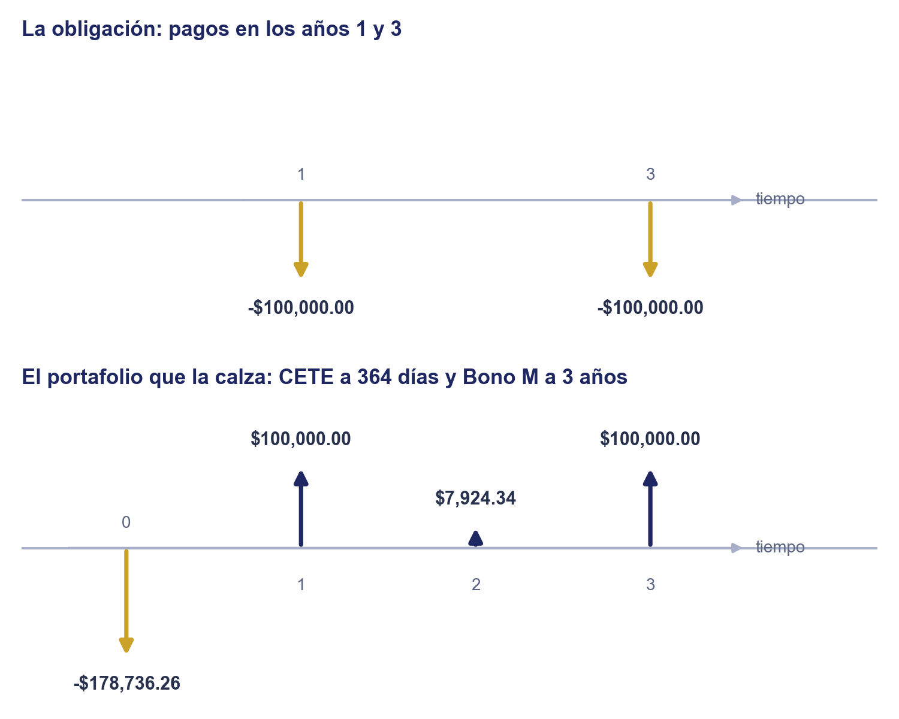
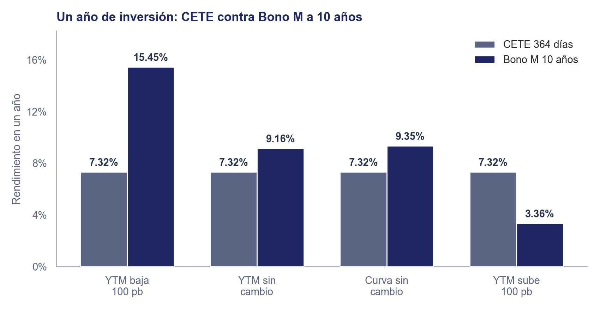

# Unidad 2 · Estrategias de Inversión en Renta Fija

**Mercados de Deuda y Capitales**, Licenciatura en Comercio y Finanzas Internacionales, Universidad Autónoma de Zacatecas

## Objetivo de la unidad

Que el estudiante justifique una estrategia de inversión en renta fija (pasiva, de calce de flujos o activa) para una obligación, un horizonte o un escenario de mercado dado.

## Contenido

|     | Tema                               | Qué cubre                                                                                                  |
| --- | ---------------------------------- | ---------------------------------------------------------------------------------------------------------- |
| I   | Cómo se elige una estrategia       | El proceso de inversión (objetivo, restricciones, estrategia) y las tres familias de estrategias           |
| II  | Estrategias pasivas                | Comprar y conservar, escalera e indexación, sin opinión sobre el mercado                                   |
| III | Estrategias dirigidas por pasivos  | Calce de flujos: asegurar los pagos de una obligación, pase lo que pase con las tasas                      |
| IV  | Estrategias activas                | Apostar con el rendimiento a horizonte al nivel de las tasas, la curva, la inflación, el crédito o el peso |
| V   | La estrategia según quién invierte | Qué familia, estrategia e instrumento le corresponden a una persona, una empresa o una institución         |

> La práctica de este tema está en [`practica_2_rendimiento_estrategias.md`](../../practicas/unidad2/practica_2_rendimiento_estrategias.md).

---

### 1. Cómo se elige una estrategia

Las notas anteriores enseñaron a valuar un bono, a resumirlo en su YTM y a reconocer lo que puede salir mal al comprarlo. Falta la pregunta del inversionista: ¿qué compro? Fabozzi y Fabozzi la responden con un **proceso de inversión** de cinco pasos: fijar el objetivo, establecer la política de inversión, elegir la estrategia, elegir los instrumentos y medir el resultado. Esta nota se concentra en los tres primeros; los instrumentos ya se conocen desde la nota de mercado e instrumentos.

1. **El objetivo.** Quien tiene un pago con fecha y monto conocidos (una **obligación**: la colegiatura, la nómina, las pensiones de una aseguradora) busca asegurar ese pago. Quien no tiene una fecha busca el mayor rendimiento que tolere en un horizonte, a veces medido contra un índice de referencia (*benchmark*).
2. **La política.** Agrega las restricciones: cuánta liquidez se necesita, cuánto riesgo de crédito o de tipo de cambio se acepta, qué permite la regulación.
3. **La estrategia.** Con el objetivo y las restricciones se elige entre tres familias, que Fabozzi y Fabozzi ordenan en un espectro según cuánto se aparta el portafolio de una referencia neutral:

| Familia                          | Objetivo típico                                       | Opinión sobre el mercado                                 | Estrategias de esta nota                                            |
| -------------------------------- | ----------------------------------------------------- | -------------------------------------------------------- | ------------------------------------------------------------------- |
| Pasiva (sección 2)               | Rendimiento de mercado con poco costo y poca atención | Ninguna                                                  | Comprar y conservar, escalera, indexación                           |
| Dirigida por pasivos (sección 3) | Pagar una obligación conocida                         | No hace falta                                            | Calce de flujos; inmunización (apéndice)                            |
| Activa (sección 4)               | Ganarle a la referencia                               | Una opinión que se aparta de lo que el mercado ya espera | Expectativas de tasas, curva, nominal o real, diferenciales, moneda |

El hilo entre las tres familias es la advertencia de la [sección 2 de la nota de rendimiento](2_rendimiento_y_curva_de_rendimientos.md#2-qué-mide-y-qué-no-mide-el-rendimiento): el YTM solo se gana si el bono se conserva al vencimiento y los cupones se reinvierten a esa misma tasa, y el precio se mueve en sentido contrario a la tasa, más mientras más largo el plazo. La estrategia **pasiva** acepta esa advertencia y no hace nada con ella; la **dirigida por pasivos** la neutraliza para una obligación concreta; la **activa** la usa a su favor, porque espera que el precio se mueva en la dirección que le conviene. Todas las cifras de la nota son del 21 de septiembre de 2026.

### 2. Estrategias pasivas

Una estrategia pasiva no intenta adivinar el mercado: compra, conserva y reinvierte, con el menor costo posible. Es la opción natural de quien no tiene una opinión, o de quien no tiene tiempo para administrarla.

**Comprar y conservar** (*buy and hold*). Se compra un bono y se conserva hasta el vencimiento. Si el emisor paga, se gana el YTM de la compra, salvo por lo que rindan los cupones al reinvertirse: el precio de mercado deja de importar, porque nunca se vende. Es lo que hace una persona que compra un CETE en cetesdirecto y espera a que venza.

**Escalera** (*ladder*). Se reparte el dinero en montos iguales que vencen a plazos sucesivos, del más corto al más largo. Cada vez que vence un tramo se reinvierte en el plazo más largo, a la tasa de ese momento, así que el riesgo de tasa y el de reinversión se promedian: ningún escenario arruina el portafolio completo.

> **Ejemplo resuelto.** Una persona tiene \$100,000 de ahorro en cetesdirecto y quiere disponer de una parte cada pocos meses, sin opinión sobre las tasas. Arma una escalera de CETES con \$25,000 en cada plazo:
>
> | Plazo    | Monto    | Tasa  |
> | -------- | -------- | ----- |
> | 28 días  | \$25,000 | 6.25% |
> | 91 días  | \$25,000 | 6.66% |
> | 182 días | \$25,000 | 6.90% |
> | 364 días | \$25,000 | 7.24% |
>
> Hoy la escalera rinde en promedio 6.76%, contra 7.24% si todo fuera a 364 días. Esos 48 pb son el costo de tener dinero disponible pronto; si no lo necesita, cada tramo que vence se reinvierte a 364 días, y en un año toda la escalera queda a ese plazo, con un vencimiento cada pocos meses. No es una escalera pareja, porque cetesdirecto solo ofrece esos cuatro plazos y los vencimientos no quedan a la misma distancia; la escalera de libro, a varios años, se arma con Bonos M que vencen en años consecutivos.

**Indexación** (*indexing*). En vez de elegir bonos, se compra un portafolio que replica un índice de bonos, casi siempre a través de un **fondo de inversión de deuda** o de un **ETF** (en México, TRAC) de deuda, como el CETETRAC de iShares, que sigue un índice de CETES. El fondo no replica el índice exacto: la comisión de administración y los costos de comprar y vender lo dejan un poco por debajo (el error de seguimiento, *tracking error*).

**Comprar directo o a través de un fondo.** Una persona puede comprar CETES, Bonos M, UDIBONOS y Bondes en cetesdirecto desde \$100, sin comisión, y conservarlos al vencimiento; a cambio, ella misma lleva las fechas y reinvierte. Un fondo da liquidez diaria y diversificación sin trámites, pero cobra comisión y no tiene fecha de vencimiento: su precio sube y baja con las tasas todo el tiempo, así que **no sirve para asegurar un pago con fecha**. Para eso está la siguiente familia.

### 3. Estrategias dirigidas por pasivos: calce de flujos

Cuando el objetivo es pagar una obligación, el riesgo que importa no es ganar menos que el mercado, sino no tener el dinero en la fecha del pago. Ese caso es más común de lo que parece: una familia sabe cuándo vence la colegiatura o el enganche de una casa; una empresa, cuándo paga a un proveedor o cuándo vence un crédito que pidió; una aseguradora o un fondo de pensiones, cuánto tendrá que pagar en rentas y siniestros durante años. Fabozzi y Fabozzi agrupan las respuestas en las **estrategias dirigidas por pasivos** (*liability-driven*): el calce de flujos, que esta sección desarrolla, y la inmunización, que el apéndice deja como lectura.

**Definición:** el **calce de flujos** (*cash flow matching*) consiste en comprar bonos cuyos pagos cubran cada pago de una obligación en su fecha, y conservarlos hasta su vencimiento.

Como no se vende nada antes de tiempo, el precio de mercado de los bonos deja de importar después de comprarlos: no hay riesgo de tasa de interés. Como cada flujo se usa el mismo día que llega, tampoco hay que reinvertirlo: no hay riesgo de reinversión, salvo por lo que sobre.

El portafolio se arma **hacia atrás**, empezando por el último pago. Si la obligación paga $o_t$ en el periodo $t$, se cubre $o_N$ con un bono que vence en $N$; los cupones de ese bono llegan también en las fechas anteriores y reducen lo que falta ahí; se repite con el siguiente pago hacia atrás.

¿De dónde sale la fórmula? En el periodo $N$, cada título de un bono con cupón $c$ y valor nominal $v_N$ paga su último flujo, $c+v_N$ (el vector de [`1_valuacion_instrumentos_deuda.md`](1_valuacion_instrumentos_deuda.md#1-los-flujos-de-un-bono-y-las-incógnitas-que-se-despejan)). Para que $q_N$ títulos paguen exactamente $o_N$ hace falta $q_N(c+v_N)=o_N$, y en cada fecha anterior esos mismos títulos ya cubren $q_Nc$:

$$q_N = \dfrac{o_N}{c+v_N} \qquad\text{y}\qquad \text{falta en } t<N:\ o_t - q_Nc \qquad (c+v_N>0)$$

> **Ejemplo resuelto.** Un fondo de becas tiene que pagar \$100,000 dentro de un año y otros \$100,000 dentro de tres. Con los precios de cetesdirecto:
>
> 1. **Año 3.** El Bono M a 3 años cuesta \$100.94 y su cupón implícito con un pago anual es \$8.61 (el que reproduce ese precio con la simplificación anual de esta nota, como en el bootstrapping del apéndice de la nota de rendimiento; \$8.6063 sin redondear). Hacen falta $q_3 = 100{,}000/108.61 \approx 920.76$ títulos (en la práctica se compran títulos enteros y queda un pequeño sobrante o faltante), que cuestan $920.76 \times 100.94 =$ \$92,941.17.
> 2. **Año 1.** Esos títulos ya pagan \$7,924.34 de cupón al año 1, así que solo falta cubrir $100{,}000 - 7{,}924.34 =$ \$92,075.66. Se cubre con CETES a 364 días al 7.24%: cada \$100 de valor nominal cuestan $100/(1+0.0724 \times 364/360) \approx$ \$93.18, y el total cuesta \$85,795.08.
> 3. **Año 2.** No hay pago, pero el Bono M paga otro cupón de \$7,924.34: es un **sobrante**.
>
> | Año | Obligación | Flujo del portafolio | Sobrante   |
> | --- | ---------- | -------------------- | ---------- |
> | 1   | \$100,000  | \$100,000.00         | \$0.00     |
> | 2   | \$0        | \$7,924.34           | \$7,924.34 |
> | 3   | \$100,000  | \$100,000.00         | \$0.00     |
>
> El portafolio cuesta \$178,736.26 hoy y paga exactamente lo que se debe, pase lo que pase con las tasas.

El calce tiene tres límites. No siempre existe un bono que venza en la fecha exacta del pago: el ejemplo funcionó porque había un Bono M a 3 años y un CETE a un año. Los sobrantes sí se reinvierten, y ahí reaparece un poco de riesgo de reinversión. Y pide más efectivo hoy que el valor de la obligación: descontada con las tasas del mismo día (7.32% a un año y 8.24% a tres), la obligación vale \$172,035.24, y el calce cuesta \$6,701.02 más. Ese dinero no se pierde: compra el cupón sobrante del año 2, que hoy vale \$6,826.67, así que el portafolio vale lo que cuesta. El costo real es inmovilizar ese dinero en un flujo que el fondo no necesita, y reinvertirlo cuando llegue.

Los profesionales combinan esta familia con las otras dos: el **calce por horizonte** (*horizon matching*) calza flujo por flujo los primeros años de una obligación e inmuniza el resto, y la **inmunización contingente** administra de forma activa mientras el portafolio tenga margen sobre la obligación, e inmuniza si ese margen se agota.

### 4. Estrategias activas

Quien no tiene una obligación que pagar y sí tiene una opinión puede intentar ganarle al mercado. Fabozzi y Fabozzi clasifican las estrategias activas según el tipo de opinión: sobre el **nivel** de las tasas, sobre la **forma de la curva**, sobre los **diferenciales** entre sectores y emisores, y sobre bonos individuales que parezcan baratos. A esas se suman dos opiniones que en México pesan mucho: la inflación (bono nominal o real) y el tipo de cambio.

Todas se comparan con la misma herramienta, el **rendimiento a horizonte** (o rendimiento total, *total return*): lo que se gana en un año al comprar un bono hoy en $a$, cobrar su cupón $c$ y venderlo al cierre del año en $v_1$, el precio que tenga entonces.

¿De dónde sale la fórmula? Es la TIR de [`4_ciencia_inversion.md`](../unidad1/4_ciencia_inversion.md#8-tasa-interna-de-retorno-tir) para un vector de un solo periodo, $(-a,\ c+v_1)$: la tasa $r_h$ que resuelve $-a + (c+v_1)(1+r_h)^{-1}=0$. El precio de venta $v_1$ es el de un bono al que le quedan $N-1$ periodos, con la fórmula de precio de la nota de valuación y el YTM $r_1$ que tenga el mercado al cierre del año:

$$r_h = \dfrac{c+v_1-a}{a} \qquad\text{con}\qquad v_1 = c\dfrac{1-(1+r_1)^{-(N-1)}}{r_1} + v_N(1+r_1)^{-(N-1)} \qquad (a>0,\ r_1\neq 0)$$

El numerador separa las dos fuentes de retorno que importan en un año: el cupón $c$ y la ganancia o pérdida de precio $v_1-a$. El método es siempre el mismo: calcular $r_h$ en varios escenarios, encontrar el **punto de equilibrio** en el que la estrategia empata a la alternativa segura, y decidir según de qué lado de ese punto está la opinión. Ese punto no es una opinión del inversionista: es lo que el mercado ya trae en los precios. Una estrategia activa solo gana si lo que pasa se aparta de él en la dirección esperada.

#### 4.1 Expectativas de tasas: elegir el plazo

La tabla de la sección 3 de la nota de rendimiento mostró cuánto pesa el plazo: al pasar el rendimiento de 8% a 9%, el precio cae 2.53% a 3 años, 6.42% a 10 años y 10.27% a 30 años. Eso funciona en los dos sentidos: si las tasas bajan, el bono largo es el que más sube. La estrategia de expectativas de tasas alarga el plazo si espera que bajen y lo acorta si espera que suban.

> **Ejemplo resuelto.** Un inversionista tiene \$1,000,000 y un horizonte de un año, y duda entre dos opciones:
>
> - **A. CETE a 364 días al 7.24%.** Gana $0.0724 \times 364/360 \approx 7.32\%$ en el año, pase lo que pase.
> - **B. Bono M a 10 años**, comprado en \$96.40 (YTM 9.16%, cupón implícito \$8.5951) y vendido al cierre del año como un bono a 9 años.
>
> | Escenario al cierre del año | $r_1$  | Precio de venta $v_1$ | Rendimiento a horizonte $r_h$ |
> | --------------------------- | ------ | --------------------- | ----------------------------- |
> | El YTM del bono baja 100 pb | 8.16%  | \$102.70              | 15.45%                        |
> | El YTM del bono no cambia   | 9.16%  | \$96.64               | 9.16%                         |
> | La curva no cambia          | 9.13%  | \$96.82               | 9.35%                         |
> | El YTM del bono sube 100 pb | 10.16% | \$91.04               | 3.36%                         |
>
> Si el YTM del bono no se mueve, el Bono M rinde justo su YTM. Si baja, rinde más del doble que el CETE; si sube, rinde menos de la mitad. El punto de equilibrio está en un YTM de 9.47% al cierre del año: si el YTM a 10 años sube **más de 31 pb**, el CETE gana. (La fila "la curva no cambia" es otra estrategia, la de la sección 4.2.)

**Qué justifica la decisión.** El inversionista elige el Bono M si cree que el YTM a 10 años subirá menos de 31 pb en el año, y el CETE si cree que subirá más, o si simplemente no puede perder. La opinión tiene que ser sobre la tasa a 10 años, no sobre la de Banxico: un recorte de Banxico mueve sobre todo el extremo corto de la curva, y la tasa larga depende más de la inflación esperada a largo plazo y de las tasas de EE.UU. La tasa objetivo de Banxico bajó de 11.25% a 6.50% desde marzo de 2024, 4.75 puntos porcentuales ([`3_riesgos_mercado_deuda.md`](3_riesgos_mercado_deuda.md#2-riesgo-de-tasa-de-interés) mide el mismo ciclo con la tasa interbancaria a 3 meses), y aun así el Bono M a 10 años rendía 9.16%, contra 7.24% del CETE a un año. Los 31 pb son lo que la curva ya trae implícito (la tasa forward del [apéndice de la nota de rendimiento](2_rendimiento_y_curva_de_rendimientos.md#apéndice-de-la-curva-de-ytm-a-la-curva-spot)).

**Si se espera que las tasas suban: Bondes F.** Acortar el plazo no es la única forma de protegerse de un alza. El **Bonde F** ([`1_valuacion_instrumentos_deuda.md`](1_valuacion_instrumentos_deuda.md#4-valuación-con-cupón-variable)) paga un cupón que se devenga con la TIIE de Fondeo, la tasa a un día que sigue de cerca a la tasa objetivo de Banxico, capitalizada día con día, y se paga cada 28 días. Si Banxico sube su tasa, el cupón sube con ella y el precio casi no se aleja de la par; para la tesorería de una empresa es una alternativa a renovar CETES.

¿De dónde sale la fórmula? Comprado a la par en fecha de cupón, con sobretasa cero y los cupones reinvertidos en el mismo instrumento, el Bonde F crece cada día por el factor $1+r_{fond}/360$, con $r_{fond}$ la TIIE de Fondeo. Es la capitalización de [`4_ciencia_inversion.md`](../unidad1/4_ciencia_inversion.md) con un periodo por día; en 364 días, si la tasa promedio es $r_{fond}$:

$$r_h = \left(1+\dfrac{r_{fond}}{360}\right)^{364} - 1$$

> **Ejemplo resuelto.** La tasa objetivo de Banxico era 6.50% (la mantuvo el 24 de septiembre). Contra el CETE a 364 días, que gana 7.32% fijo:
>
> | TIIE de Fondeo promedio del año | Rendimiento del Bonde F | Rendimiento del CETE a 364 días |
> | ------------------------------- | ----------------------- | ------------------------------- |
> | 6.50% (no cambia)               | 6.79%                   | 7.32%                           |
> | 7.00% (sube 50 pb)              | 7.33%                   | 7.32%                           |
> | 7.50% (sube 100 pb)             | 7.88%                   | 7.32%                           |
>
> El Bonde F empata al CETE con una TIIE de Fondeo promedio de 6.99%, unos 49 pb arriba de la actual: la curva ya le paga al CETE a un año por un alza de casi medio punto, y el Bonde F solo gana si el alza resulta mayor.

#### 4.2 Estrategias de curva: recorrer la curva, bala y barra

Una opinión sobre el **nivel** de las tasas decide si alargar o acortar. Una opinión sobre la **forma** de la curva (los movimientos de pendiente y curvatura de la [sección 4 de la nota de rendimiento](2_rendimiento_y_curva_de_rendimientos.md#4-la-curva-de-rendimientos-ubicar-un-bono)) decide en qué plazos poner el dinero.

**Recorrer la curva** (*riding the yield curve*). Apuesta a que la curva no cambia. En un año, el Bono M a 10 años de la sección 4.1 se convierte en uno a 9, y si la curva sigue igual, se vende con el YTM que la curva tiene a 9 años: 9.13%, interpolando en línea recta entre el 9.00% a 5 años y el 9.16% a 10. Ese YTM menor sube su precio, y el bono rinde 9.35% en vez de 9.16%. El efecto es chico a 10 años porque la curva casi no sube entre 5 y 10 años, pero no en el tramo corto, donde sube 50 pb por año: un Bono M a 3 años que en un año se vende como bono a 2, al 7.74% de la curva a ese plazo, rinde 9.13% contra su YTM de 8.24%. Con CETES funciona igual, siempre que se venda antes del vencimiento: quien necesita el dinero en 182 días puede comprar un CETE a 364 días al 7.24% y venderlo a los 182 días, cuando ya es un CETE a 182. Si la curva no cambia, lo vende al 6.90% y gana 7.32% anual en esos 182 días, 42 pb más que si hubiera comprado el CETE a 182 días; si las tasas suben, puede ganar menos. Comprar a 364 días y conservarlo no es recorrer la curva: es alargar el plazo.

**Bala y barra.** Apuestan a que la pendiente cambia:

| Estructura        | Cómo se arma                                                       | Conviene si                                                                                                                                 |
| ----------------- | ------------------------------------------------------------------ | ------------------------------------------------------------------------------------------------------------------------------------------- |
| Bala (*bullet*)   | Todo cerca de un solo plazo; por ejemplo, Bonos M a 5 años         | Se espera que la curva se empine (el tramo largo sube de tasa más que el medio)                                                             |
| Barra (*barbell*) | Una parte en CETES y otra en Bonos M a 20 o 30 años, nada en medio | Se espera que la curva se aplane (las tasas largas bajan frente a las cortas): el extremo largo gana precio y el corto se reinvierte pronto |

La comparación solo es justa si las dos tienen el **mismo plazo promedio ponderado** (la duración de [`5_duracion_convexidad.md`](5_duracion_convexidad.md#2-duración-de-macaulay), lectura complementaria); si no, una de las dos simplemente apuesta más al nivel de las tasas. Con la misma duración, la barra gana más que la bala en los movimientos grandes de tasa, en cualquier dirección (la **convexidad** de esa misma lectura), y a cambio suele rendir un poco menos si la curva no se mueve. La **mariposa** (*butterfly*) lleva la idea un paso más allá: apuesta a la curvatura, comprando el tramo medio y vendiendo los extremos, o al revés.

#### 4.3 Nominal o real: UDIBONO o Bono M

El Bono M paga una tasa nominal fija; el UDIBONO, una tasa real sobre un valor nominal en UDIs, que se ajusta con la inflación observada ([`3_riesgos_mercado_deuda.md`](3_riesgos_mercado_deuda.md#4-riesgo-de-inflación)). Si los dos se conservan al vencimiento, la comparación depende de una sola cifra: la inflación promedio del plazo.

¿De dónde sale la fórmula? Es la ecuación de Fisher de [`4_ciencia_inversion.md`](../unidad1/4_ciencia_inversion.md): con un YTM nominal $r_{nom}$ y una inflación promedio $r_{inf}$, el Bono M gana en términos reales

$$r_{real} = \dfrac{1+r_{nom}}{1+r_{inf}} - 1 \qquad (r_{inf}>-1)$$

y el UDIBONO gana su tasa real pactada. Igualar las dos da la **inflación implícita** (*breakeven inflation*) del apéndice de la nota de rendimiento, que allá se aproxima con la resta $r_{nom}-r_{real}$.

> **Ejemplo resuelto.** A 10 años, el Bono M rendía 9.16% y el UDIBONO 4.75% real. La resta da una inflación implícita de 4.41%; la cuenta exacta, $1.0916/1.0475-1$, da 4.21%.
>
> | Inflación promedio de los 10 años | Rendimiento real del Bono M | Rendimiento real del UDIBONO |
> | --------------------------------- | --------------------------- | ---------------------------- |
> | 3% (la meta de Banxico)           | 5.98%                       | 4.75%                        |
> | 4.21% (la implícita)              | 4.75%                       | 4.75%                        |
> | 6%                                | 2.98%                       | 4.75%                        |
>
> La inflación de la primera quincena de septiembre de 2026 fue 3.42%, y Banxico espera llegar a la meta de 3% hacia finales de 2027. Quien les crea elige el Bono M; quien espere una inflación promedio arriba de 4.21% durante diez años, o no quiera correr ese riesgo, elige el UDIBONO. El 4.21% no es solo la inflación que espera el mercado: incluye una prima que cobra quien acepta el riesgo de inflación con el Bono M, y otra porque el UDIBONO es menos líquido, así que la inflación esperada suele ser algo menor.

#### 4.4 Diferenciales: crédito y sector

La [sección 4 de la nota de rendimiento](2_rendimiento_y_curva_de_rendimientos.md#4-la-curva-de-rendimientos-ubicar-un-bono) ubicó un bono corporativo a 10 años 0.79 pp por encima de la curva: esa es su **sobretasa**, y paga dos cosas, el riesgo de crédito del emisor y su menor liquidez ([`3_riesgos_mercado_deuda.md`](3_riesgos_mercado_deuda.md#3-riesgo-de-crédito-y-calificaciones)). Comprarlo en vez del Bono M es una de las decisiones más frecuentes de quien administra deuda: ganar más cupón a cambio de ese riesgo. Se compara con el mismo rendimiento a horizonte, con $r_1$ igual al YTM del Bono M a 9 años más la sobretasa que tenga el corporativo al cierre del año.

> **Ejemplo resuelto (ilustrativo).** El bono corporativo de la nota de rendimiento (cupón de \$8, precio de \$88, YTM de 9.95%) contra el Bono M a 10 años, si el YTM del Bono M no cambia (9.16% en el año):
>
> | Sobretasa al cierre del año | $r_1$  | Rendimiento a horizonte del corporativo | Rendimiento del Bono M |
> | --------------------------- | ------ | --------------------------------------- | ---------------------- |
> | Se cierra 25 pb (0.54 pp)   | 9.70%  | 11.47%                                  | 9.16%                  |
> | No cambia (0.79 pp)         | 9.95%  | 9.94%                                   | 9.16%                  |
> | Se abre 50 pb (1.29 pp)     | 10.45% | 6.98%                                   | 9.16%                  |
>
> El corporativo gana 78 pb más si nada cambia, pero empata al Bono M si su sobretasa se abre solo **13 pb**, hasta 0.92 pp: cada punto base de sobretasa le pega al precio igual que un punto base de tasa a 9 años. Y si el emisor incumple, la pérdida es de capital, no de unos puntos base.

Lo mismo vale entre **sectores**: un bono bancario suele pagar una sobretasa distinta de la de uno corporativo del mismo plazo y calificación, y uno de un estado o municipio otra. Moverse entre gubernamental, bancario y corporativo es una apuesta a que esas sobretasas se cierran o se abren. La **selección de bonos individuales** es la versión más fina: ubicar en la curva un bono cuyo YTM queda por encima de lo que justifican su crédito y su liquidez, y comprarlo esperando que el mercado lo corrija.

#### 4.5 Moneda: el inversionista extranjero

Para una empresa o un fondo que piensa en dólares, un CETE no rinde 7.32%: rinde lo que quede después de cambiar dólares a pesos hoy y pesos a dólares al vencimiento. El diferencial entre las tasas de México y de EE.UU. (el riesgo país de la [sección 1.3 de la nota de rendimiento](2_rendimiento_y_curva_de_rendimientos.md#13-por-qué-importa-el-ytm)) atrae ese dinero, y por eso las tasas de México responden a las de EE.UU. La estrategia se llama **acarreo** (*carry trade*): ganar el diferencial de tasas, apostando a que el peso no se deprecie más que ese diferencial.

¿De dónde sale la fórmula? Con $s_0$ y $s_1$ el tipo de cambio en pesos por dólar hoy y al cierre del año, un dólar se convierte en $s_0$ pesos, que crecen a $s_0(1+r_{MXN})$ con la tasa en pesos $r_{MXN}$, y regresan como $s_0(1+r_{MXN})/s_1$ dólares. Restar el dólar invertido da el rendimiento en dólares $r_h$, e igualarlo con la tasa en dólares $r_{USD}$ da la depreciación del peso que los deja en empate:

$$r_h = (1+r_{MXN})\dfrac{s_0}{s_1} - 1 \qquad\text{y}\qquad \dfrac{s_1}{s_0} - 1 = \dfrac{1+r_{MXN}}{1+r_{USD}} - 1 \qquad (s_1>0,\ r_{USD}>-1)$$

> **Ejemplo resuelto.** El tipo de cambio era 17.2252 pesos por dólar y el Treasury a un año rendía 4.45% (FRED). Un inversionista con dólares compara un CETE a 364 días (7.32%) con el Treasury:
>
> | Tipo de cambio al cierre del año | Precio del dólar | Rendimiento en dólares del CETE | Treasury a un año |
> | -------------------------------- | ---------------- | ------------------------------- | ----------------- |
> | 16.71                            | Baja 3%          | 10.64%                          | 4.45%             |
> | 17.23                            | No cambia        | 7.32%                           | 4.45%             |
> | 18.09                            | Sube 5%          | 2.21%                           | 4.45%             |
>
> El punto de equilibrio es una depreciación del peso de 2.75%, hasta 17.70 pesos por dólar: con menos, gana el acarreo; con más, el Treasury. Cuatro días después, el 25 de septiembre, el dólar ya estaba en 17.69: casi todo el margen de un año se había ido en una semana.

#### 4.6 La regla general

| Si se espera que...                                                 | Conviene                                                         | Por qué                                                                  |
| ------------------------------------------------------------------- | ---------------------------------------------------------------- | ------------------------------------------------------------------------ |
| Las tasas largas bajen                                              | Alargar el plazo (Bonos M)                                       | El precio del bono largo es el que más sube (4.1)                        |
| Las tasas suban                                                     | Acortar el plazo (CETES) o cupón variable (Bondes F)             | El precio casi no se mueve y el rendimiento sube con la tasa nueva (4.1) |
| La curva no cambie                                                  | Recorrer la curva                                                | El bono baja de plazo y de YTM, y gana precio (4.2)                      |
| La curva se aplane o se empine                                      | Barra o bala, con la misma duración                              | Cada estructura gana con un cambio de pendiente (4.2)                    |
| La inflación supere la implícita                                    | UDIBONOS en vez de Bonos M                                       | Pagan una tasa real, la inflación que ocurra se suma sola (4.3)          |
| La sobretasa de un emisor o sector no se abra más de lo que aguanta | Su bono corporativo o bancario en vez del Bono M del mismo plazo | Gana la sobretasa y, si se cierra, también precio (4.4)                  |
| El peso no se deprecie más que el diferencial de tasas              | Acarreo: CETES o Bonos M en vez de Treasuries                    | Gana el diferencial, menos lo que se deprecie el peso (4.5)              |
| No hay opinión                                                      | Una estrategia pasiva                                            | Ningún escenario arruina el portafolio completo (sección 2)              |

En todas las filas vale la misma advertencia: la curva ya trae una expectativa de mercado (de tasas, de inflación, de crédito o de tipo de cambio), y la estrategia solo gana si lo que pasa se aparta de ella en la dirección que el inversionista espera. Los profesionales amplifican estas apuestas con **apalancamiento**, por ejemplo comprando un Bono M con dinero prestado en reporto para ganar la diferencia entre su rendimiento y el costo del reporto (si las tasas suben, la pérdida también se multiplica), o las ajustan sin vender bonos con **derivados**, como los futuros sobre el Bono M y los swaps de TIIE de MexDer; las dos quedan fuera de esta unidad.

### 5. La estrategia según quién invierte

El proceso de la sección 1 empieza por el objetivo y las restricciones, y la tabla lo aplica a los inversionistas más comunes: primero se elige la familia según la situación, y solo después, si hay opinión, la estrategia activa.

| Quién                            | Situación                                                    | Familia              | Estrategia                                     | Instrumento                                                                  |
| -------------------------------- | ------------------------------------------------------------ | -------------------- | ---------------------------------------------- | ---------------------------------------------------------------------------- |
| Persona                          | Fondo de emergencia                                          | Pasiva               | Liquidez antes que rendimiento                 | CETES a 28 días que se renuevan, o BONDDIA en cetesdirecto (liquidez diaria) |
| Persona                          | Ahorro de largo plazo sin opinión                            | Pasiva               | Escalera o indexación (sección 2)              | CETES y Bonos M a varios plazos, o un fondo de deuda                         |
| Persona                          | Meta con fecha (colegiatura, enganche)                       | Dirigida por pasivos | Calce (sección 3)                              | CETE o Bono M que venza en esa fecha                                         |
| Persona                          | Temor a la inflación                                         | Activa               | Nominal o real (sección 4.3)                   | UDIBONOS                                                                     |
| Empresa                          | Excedente de tesorería por semanas o meses                   | Pasiva               | Liquidez y tasa que siga a Banxico             | CETES cortos, reporto o Bondes F (sección 4.1)                               |
| Empresa                          | Pago conocido (proveedor, nómina, vencimiento de un crédito) | Dirigida por pasivos | Calce (sección 3)                              | CETES o Bonos M que venzan en esas fechas                                    |
| Empresa o fondo de deuda         | Opinión sobre el crédito de un emisor                        | Activa               | Diferencial (sección 4.4)                      | Certificados bursátiles corporativos o bancarios                             |
| Inversionista extranjero         | Piensa en dólares                                            | Activa               | Acarreo (sección 4.5)                          | CETES o Bonos M, según su opinión del peso                                   |
| Aseguradora o fondo de pensiones | Rentas y siniestros durante muchos años                      | Dirigida por pasivos | Calce; la inmunización del apéndice es lectura | Bonos M y UDIBONOS largos                                                    |

La misma persona cambia de fila con el tiempo, y los fondos de pensiones lo hacen por diseño: las SIEFORES generacionales, que administran el ahorro para el retiro según el año de nacimiento del trabajador, acortan los plazos y bajan el riesgo a medida que se acerca la fecha de retiro, como quien pasa de "ahorro de largo plazo" a "meta con fecha".

Todos los rendimientos de esta nota son antes de costos: la retención del ISR sobre los intereses, las comisiones y el diferencial entre el precio de compra y el de venta (mayor en bonos corporativos que en gubernamentales) reducen lo que de verdad se gana, y pueden cambiar una comparación cerrada. Medir lo que de verdad se ganó, el quinto paso del proceso, es justamente restar esos costos y comparar contra la referencia elegida.

---

## Apéndice: inmunización

> Este apéndice no se evalúa. Usa la duración de Macaulay de [`5_duracion_convexidad.md`](5_duracion_convexidad.md#2-duración-de-macaulay), que es lectura complementaria.

El calce de la sección 3 necesita un bono por cada fecha de pago. La **inmunización** relaja esa exigencia: en vez de igualar cada flujo, pide tres condiciones (Redington): que el portafolio y la obligación tengan el mismo valor presente, la misma duración de Macaulay $D$, y que la convexidad del portafolio sea mayor o igual que la de la obligación. Con las dos primeras, un cambio pequeño y parejo de la tasa mueve los dos valores casi lo mismo; la tercera hace que lo que no se cancela quede a favor del portafolio.

¿De dónde sale la regla? $D$ es un promedio ponderado de plazos, así que la duración de un portafolio de dos instrumentos es el promedio de sus duraciones, ponderado por la fracción $w$ del dinero que va a cada uno: $D_{port} = (1-w)D_A + wD_B$. Igualarla con la de la obligación y despejar $w$ da

$$w = \dfrac{D_{obl}-D_A}{D_B-D_A} \qquad (D_B\neq D_A)$$

> **Ejemplo resuelto.** La misma obligación de la sección 3 (\$100,000 en los años 1 y 3), con el supuesto de una curva plana al 9%, como en Luenberger. Su valor presente es \$168,961.47 y su duración, 1.91 años. Se cubre con un CETE a un año ($D_A=1$, un solo flujo) y el Bono M a 10 años con cupón de \$8.5951 ($D_B=7.05$ años). Entonces $w=(1.91-1)/(7.05-1)\approx 0.15$: \$143,451.07 en CETES y \$25,510.39 en Bonos M.
>
> | Choque de tasa | Valor del portafolio | Valor de la obligación | Diferencia |
> | -------------- | -------------------- | ---------------------- | ---------- |
> | Baja 100 pb    | \$172,016.14         | \$171,975.82           | +\$40.33   |
> | Sube 100 pb    | \$166,077.01         | \$166,040.57           | +\$36.43   |
>
> En los dos casos el portafolio sigue cubriendo la obligación, con unos \$40 de margen sobre más de \$166,000. Que el margen sea positivo con la tasa a la baja y al alza es la tercera condición: el portafolio, con un bono a 10 años, es más convexo que la obligación.

Los \$168,961.47 no se comparan con los \$178,736.26 del calce: salen de suponer 9% en todos los plazos, más que el 7.32% a un año y el 8.24% a tres del 21 de septiembre de 2026. Con esas tasas la obligación vale \$172,035.24, y esa es la cifra contra la que se mide lo que cuesta cada estrategia.

La protección tiene condiciones que el calce no necesita. Supone una curva plana que se mueve de forma pareja. Solo vale para cambios pequeños. Y se pierde con el tiempo, porque las duraciones cambian a ritmos distintos y hay que rebalancear el portafolio.

---

## Fuentes y referencias recomendadas

- Fabozzi, F. J., & Fabozzi, F. A. (2021). *Bond Markets, Analysis, and Strategies* (10ª ed.). MIT Press: el proceso de inversión; el espectro de estrategias pasivas (comprar y conservar, indexación y error de seguimiento), dirigidas por pasivos (calce de flujos, inmunización, calce por horizonte, inmunización contingente) y activas (expectativas de tasas, estrategias de curva, diferenciales de crédito y de sector, selección de bonos individuales); el rendimiento total a un horizonte y el apalancamiento con reporto.
- Luenberger, D. G. (2013). *Investment Science* (2ª ed.). Oxford University Press: calce de flujos (cash matching) e inmunización con valor presente y duración.
- Redington, F. M. (1952). Review of the principles of life-office valuations. *Journal of the Institute of Actuaries*, 78(3), 286-340: las tres condiciones de la inmunización.
- Cetesdirecto: tablas de CETES, Bonos M y UDIBONOS del 21 de septiembre de 2026 (precio y tasa por plazo), y descripción de BONDDIA, el fondo de liquidez diaria de Nacional Financiera. Los ejemplos de las secciones 2 a 4 y del apéndice (el bono corporativo es ilustrativo) se reproducen con `codigo/estrategias.py`, y sus números se comprueban en `codigo/test_estrategias.py`.
- Banco de México: comunicados de política monetaria del 6 de agosto y del 24 de septiembre de 2026 (tasa objetivo de 6.50%, inflación de 3.42% en la primera quincena de septiembre y convergencia a la meta de 3% hacia finales de 2027), y descripción técnica de los Bondes F (cupón de TIIE de Fondeo capitalizada cada 28 días).
- BlackRock iShares México: ficha del iShares S&P/VALMER Mexico CETETRAC, que sigue el índice S&P/BMV de CETES.
- Federal Reserve Bank of St. Louis, FRED: rendimiento del Treasury a un año (DGS1) y tipo de cambio peso-dólar (DEXMXUS) del 21 y el 25 de septiembre de 2026, en `datos/fred_carry_2026-09-21.csv`.

---

## Cierre de la unidad — Lo esencial para recordar

- Una estrategia se elige con un proceso: primero el **objetivo** (pagar una obligación o ganar rendimiento en un horizonte), después las **restricciones** (liquidez, riesgo, regulación), y con eso la **familia**: pasiva, dirigida por pasivos o activa.
- Las **pasivas** compran, conservan y reinvierten sin opinión (comprar y conservar, escalera, indexación). La **dirigida por pasivos** asegura una obligación: el **calce de flujos** cubre cada pago con un bono que vence en esa fecha, se arma hacia atrás y no tiene riesgo de tasa.
- Las **activas** apuestan con el **rendimiento a horizonte** al nivel de las tasas (plazo, Bondes F), a la curva (recorrerla, bala o barra), a la inflación (UDIBONO), al crédito (sobretasa) o al peso (acarreo), y se justifican con un punto de equilibrio que ya es lo que el mercado espera: 31 pb, 49 pb, 4.21%, 13 pb o 2.75% de depreciación.
- La persona y la empresa eligen primero la familia según su situación (liquidez, fecha de pago, moneda) y solo después, si tienen opinión, una estrategia activa. Un fondo da liquidez, pero no sirve para calzar.

**Próxima sesión:** examen de la Unidad 2. Después, la Unidad 3: el mercado de participación (acciones, FIBRAs, CKD y CERPIs).
