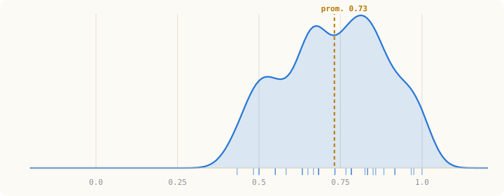
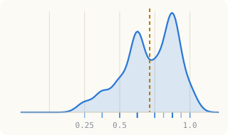
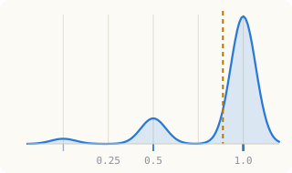
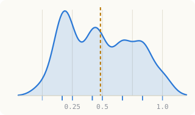
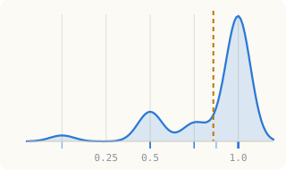

# Diagnóstico de Mercados de Deuda y Capitales

**Universidad Autónoma de Zacatecas · Comercio y Finanzas Internacionales**

Estimación de densidad de las calificaciones del examen diagnóstico aplicado el 21 de agosto de 2026, antes de iniciar la Unidad 1 — **31 alumnos**, 10 preguntas por examen.

> Versión interactiva (con modo oscuro y detalle al pasar el mouse): [Curvas del Diagnóstico](https://claude.ai/code/artifact/67aa444b-7bf0-43b5-b2b9-0a02988540ee)

## Distribución general del puntaje

**Promedio del grupo: 0.73 / 1.0**

Curva de densidad del puntaje promedio (10 preguntas) de los 31 alumnos que presentaron el diagnóstico. Cada marca en el eje inferior es un alumno; la línea dorada marca el promedio del grupo.

## Por categoría — ¿dónde ya tienen intuición y dónde no?

Cada gráfica muestra la misma estimación de densidad, pero solo con las preguntas de esa categoría — en el orden en que se enseñan en la Unidad 1. El bulto de la curva hacia la derecha significa que el grupo ya trae la idea; hacia la izquierda, que el tema es nuevo.

### Activo Financiero e Intermediación — promedio 0.71

*`0_activo_financiero.md` · preguntas 1, 2, 3, 6*

### Clasificación de Activos y Mercados — promedio 0.89

*`1_clasificacion_mercados.md` · preguntas 4, 5*

### Estructura del Sistema Financiero Mexicano — promedio 0.48

*`2_estructura_sfm.md` · preguntas 7, 8*

### Matemática Financiera — promedio 0.86

*`3_matematica_financiera_mecanica_mercado.md` · preguntas 9, 10*

## Resumen numérico

| Categoría | Promedio | % con score ≥ 0.5 | Nota de la unidad |
|---|---:|---:|---|
| Activo Financiero e Intermediación | 0.71 | 90% | `0_activo_financiero.md` |
| Clasificación de Activos y Mercados | 0.89 | 94% | `1_clasificacion_mercados.md` |
| Estructura del Sistema Financiero Mexicano | 0.48 | 55% | `2_estructura_sfm.md` |
| Matemática Financiera | 0.86 | 90% | `3_matematica_financiera_mecanica_mercado.md` |

## Metodología

31 alumnos, 10 preguntas por diagnóstico. Cada respuesta se calificó con un puntaje de 0 a 1 (qué tan probable es que sea correcta) contra un rubro por pregunta, y se estimó la densidad (kernel gaussiano) del puntaje promedio por alumno, general y por categoría.

**Colores.** Azul y oro son los colores institucionales confirmados de la UAZ; no se localizó un manual de identidad con Pantone exacto, así que los tonos aquí son una aproximación validada para uso en datos (contraste y accesibilidad para daltonismo), no el estándar oficial de marca.
